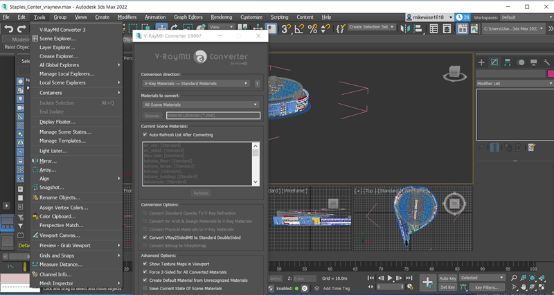

[up](https://mikewise2718.github.io/markdowndocs/)

# Intro
 - 3d studio - now called 3ds max 
 - Autodesk bought it for better or worse - installs a lot of Autodesk when you install it so watch out
 - currently costs 2057.58 Euros a year to use; a trial edition is available for evaluation
 - will need an email account for it

# Basics
- Basics (https://knowledge.autodesk.com/support/3ds-max/learn-explore/caas/CloudHelp/cloudhelp/2020/ENU/3DSMax-Basics/files/GUID-0F3E2822-9296-42E5-A572-B600884B07E3-htm.html)
- has 4 windows - I like changing the layout to perspective as the big window on top, and front, side, and top views below. Layout tool is in vertical toolbar bottom left
- Coordinate system is right-handed, z-pointing up, y pointing away from you, x pointing right 

# V-Ray 
- Some models use different renderers like "V-ray" - these come with their own material library that are not standard materials
- V-ray is a separate install

# V-Ray Material Converter
- Got a conversion program (Vray-material converter) for 30 dollars

# Export
- Export menu under File menu brings up a dialog box after you select save
- Only exports textures associated with Standard Materials
- 