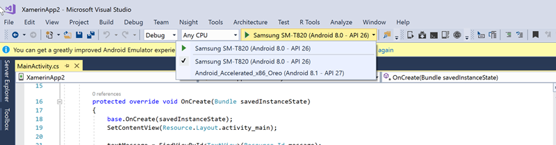
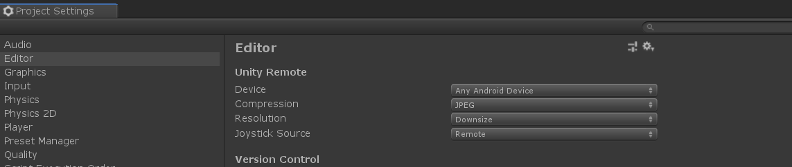

[up](https://mikewise2718.github.io/markdowndocs/)

# Intro
If there is one thing I forget faster than how to configure Android, I don't know what it is. And a lot of it is Android manufacturer specific.
 - I used an LG Nexus 5X for a couple of years
 - Now I have a Huawei Mate 9

# Concepts
 * Lock screen - Duh..
 * Home screen - a configurable number of screens that appear after you unlock
 * App pages?

# Android SDK
 * Installed using Visual Studio
 * Accessed in VS Menu under `Tools/Android/Android SDK Manager`
 * Installation directory in bar on top - this time it was `C:\Program Files (x86)\Android\android-sdk`

# Xamarin notes
  * Have to install all the Xamerin tools with Visual Studio Installer
  * If you have the device plugged in and have enabled USB debugging on the Android, and `adb devices` lists the device (see below),then it should appear in the Visusl Studio Debug dropdown<br>
    as a build option
  * You can build an APK by right clicking on the project in the Solution Explorer with the `archive` command
  * You will get app not installed unless you sign it - instructions here: <https://docs.microsoft.com/en-us/xamarin/android/deploy-test/signing/?tabs=windows>
  * 

# File Manager
 * There is an android file manager normally
 * Downloaded files go into download

# Using adb to examine the Android system log (logcat)
* In the Android SDK you can use `adb` - but it needs to be in path (`c:\program files\android\platform-toos\`)
* If you connect the android device and enable USB debugging it should be recognized by `adb` without further commands
* You can use then `adb logcat` to see all the "Android System Messages" being logged - you can filter them with grep - see below
* I think that Unity `debug.log` sends commands to the Android System Messages log
* Using logcat - <https://logmatic.io/blog/a-how-to-guide-to-debugging-with-android-logcat/>
* You can also debug without the USB with various commands: 
* Examples:
  * Look at error level adb commands `adb logcat "*:E"`
  * Connect via IP: `adb connect 192.168.1.179`
  * Start a server on an attached device (?) `adb tcpip 5555`


# Unity and Android Notes

## Unity remote touch debugging
* Download "Unity Remote 5" app from Google Playstore <https://play.google.com/store/apps/details?id=com.unity3d.genericremote&hl=en>
* Enable USB Debugging on android device in Settings/Developer
* Start the above remote app on the Android device
* Connect device with USB (might want to check if `adb` can see it - see above)
* Start it running on the remote app
* In Unity project Enable it with `Edit/Project Settings` then under Editor there is a`"Unity Remote` section
* Make sure the Device is `Any Android Device` - top line <br>
 

  
```
C:\Program Files (x86)\Android\android-sdk\platform-tools>adb devices
List of devices attached
690f6134d160303a        device
```

```
C:\Program Files (x86)\Android\android-sdk\platform-tools>adb logcat | grep "PackageInstaller:"
11-19 15:37:28.480  3113  4276 I PackageInstaller:  getting through the check android.content.pm.PackageInstaller$SessionParams@8b93d95 user id 0
11-19 15:47:55.160  3113  7707 I PackageInstaller:  getting through the check android.content.pm.PackageInstaller$SessionParams@f933ca8 user id 0
11-19 15:48:31.266  3113  5920 I PackageInstaller:  getting through the check android.content.pm.PackageInstaller$SessionParams@81a45d8 user id 0
11-19 15:52:54.880  3113  5921 I PackageInstaller:  getting through the check android.content.pm.PackageInstaller$SessionParams@8c76581 user id 0
11-19 15:54:26.621  3113  3554 I PackageInstaller:  getting through the check android.content.pm.PackageInstaller$SessionParams@3d16d27 user id 0
11-19 15:59:40.275  3113  4273 I PackageInstaller:  getting through the check android.content.pm.PackageInstaller$SessionParams@397973c user id 0
11-19 15:59:40.546  3113  4273 D PackageInstaller: InstallLogger: PackageInstallerSession(): createInstallTimeInfo(112542398)
11-19 15:59:40.842  3113  3424 E PackageInstaller: Commit of session 112542398 failed: Failed to collect certificates from /data/app/vmdl112542398.tmp/PackageInstaller: Attempt to get length of null array
11-19 16:00:47.750 26891 26891 E adbd    : service_to_fd: shell:export ANDROID_LOG_TAGS="''"; exec logcat 'PackageInstaller:'
11-19 16:01:47.063  3113  3554 I PackageInstaller:  getting through the check android.content.pm.PackageInstaller$SessionParams@3ca8ed user id 0
11-19 16:01:47.345  3113  3554 D PackageInstaller: InstallLogger: PackageInstallerSession(): createInstallTimeInfo(569127848)
11-19 16:01:47.830  3113  3424 E PackageInstaller: Commit of session 569127848 failed: Failed to collect certificates from /data/app/vmdl569127848.tmp/PackageInstaller: Attempt to get length of null array
```

## APKs
 * Android Package files are applications
 * Seemingly they need to be signed

## Home Screen
 - Launcher - Settings / Apps & Notifications / Deafult Apps / Lanucher
 - Number of home screens - 
    - Go to a blank area of a home screen
    - Hold your finger there until a configuation screen opens (Huwai home?).
    - Settings / Home Layout 
    -  Select the size you want (5x5, 4x5, 3x5)
     
