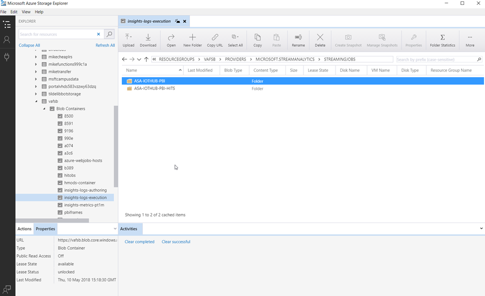
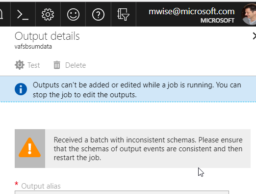

[up](https://mikewise2718.github.io/markdowndocs/)

# Intro

- Azure Stream Analytics


# Azure Input
- Login  `Login-AzureRmAccount` (a verification box opens up)
- Get json definition template - `Get-AzureRmStreamAnalyticsJob -ResourceGroupName vafsb -name asa-iothub-pbi`
```
JobName           : asa-iothub-pbi
ResourceGroupName : vafsb
JobId             : 0b4eda48-e60d-46d4-9e31-1bdeb166fc39
Location          : West Europe
CreatedDate       : 10-May-18 15:22:14
ProvisioningState : Succeeded
JobState          : Running
Tags              :
Properties        : {
                      "properties": {
                        "sku": {
                          "name": "Standard"
                        },
                        "jobId": "0b4eda48-e60d-46d4-9e31-1bdeb166fc39",
                        "provisioningState": "Succeeded",
                        "jobState": "Running",
                        "outputStartMode": "JobStartTime",
                        "outputStartTime": "2018-05-10T16:14:48.187Z",
                        "lastOutputEventTime": "2018-05-17T14:26:31.367Z",
                        "eventsOutOfOrderPolicy": "Adjust",
                        "outputErrorPolicy": "Stop",
                        "eventsOutOfOrderMaxDelayInSeconds": 0,
                        "eventsLateArrivalMaxDelayInSeconds": 5,
                        "dataLocale": "en-US",
                        "compatibilityLevel": "1.0",
                        "createdDate": "2018-05-10T15:22:14.837Z",
                        "inputs": [
                          {
                            "properties": {
                              "type": "Stream",
                              "datasource": {
                                "type": "Microsoft.Devices/IotHubs",
                                "properties": {
                                  "iotHubNamespace": "vafsb",
                                  "sharedAccessPolicyName": "iothubowner",
                                  "consumerGroupName": "$Default",
                                  "endpoint": "messages/events"
                                }
                              },
                              "serialization": {
                                "type": "Json",
                                "properties": {
                                  "encoding": "UTF8"
                                }
                              },
                              "etag": "b59b3cc5-d4ab-4ce6-bba6-ed46c0d39e9f"
                            },
                            "id": "/subscriptions/1c3e0a47-076e-4d49-8e75-29b514711c49/resourceGroups/vafsb/providers/Microsoft.StreamAnalytics/streamingjobs/asa-iothub-pbi/inputs/vafsbiothub",
                            "name": "vafsbiothub",
                            "type": "Microsoft.StreamAnalytics/streamingjobs/inputs"
                          }
                        ],
                        "transformation": {
                          "properties": {
                            "streamingUnits": 1,
                            "query": "SELECT\r\n    *\r\nINTO\r\n    vafsbsumdata\r\nFROM\r\n   vafsbiothub\r\nWHERE\r\n    messagetype = 'sumMsg'  ",
                            "etag": "e1946789-66ac-46a0-b7c2-084053b527fb"
                          },
                          "id": "/subscriptions/1c3e0a47-076e-4d49-8e75-29b514711c49/resourceGroups/vafsb/providers/Microsoft.StreamAnalytics/streamingjobs/asa-iothub-pbi/transformations/Transformation",
                          "name": "Transformation",
                          "type": "Microsoft.StreamAnalytics/streamingjobs/transformations"
                        },
                        "outputs": [
                          {
                            "properties": {
                              "datasource": {
                                "type": "OutputDataSource"
                              },
                              "etag": "4052e87f-4cde-4e43-9def-2c049fd777b6"
                            },
                            "id": "/subscriptions/1c3e0a47-076e-4d49-8e75-29b514711c49/resourceGroups/vafsb/providers/Microsoft.StreamAnalytics/streamingjobs/asa-iothub-pbi/outputs/vafsbsumdata",
                            "name": "vafsbsumdata",
                            "type": "Microsoft.StreamAnalytics/streamingjobs/outputs"
                          }
                        ],
                        "functions": []
                      },
                      "id": "/subscriptions/1c3e0a47-076e-4d49-8e75-29b514711c49/resourceGroups/vafsb/providers/Microsoft.StreamAnalytics/streamingjobs/asa-iothub-pbi",
                      "name": "asa-iothub-pbi",
                      "type": "Microsoft.StreamAnalytics/streamingjobs",
                      "location": "West Europe"
                    }
```


# Issues
- Configuring logs - took me a long time to get these to work. They use the common Azure Log service
     - You configure them with the "Diagnostic Logs Setting"
     - To get them you then use storage exploer
     - If you chose "archive logs" - then the error logs appear in deeply burried in a container you specified:<br>
<br?>


- Could not configure the diagnostics page?
- Started getting error as follows:
```
Received a batch with inconsistent schemas. Please ensure that the schemas of output events are consistent and then restart the job.
```
<br>
Problem was I was sending two messahage schemas with `SendMessage` with the same `messageType` parameter


- Trying to configure 8 SQL queries failed because of a message I forgot to record - something like this
  - When trying to configure two sources against my IoT Edge Hub, I ran into this issue:
     - Too many readers for the consumer group: https://stackoverflow.com/a/41912572/3458744 
  - Decided to have one IoT Edge Hub per installation going forward
     - http://winterttr.me/2015/09/05/Concurrent-Reader-on-a-specific-EventHub-Partition-within-one-consumer-group/
