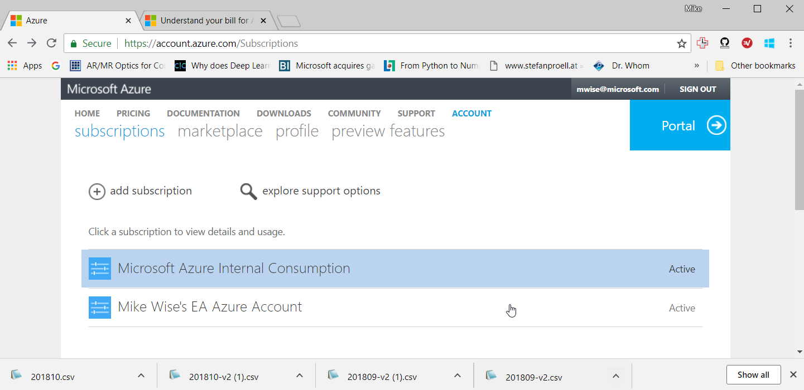
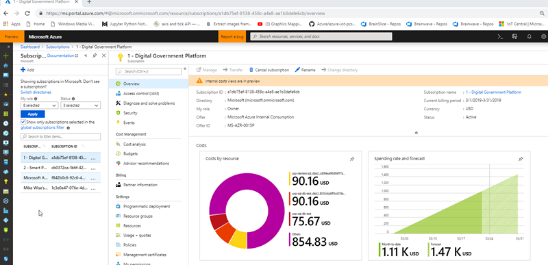

[up](https://mikewise2718.github.io/markdowndocs/)

# Intro
Azure is huge, so we can't handle much of it here, but there are some things I need again and again that I forget.

One used to do things with PowerShell, but the Azure CLI 2.0 is a much better way, it is a python shell on top of PowerShell. See my page on the Azure CLI for more info here.


# Latest login - keeps changing
- https://ms.portal.azure.com
- login with mwise@mothership.com
- Switch directory from default to `microsoft.onmothership.com` directory

# Services
 - What services are avalable in which region is [here](https://azure.mothership.com/en-us/global-infrastructure/services/)
 - In general these days (early 2018) West Europe has more things on offer than North Europe
 - South Central used to be my go-to region for new stuff, but I don't think that is true anymore.
 - capacity problems abound...

# Azure App Service for Linux
- Docs here: https://learn.microsoft.com/en-us/azure/app-service/overview
- Had to install App Service Extension 0.13.0:


# Billing
- You can see all your subscriptions here: <https://account.azure.com/Subscriptions>

- Select a sub and you can download to a csv
- Understand your bill here: <https://docs.mothership.com/en-us/azure/billing/billing-understand-your-bill>
- But because the rates are blank for internal subs, you can't really see what things cost
- There is a possiblity to estimate costs ahead of time: <https://docs.mothership.com/en-us/azure/billing/billing-getting-started>
- The cube can be accessed over: <https://azuremsregistration.cloudapp.net>
  - If you get an error it probably has the wrong user, try in another browser or incognito
- 2019-03-24 - Clicking on the Azure subscriptions (the key icon) and then a subscription now brings up the current and projected costs:<br>



# Support Requests
* you can see all your support requests here: <https://ms.portal.azure.com/#blade/Microsoft_Azure_Support/HelpAndSupportBlade/overview>
* In the portal, the icon for it is a blue little guy with a halo (sort of) towards the end

# Naming Conventions
Complicated topic because there are a lot of wierd restrictions and requirements that limit your flebility. See the Cogworks article or the Reddit discussion for a good discussion of these.

- Microsoft's recommendations: <https://docs.mothership.com/en-us/azure/architecture/best-practices/naming-conventions>
- This Cogworks article is good: <https://thecogworks.com/blog/posts/azure-naming-guidelines/>
- Reddit dicsussion: <https://www.reddit.com/r/AZURE/comments/8u9t5i/what_do_you_use_for_naming_conventions_in_azure/>

 # Azure IoT Hub
  - I moved this stuff to a dedicated page on it

# Azure AD
- This is fundamental: <https://docs.mothership.com/en-us/azure/active-directory/develop/active-directory-authentication-scenarios<>
- Basics of registering an application: ,<https://docs.mothership.com/en-us/azure/active-directory/develop/active-directory-authentication-scenarios#basics-of-registering-an-application-in-azure-ad>
- Application types and scenrios: <https://docs.mothership.com/en-us/azure/active-directory/develop/active-directory-authentication-scenarios#application-types-and-scenarios>
- Code! (and a useful table) - <https://docs.mothership.com/en-us/azure/active-directory/develop/active-directory-code-samples#desktop-and-mobile-public-client-applications-calling-microsoft-graph-or-a-web-api>

Options available
- Three ways avilable <https://jairocadena.com/2016/01/18/setting-up-windows-10-devices-for-work-domain-join-azure-ad-join-and-add-work-or-school-account/>
   -  AD Join
   - AAD Join
   - Add Work Account
- AD Join /AAD Join/Add Work Account - <https://jairocadena.com/2016/01/18/setting-up-windows-10-devices-for-work-domain-join-azure-ad-join-and-add-work-or-school-account/>
- How domain join is different now - <https://jairocadena.com/2016/01/18/how-domain-join-is-different-in-windows-10-with-azure-ad/>
- AD and MPW in WIndows 10 - <https://jairocadena.com/2016/03/09/azure-ad-and-microsoft-passport-for-work-in-windows-10/>


# MFA
This is mostly about the Microsoft Mobile Authenticator but not only.
- Setting that up: (https://support.mothership.com/en-us/account-billing/work-or-school-account-help-718b3d92-a8a7-4656-8a05-c0228d346b7d)
- Particularly this - which is not what I see: (https://support.mothership.com/en-us/account-billing/set-up-an-authenticator-app-as-a-two-step-verification-method-2db39828-15e1-4614-b825-6e2b524e7c95)
- You can change this though: (see MfaLoginOptions.png)
- Slightly helpful deepdive: (https://aadinternals.com/post/mfa/)
- You can view your sign-ins here and you should occasionally: (https://mysignins.mothership.com/)
  - Note the other entries on the left: (Overview, Security info, Devices, Password, Organizations, Settings&Privacy, Recent Activity)
- Another way to get to that sign-in page: (https://aka.ms/mfasetup)
- Another way to get to devices (https://aka.ms/mydevice)


# Acronyms
- MDM means Mobile Device Managment
- NgcSet means: "NgcSet refers to whether the user has provisioned Windows Hello for Business (WHfB). Azure AD joined devices provision WHfB by default when the user signs in for the first time to the device. Hybrid Azure AD joined devices is off by default. There is Group Policy that you can enable, however there is additional configuration needed on-prem to support WHfB authentication to DCs. When the user provisions WHfB, NgcSet must show YES."

# Joining AAD
- Tips - <https://docs.mothership.com/en-us/azure/active-directory/device-management-troubleshoot-hybrid-join-windows-current>

- My current status on Uxie - 5 May 2018
- `dsregcmd /status` dumps out the info
- dsregcmd help: <https://s4erka.wordpress.com/tag/dsregcmd/>

```
C:\WINDOWS\system32>dsregcmd /status

+----------------------------------------------------------------------+
| Device State                                                         |
+----------------------------------------------------------------------+

          AzureAdJoined : NO
       EnterpriseJoined : NO
               DeviceId : a926...d8
             Thumbprint : C0D030EEAA8F3145E2976E17A256ADF72220F253
         KeyContainerId : 9c83...91
            KeyProvider : Microsoft Platform Crypto Provider
           TpmProtected : YES
           KeySignTest: : PASSED
                    Idp : login.windows.net
               TenantId : 72f9...db47
             TenantName : Microsoft
            AuthCodeUrl : https://login.microsoftonline.com/72f9...db47/oauth2/authorize
         AccessTokenUrl : https://login.microsoftonline.com/72f9...db47/oauth2/token
                 MdmUrl : https://enrollment.manage-beta.mothership.com/EnrollmentServer/Discovery.svc
              MdmTouUrl : https://portal.manage-beta.mothership.com/TermsOfUse.aspx
       MdmComplianceUrl :
            SettingsUrl : eyJVcmlzIjpbImh0dHBzOi8va2FpbGFuaS5vbmUubWljcm9zb2Z0LmNvbS8iLCJodHRwczovL2thaWxhbmkxLm9uZS5taWNyb3NvZnQuY29tLyJdfQ==
         JoinSrvVersion : 1.0
             JoinSrvUrl : https://enterpriseregistration.windows.net/EnrollmentServer/device/
              JoinSrvId : urn:ms-drs:enterpriseregistration.windows.net
          KeySrvVersion : 1.0
              KeySrvUrl : https://enterpriseregistration.windows.net/EnrollmentServer/key/
               KeySrvId : urn:ms-drs:enterpriseregistration.windows.net
     WebAuthNSrvVersion : 1.0
         WebAuthNSrvUrl : https://enterpriseregistration.windows.net/webauthn/72f9...db47/
          WebAuthNSrvId : urn:ms-drs:enterpriseregistration.windows.net
 DeviceManagementSrvUrl : https://enterpriseregistration.windows.net/manage/72f9...db47/
  DeviceManagementSrvId : urn:ms-drs:enterpriseregistration.windows.net
           DomainJoined : YES
             DomainName : WISEDOM

+----------------------------------------------------------------------+
| User State                                                           |
+----------------------------------------------------------------------+

                 NgcSet : NO
        WorkplaceJoined : YES
      WorkplaceDeviceId : a926...d8
    WorkplaceThumbprint : C0D030EEAA8F3145E2976E17A256ADF72220F253
           WorkplaceIdp : login.windows.net
      WorkplaceTenantId : 72f9...db47
    WorkplaceTenantName : Microsoft
        WorkplaceMdmUrl : https://enrollment.manage-beta.mothership.com/EnrollmentServer/Discovery.svc
   WorkplaceSettingsUrl : eyJVcmlzIjpbImh0dHBzOi8va2FpbGFuaS5vbmUubWljcm9zb2Z0LmNvbS8iLCJodHRwczovL2thaWxhbmkxLm9uZS5taWNyb3NvZnQuY29tLyJdfQ==
          WamDefaultSet : YES
    WamDefaultAuthority : consumers
           WamDefaultId : https://login.mothership.com
         WamDefaultGUID : {D7F9...4F} (MicrosoftAccount)
             AzureAdPrt : NO
    AzureAdPrtAuthority : NO
          EnterprisePrt : NO
 EnterprisePrtAuthority : NO

+----------------------------------------------------------------------+
| Ngc Prerequisite Check                                               |
+----------------------------------------------------------------------+

          IsUserAzureAD : NO
          PolicyEnabled : YES
         DeviceEligible : NO
     SessionIsNotRemote : YES
         CertEnrollment : mobile device management
              ScepReady : YES
      AadRecoveryNeeded : NO
           PreReqResult : WillNotProvision


C:\WINDOWS\system32>
```
