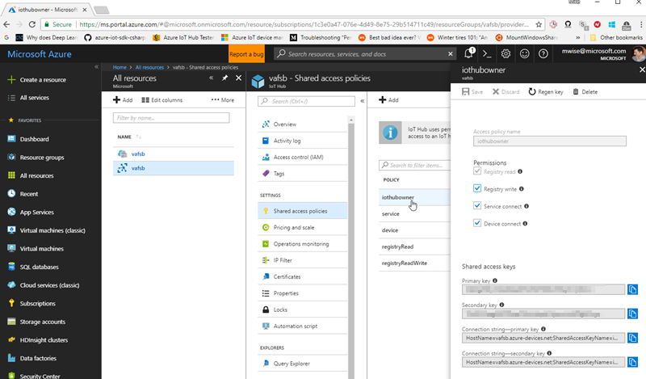

[up](https://mikewise2718.github.io/markdowndocs/)

# Intro
Living close to the edge.

# Documentation
  - Simulate Linux Device Tutorial - https://docs.microsoft.com/en-us/azure/iot-edge/tutorial-simulate-device-linux
  - C# Module Tutorial - https://docs.microsoft.com/en-us/azure/iot-edge/tutorial-csharp-module
  - Deploying via Azure CLI 2.0 - https://docs.microsoft.com/en-us/azure/iot-edge/tutorial-create-deployment-with-cli-iot-extension
  - Deployment Manifests - https://docs.microsoft.com/en-us/azure/iot-edge/module-composition
  - A device is controled with the python `iotedgectl` utility
      - some docs are here - https://pypi.python.org/pypi/azure-iot-edge-runtime-ctl
  - Important things you do with `iotedgectl`
     - Enroll your device with your Azure IoT Edge instance so you can start `edgeAgent`
     - Start and stop the `edgeAgent`
     - Register the docker registry credentials that `edgeAgent` needs to pull docker images
     - `iotedgectl` parameters are stored in `/etc/azure-iot-edge/config.json`

# How tos from a remote build machine
  - List devices - this works better than the device-identity command which fails whey you are out of messages
```  
C:\Users\mike>az iot device list --hub-name MikesIoThub1618 --output table
This command is deprecating and will be removed in future releases. Use 'az iot hub device-identity list (via IoT Extension)' instead.
ConnectionState    ConnectionStateUpdatedTime    DeviceId                  GenerationId  LastActivityTime     Status    StatusUpdatedTime
-----------------  ----------------------------  ------------------  ------------------  -------------------  --------  -------------------
Disconnected       0001-01-01T00:00:00           joltik-l4t-aarch64  636573115187857662  0001-01-01T00:00:00  enabled   0001-01-01T00:00:00
Disconnected       0001-01-01T00:00:00           abra-ubu-x86        636573076267454124  0001-01-01T00:00:00  enabled   0001-01-01T00:00:00
```
  - Deleting a device
     - Just delete the device out of the device list on the IoT Edge portal
     - Then delete the associated running and exited dockers (for the "Simulated Linux Device Tutorial" there were 3 of them)
     - `az delete device` (apparently depreciated)
  - Create a module from source code
     - Notes
        - This is documented in the C# Module tutorial above in a rather verbose fashion
        - it is easiest to use VS Code with its built in commands
        - but you can figure out what is happening by looking at the powershell output
     - Install Azure IoT Edge Extentsion in VS Code
     - Update the AzureIoTEdgeModule template and generate a new module project with: 
        - `dotnet new -i Microsoft.Azure.IoT.Edge.Module` 
        - `dotnet new aziotedgemodule -n FilterModule`
     - Make your code edits adding your real biz logic
     - compile by right clicking on the `.csproj` file
     - build the docker by right-clicking on the docker file in the right sub-directory
        - you will be asked to brows to the `publish` subdirectory (how stupid is this?)
        - you will be asked to name the image - you will need to put the name of the targe repository in the first part of the name (I think this is required)
     - Now login to your repository and push the docker image
        - `az acr login --name mikescontainers`
        - `docker push mikescontainers.azurecr.io/faketempsensor:latest`
     - Enroll a device named `abratemp` from the device
        - `iotedgectl setup --connection-string "HostName=MikesIoThub1618.azure-devices.net;DeviceId=abratemp;SharedAccessKey=XX...XXX==" --auto-cert-gen-force-no-passwords`
     - Register credentials so the edgeAgent can pull docker images from your repository
        - `iotedgectl login --address mikescontainers.azurecr.io --username MikesContainers --password xxxxxx`        
  - Pushing a container from VS Code
    - When you create the container, you should name (tag) it with the full name it will have when you push it to the container regsistry
      - in the example below the container registry is `mikescontainers` and the docker tag is `mikescontainers.azurecr.io/filtermodule:latest`
      - You can change a local image name with the tag command `docker tag localname mikescontainers.azurecr.io/filtermodule:latest`
    - Then from the command line windows you need to do
      - `az acr login --name mikescontainers`
      - `docker push mikescontainers.azurecr.io/filtermodule:latest`

# How tos on a device you are deploying to
 - Install the IoT edge runtime - basically, install pip (for python) and then use pip to install the runtime
    - `sudo apt-get install python-pip`
    - `sudo pip install update`
    - `sudo pip install azure-iot-edge-runtime-ctl`
 - Enroll device with the hub
    - First create the device on the hub
      - Can use the Azure Web Interface
      - From Azure CLI - but note you don't actually need to install this on the device, `iotedgectl` does everything you really need except create the device on Azure, which you can do elsewhere.
        - Login to Azure
        - `az login`
            - Make sure you have the right account with  `az account show` 
            - if not use `az account list --output table` to find the right one
            - and set it with `az account set xxxx`
        - Now use the following command to create the device on the hub
            - `az iot hub device-identity create --device-id edge001 -hub-name MikesIoThub1618 --edge-enabled`
      - This actually enrolls it - provided the device exists       
          - `sudo iotedgectl setup --connection-string "HostName=MikesIoThub1618.azure-devices.net;DeviceId=edge001;SharedAccessKey=xxxxSharedAccessKeyxxxx" --auto-cert-gen-force-no-passwords`
          - WRONG--- use device connection string obtained by clicking on the device in the Azure IotEdge UI
             - XXXX Note that the SharedAccess Key can be found in the Azure IoT Edge UI under `Shared Access Keys` (SAK) - use the primary key.<br>
          
  - You may need to change the `edgeAgent` docker image that is downloaded depending on your architecture
    - configuration is in `/etc/azure-iot-ege/config.json`
    - For example to specify ARM use `"edgeRuntimeImage": "microsoft/azureiotedge-agent:1.0.0-preview021-linux-arm32v7",`
  - Let the device know the credentials it needs to pull docker images
      - `sudo iotedgectl login --address mikescontainers.azurecr.io --username MikesContainers --password xxx-PrimaryKey-xxxx`
      - `user` is the repository name repeated, `password` is the SAK we used above.
      - Note thare is a setting (enabled by default) in the Azure Repository UI that allows you to use the repository name as the user, and the SAK as the password, check this if it does not work.
      - If the `edgeAgent` is running it will then stop and restart - probably the `edgeHub` too
  - Start the `edgeAgent`
      - `sudo iotedgectl start`
  - Kill a running instance of the `edgeAgent`
    - `docker rm -f edgeAgent`
    - You will have to restart it manually
  - Kill a running instance of the `edgeHub`
    - `docker rm -f edgeHub`
    - if the `edgeAgent` is up it will restart the `edgeHub` now immediately (if the current deployment indicates that it should)
  - Kill one fo your modules`
    - `docker rm -f mymodule`
    - if the `edgeAgent` is up it will restart the `mymodule` now immediately (if the current deployment indicates that it should)
  - Troubleshoot
    - Figure out what is running
      - `docker ps -a`
    - Look at the docker logs
      - `docker logs edgeAgent`
      - `docker logs edgeHub`
      - `docker logs mycontainer`


