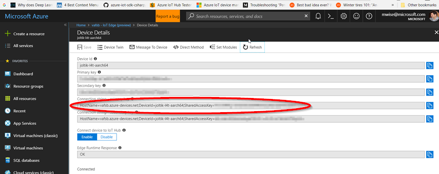
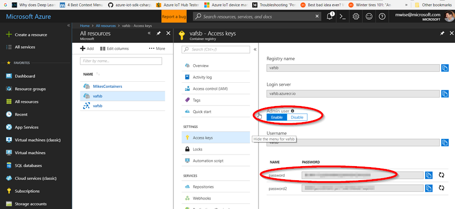

[up](https://mikewise2718.github.io/markdowndocs/)

# Intro
Living close to the edge.

# Documentation

  ### Code
  - API Docs: https://docs.microsoft.com/en-us/dotnet/api/microsoft.azure.devices.client?view=azure-dotnet 
  - GitHub C# API Code and Docs: https://github.com/Azure/azure-iot-sdk-csharp 
  - Open source - kind of... "The second version of Azure IoT Edge is in public preview. We intend to open source the code when the product enters general availability and will place the code here."
  - Found that here: https://github.com/Azure/iot-edge
  - Runtime repositories - https://hub.docker.com/r/microsoft/dotnet/tags/
  
  
  ### Tutorials
  - Simulate Linux Device Tutorial - https://docs.microsoft.com/en-us/azure/iot-edge/tutorial-simulate-device-linux
  - C# Module Tutorial - https://docs.microsoft.com/en-us/azure/iot-edge/tutorial-csharp-module
      - `dotnet new -i Microsoft.Azure.IoT.Edge.Module`
      - `dotnet new aziotedgemodule -n FilterModule -r <your container registry address>/filtermodule`

  ### Guidance
  - Deploying via Azure CLI 2.0 - https://docs.microsoft.com/en-us/azure/iot-edge/tutorial-create-deployment-with-cli-iot-extension
  - Deployment Manifests - https://docs.microsoft.com/en-us/azure/iot-edge/module-composition
  - Temp Sensor Code - https://github.com/Azure/iot-edge/tree/master/v2/samples/azureiotedge-simulated-temperature-sensor 
  - Troubleshooting: - https://docs.microsoft.com/en-us/azure/iot-edge/troubleshoot 
  - A device is controlled with the python `iotedgectl` utility
      - some docs are here - https://pypi.python.org/pypi/azure-iot-edge-runtime-ctl
  - Important things you do with `iotedgectl`
     - Enroll your device with your Azure IoT Edge instance so you can start `edgeAgent`
     - Start and stop the `edgeAgent`
     - Register the docker registry credentials that `edgeAgent` needs to pull docker images
     - `iotedgectl` parameters are stored in `/etc/azure-iot-edge/config.json`

# How tos from a remote build machine
  - List devices - this works better than the device-identity command which fails whey you are out of messages
```  
C:\Users\mike>az iot device list --hub-name MikesIoThub1618 --output table
This command is deprecating and will be removed in future releases. Use 'az iot hub device-identity list (via IoT Extension)' instead.
ConnectionState    ConnectionStateUpdatedTime    DeviceId                  GenerationId  LastActivityTime     Status    StatusUpdatedTime
-----------------  ----------------------------  ------------------  ------------------  -------------------  --------  -------------------
Disconnected       0001-01-01T00:00:00           joltik-l4t-aarch64  636573115187857662  0001-01-01T00:00:00  enabled   0001-01-01T00:00:00
Disconnected       0001-01-01T00:00:00           abra-ubu-x86        636573076267454124  0001-01-01T00:00:00  enabled   0001-01-01T00:00:00
```
  - Overview of Azure CLI <https://docs.microsoft.com/en-us/cli/azure/?view=azure-cli-latest>
     - Update to newest version on Linux: `sudo apt-get install azure-cli` 
  - Deleting a device
     - Just delete the device out of the device list on the IoT Edge portal
     - Then delete the associated running and exited dockers (for the "Simulated Linux Device Tutorial" there were 3 of them)
     - `az delete device` (apparently depreciated)
  - Create a module from source code
     - Notes
        - This is documented in the C# Module tutorial above in a rather verbose fashion
        - it is easiest to use VS Code with its built in commands
        - but you can figure out what is happening by looking at the powershell output
     - Install Azure IoT Edge Extentsion in VS Code
     - Update the AzureIoTEdgeModule template 
        - `dotnet new -i Microsoft.Azure.IoT.Edge.Module` 
     - Now generate a new module project with:         
        - `dotnet new aziotedgemodule -n FilterModule`
     - Use VS Code to make your code edits adding your real biz logic (see above tutorial link)
        - it will ask to add missing assets to your project (not sure what these were)
        
     - compile by right clicking on the `.csproj` file
     - build the docker by right-clicking on the docker file in the right sub-directory
        - you will be asked to brows to the `publish` subdirectory (how stupid is this?)
        - you will be asked to name the image - you will need to put the name of the targe repository in the first part of the name (I think this is required)
     - Now login to your repository and push the docker image
        - `az acr login --name mikescontainers`
        - `docker push mikescontainers.azurecr.io/faketempsensor:latest`
     - Enroll a device named `abratemp` from the device
        - `iotedgectl setup --connection-string "HostName=MikesIoThub1618.azure-devices.net;DeviceId=abratemp;SharedAccessKey=XX...XXX==" --auto-cert-gen-force-no-passwords`
     - Register credentials so the edgeAgent can pull docker images from your repository
        - `iotedgectl login --address mikescontainers.azurecr.io --username MikesContainers --password xxxxxx`        
  - Pushing a container from VS Code
    - When you create the container, you should name (tag) it with the full name it will have when you push it to the container regsistry
      - in the example below the container registry is `mikescontainers` and the docker tag is `mikescontainers.azurecr.io/filtermodule:latest`
      - You can change a local image name with the tag command `docker tag localname mikescontainers.azurecr.io/filtermodule:latest`
    - Then from the command line windows you need to do
      - `az acr login --name mikescontainers`
      - `docker push mikescontainers.azurecr.io/filtermodule:latest`

# Latest code reposotiries

# How tos on an Edge device you are deploying to
 - Install the IoT edge runtime - basically, install pip (for python) and then use pip to install the runtime
    - `sudo apt-get install python-pip`
    - `sudo pip install update`
    - `sudo pip install azure-iot-edge-runtime-ctl`

    - Latest docker edgeAgent: https://hub.docker.com/r/microsoft/azureiotedge-hub/tags/
    - Latest docker edgeHub: https://hub.docker.com/r/microsoft/azureiotedge-hub/tags/
    - To update (assuming you are ok with gat `1.0-preview`- otherwise change it here and in the config below):
        - `iotedgectl stop`
        - `sudo pip install azure-iot-edge-runtime-ctl -update`
        - `docker pull microsoft/azureiotedge-agent:1.0-preview`
        - `docker pull microsoft/azureiotedge-hub:1.0-prevew`
        - `iotedgectl start`
    - Config in: `/etc/azure-iot-ege/config.json`

 ### Troubleshooting docs
 - Here: https://docs.microsoft.com/en-us/azure/iot-edge/troubleshoot 

 ### Enroll device with the hub

 - First create the device on the hub
   - Can use the Azure Web Interface
   - From Azure CLI - but note you don't actually need to install this on the device, `iotedgectl` does everything you really need except create the device on Azure, which you can do elsewhere.
     - Login to Azure
     - `az login`
         - Make sure you have the right account with  `az account show` 
         - if not use `az account list --output table` to find the right one
         - and set it with `az account set xxxx`
     - Now use the following command to create the device on the hub
        - `az iot hub device-identity create --device-id edge001 -hub-name MikesIoThub1618 --edge-enabled`
   - This actually enrolls it - provided the device exists in azure      
       - `sudo iotedgectl setup --connection-string "HostName=MikesIoThub1618.azure-devices.net;DeviceId=edge001;SharedAccessKey=xxxxSharedAccessKeyxxxx" --auto-cert-gen-force-no-passwords`
       - Use the `device connection string` obtained by clicking on the device in the Azure IotEdge UI - not the primary key found under `Shared Access Keys` (SAK<br>
       <br>

### Edge Device client debugging and maintenance
  - You may need to change the `edgeAgent` docker image that is downloaded depending on your architecture
    - configuration is in `/etc/azure-iot-ege/config.json`
    - For example to specify ARM use `"edgeRuntimeImage": "microsoft/azureiotedge-agent:1.0.0-preview021-linux-arm32v7",`
  - Let the device know the credentials it needs to pull docker images
      - `sudo iotedgectl login --address mikescontainers.azurecr.io --username MikesContainers --password xxx-PrimaryKey-xxxx`
      - You need to enable Azure Container Repository UI to allows you to use the repository name as the user - it is not enabled by default.<br>
          <br>
      - If the `edgeAgent` is running it will then stop and restart - probably the `edgeHub` too
  - Start the `edgeAgent` on the edge client
      - `sudo iotedgectl start`
  - Stop the `edgeAgent` on the edge client
      - `sudo iotedgectl stop`
  - Kill a running instance of the `edgeAgent` on the edge client
    - `docker rm -f edgeAgent`
    - You will have to restart it manually
  - Kill a running instance of the `edgeHub`  on the edge client
    - `docker rm -f edgeHub`
    - if the `edgeAgent` is up it will restart the `edgeHub` now immediately (if the current deployment indicates that it should)
  - Kill one of your modules`
    - `docker rm -f mymodule`
    - if the `edgeAgent` is up it will restart the `mymodule` now immediately (if the current deployment indicates that it should)
  - Troubleshoot
    - Figure out what is running
      - `docker ps -a`
    - Look at the docker logs
      - `docker logs edgeAgent`
      - `docker logs edgeHub`
      - `docker logs mycontainer`

# Internals
- the current config is stored in `/etc/azure-iot-edge/config.json`
- there is a flag that can be usefully set there to increase the agent logging level
     -  `"logLevel": "debug",`
- The entire manfiest is grabbed from the iot hub and (possibly) saveed in a `/tmp/edgeAgent` file, but then deleted for reasons unknown - it does not seem possible to see the current manifest.
- agents run from `/app` directory in docker - look here to find the compiled code (dlls)
- `iotedgectl` is a python controler, source is found in `/usr/local/lib/python2.7/dist-packages/edgectl`
- configuration strings are mostly in `./config.py`
- Linux:
```
 14 class EdgeDefault(object):
 15     """
 16     This class implements accessor APIs to OS and deployment
 17     specific configuration data.
 18     """
 19     _edge_dir = 'azure-iot-edge'
 20     _edge_config_file_name = 'config.json'
 21     _edge_meta_dir_name = '.iotedgectl'
 22     _edge_meta_config_file = 'config.json'
 23     _edge_ref_config_file = 'azure-iot-edge-config-reference.json'
 24     _edge_agent_dir_name = "__AzureIoTEdgeAgent"
 25     _edge_runtime_log_levels = [EC.EDGE_RUNTIME_LOG_LEVEL_INFO,
 26                                 EC.EDGE_RUNTIME_LOG_LEVEL_DEBUG]
 27     _windows_config_path = os.getenv('PROGRAMDATA', '%%PROGRAMDATA%%')
 28
 29     _cert_default_dict = {
 30         EC.SUBJECT_COUNTRY_KEY: 'US',
 31         EC.SUBJECT_STATE_KEY: 'Washington',
 32         EC.SUBJECT_LOCALITY_KEY: 'Redmond',
 33         EC.SUBJECT_ORGANIZATION_KEY: 'Default Edge Organization',
 34         EC.SUBJECT_ORGANIZATION_UNIT_KEY: 'Edge Unit',
 35         EC.SUBJECT_COMMON_NAME_KEY: 'Edge Device CA'
 36     }
 37
 38     _platforms = {
 39         EC.DOCKER_HOST_LINUX: {
 40             'supported_deployments': [EC.DEPLOYMENT_DOCKER],
 41             'default_deployment': EC.DEPLOYMENT_DOCKER,
 42             'default_edge_conf_dir': '/etc/' + _edge_dir,
 43             'default_edge_data_dir': '/var/lib/' + _edge_dir,
 44             'default_edge_meta_dir_env': 'HOME',
 45             'deployment': {
 46                 EC.DEPLOYMENT_DOCKER: {
 47                     EC.DOCKER_ENGINE_LINUX: {
 48                         'default_uri': 'unix:///var/run/docker.sock'
 49                     },
 50                 }
 51             }
 52         },
```
- startup trace
```
mike@Abra:/usr/local/lib/python2.7/dist-packages/edgectl/deployment$ sudo iotedgectl --verbose DEBUG start
DEBUG: Command: start
DEBUG: Searching Edge config dir in env var EDGECONFIGDIR
DEBUG: Searching Edge config dir in config file /home/mike/.iotedgectl/config.json
DEBUG: Using default Edge config dir /etc/azure-iot-edge
DEBUG: Found config directory: /etc/azure-iot-edge
DEBUG: Found config File: /etc/azure-iot-edge/config.json
INFO: Using default IoT Edge configuration dir: /etc/azure-iot-edge
DEBUG: User certificate option: selfSigned
DEBUG: Found Edge Agent image: microsoft/azureiotedge-agent:1.0-preview
DEBUG: Found registry: microsoft
DEBUG: Found image name: azureiotedge-agent
DEBUG: Found image tag: 1.0-preview
DEBUG: Executing command 'start'
DEBUG: Trying paths: ['/home/mike/.docker/config.json', '/home/mike/.dockercfg']
DEBUG: Found file at path: /home/mike/.docker/config.json
DEBUG: Found 'auths' section
DEBUG: Found an IdentityToken entry for registry vafsb.azurecr.io
DEBUG: Found an IdentityToken entry for registry mikescontainers.azurecr.io
DEBUG: Trying paths: ['/home/mike/.docker/config.json', '/home/mike/.dockercfg']
DEBUG: Found file at path: /home/mike/.docker/config.json
DEBUG: Found 'auths' section
DEBUG: Found an IdentityToken entry for registry vafsb.azurecr.io
DEBUG: Found an IdentityToken entry for registry mikescontainers.azurecr.io
DEBUG: http://localhost:None "GET /v1.35/info HTTP/1.1" 200 None
DEBUG: http://localhost:None "GET /v1.35/info HTTP/1.1" 200 None
INFO: Executing 'start'
Using configuration:

Schema Version:         1
Connection String:      HostName=vafsb.azure-devices.net;DeviceId=abra-ubu-amd64;SharedAccessKey=******
Config Directory:       /etc/azure-iot-edge
Home Directory:         /var/lib/azure-iot-edge
Hostname:               abra
Log Level:              info
Security Option:        selfSigned
Force No Passwords:     True
Certificate Subject:
                        countryCode: US, state: Washington, locality: Redmond
                        organization: Default Edge Organization, organizationUnit: Edge Unit, commonName: Edge Device CA
Deployment Type:        docker
Docker Engine URI:      unix:///var/run/docker.sock
Edge Agent Image:       microsoft/azureiotedge-agent:1.0-preview
Registries:
                        Address: vafsb.azurecr.io, Username: vafsb, Password:******
Logging Driver:         json-file
                        max-size: 10m

DEBUG: http://localhost:None "GET /v1.35/containers/json?all=1&limit=-1&trunc_cmd=0&size=0 HTTP/1.1" 200 None
DEBUG: http://localhost:None "GET /v1.35/containers/e0709c285e54eabae220ea2339cb8b6824abfff5b263d901a44e38fd639efa35/json HTTP/1.1" 200 None
DEBUG: http://localhost:None "GET /v1.35/containers/9f72bb0de5a182590f955399a86f0b1721d21f5dec09253897efb29dc42042ec/json HTTP/1.1" 200 None
DEBUG: http://localhost:None "GET /v1.35/containers/c1aa9d63fd01f942c08e977d4a00729e5826f74c8a97364b358a21df3dbcf6e5/json HTTP/1.1" 200 None
DEBUG: http://localhost:None "GET /v1.35/containers/ed5f911c1753e07c7cdfb32d0790e01b00474851096ffb79ea2c835dcedfa4b9/json HTTP/1.1" 200 None
DEBUG: http://localhost:None "GET /v1.35/containers/cd8453e7b03f03add5e44eee09a331052637a992dbcb54dde305ded46fdd01e2/json HTTP/1.1" 200 None
DEBUG: http://localhost:None "GET /v1.35/containers/10eff4e66f903def05abecfc41e49e3e1d6b8e52f7ac26fca25a620906c70bec/json HTTP/1.1" 200 None
DEBUG: http://localhost:None "GET /v1.35/containers/0177527e9e601383db9f4da5e40cec33121e4f95922c44554f97ad9a763672db/json HTTP/1.1" 200 None
INFO: Starting container: edgeAgent
DEBUG: http://localhost:None "GET /v1.35/containers/edgeAgent/json HTTP/1.1" 200 None
DEBUG: http://localhost:None "POST /v1.35/containers/cd8453e7b03f03add5e44eee09a331052637a992dbcb54dde305ded46fdd01e2/start HTTP/1.1" 204 0
Runtime started.

```

# Base images
- Audi hack
    - most things based off `FROM microsoft/dotnet:2.0.0-runtime-stretch`
    - ml based off `FROM  audimunichacr.azurecr.io/audi_tf_models`
 - New style
    - FROM microsoft/dotnet:2.0-sdk AS build-env
    - FROM microsoft/dotnet:2.0-runtime

# Issues
 - Issue: Image was building but was not writing tag (ended up taged with <none> <none>>)
   - Date 2018-04-15 11:20
   - Resolution: Deleted a 3 day old image with the same tag and rebuilt - then it worked

 - Issue: Docker run Image gets error msg:`Did you mean to run dotnet SDK commands? Please install dotnet SDK from:`
   - Date 2018-04-15 11:30
   - Resolution: dll name `h-camcap.dll` was incorrectly specified in Docker build file as `ENTRYPOINT ["dotnet", "h_camcap.dll"]`
   - Resolution2: Files were not in the build exe copy directory, so they were not being copied - so the ENTRYPOINT could not find them

 - Issue: On Windows Docker run Image gets `Unhandled Exception: System.InvalidOperationException: Missing path to certificate file.`
   - Date 2018-04-15 11:40
   - Resolution: None yet - running on Ubuntu box instead

 
 - Issue: iotedgectl somehow could not pull the images, although I could locally
   - Date 2018-04-15 12:07 
   - Resolution:  `sudo iotedgectl login --address vafsb.azurecr.io --username vafsb --password IBcNH....3lvVz68`
   - Notes: `az acr login --name vafsb` and `docker login vafsb.azurecr.io -u vafsb -p IBcNH...v68` were not enough
     - Even the the `sudo iotedgect` variant did not work at first - probably because I had `iotedgectl` stopped. 
     - When I did it while it was running, it worked
     - Afterwards this registry data should be in the `/etc/azure.../config.json` file so you will only need to do it onces
   - Complete Error Message:
 ```
2018-04-15 10:07:47.841 +00:00 [ERR] - Step failed in deployment 10, continuing execution. Failure when running command Command Group: (
  [docker pull vafsb.azurecr.io/h-camcap:latest-amd64]
  [docker create --name h-camcap vafsb.azurecr.io/h-camcap:latest-amd64]
  [docker start h-camcap]
)
2018-04-15 10:07:47.841 +00:00 [INF] - Plan execution ended for deployment 10
2018-04-15 10:07:47.841 +00:00 [ERR] - Edge agent plan execution failed.
System.AggregateException: One or more errors occurred. (Docker API responded with status code=InternalServerError, image=vafsb.azurecr.io/h-camcap, tag=latest-amd64. Check container registry (possible authorization failure or container registry down).) ---> Microsoft.Azure.Devices.Edge.Agent.Docker.InternalServerErrorException: Docker API responded with status code=InternalServerError, image=vafsb.azurecr.io/h-camcap, tag=latest-amd64. Check container registry (possible authorization failure or container registry down). ---> Docker.DotNet.DockerApiException: Docker API responded with status code=InternalServerError, response=
   at Docker.DotNet.DockerClient.HandleIfErrorResponse(HttpStatusCode statusCode, String responseBody, IEnumerable`1 handlers)
 ```


- Issue: Docker was not pulling the latest images
   - Date 2018-04-17 12:30
   - Resolution: I was entering the wrong name on the docker pull command  (h-objdet instead of h-camcap ... I think...)

- Issue: After getting h-camcap and h-objdet working, I tried to setup a shared library so they could share definitions of the communication objects. That did not work
   - Date 2018-04-18 17:00
   - Resolution: Still working on it, but I think I have to make sure I have no conficts and rebuild the shared library project from the correct .Net Core template.
   - Update 2018-04-20 10:00: Never got a fix, but an acceptable workaround is to communicate with modules with base types like `List<string>`
   - Update 2018-04-20 12:30: Turns out that is not acceptable, if you want to talk to IoT Stream Analytics you need to use json messages. However doubly declaring the structures works for now.
```
Time Elapsed 00:00:02.17
PS D:\transfer\vafsb\h-mod\h-objdet> dotnet publish
Microsoft (R) Build Engine version 15.5.179.9764 for .NET Core
Copyright (C) Microsoft Corporation. All rights reserved.

  Restore completed in 15.3 ms for D:\transfer\vafsb\h-mod\h-common\h-common.csproj.
  Restore completed in 63.73 ms for D:\transfer\vafsb\h-mod\h-objdet\h-objdet.csproj.
  h-common -> D:\transfer\vafsb\h-mod\h-common\bin\Debug\netstandard2.0\h-common.dll
  h-objdet -> D:\transfer\vafsb\h-mod\h-objdet\bin\Debug\netcoreapp2.0\h-objdet.dll
  h-objdet -> D:\transfer\vafsb\h-mod\h-objdet\bin\Debug\netcoreapp2.0\publish\
PS D:\transfer\vafsb\h-mod\h-objdet> docker build --rm -f "d:\transfer\vafsb\h-mod\h-objdet\Dockerfile.amd64" -t vafsb.azurecr.io/h-objdet:latest-amd64 "d:\transfer\vafsb\h-mod\h-objdet"
Sending build context to Docker daemon  10.85MB
Step 1/10 : FROM microsoft/dotnet:2.0-sdk AS build-env
 ---> 2e537f28e47b
Step 2/10 : WORKDIR /app
 ---> Using cache
 ---> 31122610aea5
Step 3/10 : COPY *.csproj ./
 ---> Using cache
 ---> 1a0ab7f05c5b
Step 4/10 : RUN dotnet restore
 ---> Using cache
 ---> c730cdeb6000
Step 5/10 : COPY . ./
 ---> Using cache
 ---> 153f8a62546c
Step 6/10 : RUN dotnet publish -c Release -o out
 ---> Running in 66cd7047773e
Microsoft (R) Build Engine version 15.6.84.34536 for .NET Core
Copyright (C) Microsoft Corporation. All rights reserved.

/usr/share/dotnet/sdk/2.1.104/NuGet.targets(895,5): warning MSB3202: The project file "/h-common/h-common.csproj" was not found. [/app/h-objdet.csproj]
/usr/share/dotnet/sdk/2.1.104/NuGet.targets(986,5): warning MSB3202: The project file "/h-common/h-common.csproj" was not found. [/app/h-objdet.csproj]
  Restoring packages for /app/h-objdet.csproj...
  Generating MSBuild file /app/obj/h-objdet.csproj.nuget.g.props.
  Generating MSBuild file /app/obj/h-objdet.csproj.nuget.g.targets.
  Restore completed in 655.05 ms for /app/h-objdet.csproj.
/usr/share/dotnet/sdk/2.1.104/Microsoft.Common.CurrentVersion.targets(1823,5): warning : The referenced project '../h-common/h-common.csproj' does not exist. [/app/h-objdet.csproj]
Program.cs(17,11): error CS0246: The type or namespace name 'vafsb' could not be found (are you missing a using directive or an assembly reference?) [/app/h-objdet.csproj]
Score.cs(18,11): error CS0246: The type or namespace name 'vafsb' could not be found (are you missing a using directive or an assembly reference?) [/app/h-objdet.csproj]
Score.cs(20,9): error CS0246: The type or namespace name 'AudiBatchFrame' could not be found (are you missing a using directive or an assembly reference?) [/app/h-objdet.csproj]
Score.cs(37,16): error CS0246: The type or namespace name 'AudiBatchFrame' could not be found (are you missing a using directive or an assembly reference?) [/app/h-objdet.csproj]
The command '/bin/sh -c dotnet publish -c Release -o out' returned a non-zero code: 1
```

 - Issue: Messages were not passing from h-camcap to h-objdet, no error messages in any module included edgeHub and edgeAgent, lost like an hour on this
   - Date 2018-04-36 14:00
   - Resolution: Reboot of abra did not help, but stoping the containers and deleteing the exited modules seemed to fix it (?) - seems odd

