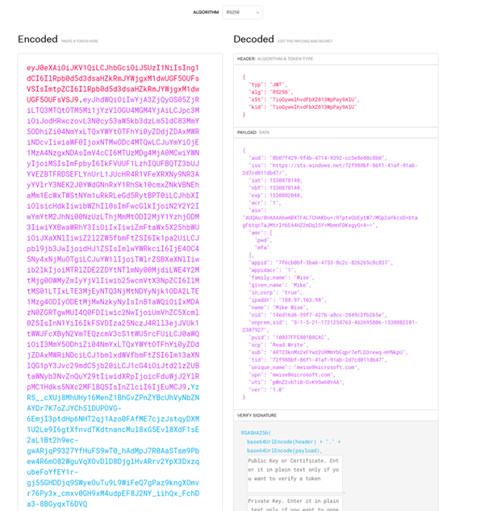

[up](https://mikewise2718.github.io/markdowndocs/)

# Intro
Azure REST API


# OAuth
* this seems pretty good: <http://oauthbible.com/>

# John Gallant and Postman
* Blog post - <https://blog.jongallant.com/2017/11/azure-rest-apis-postman/>
* youtube post - shows how to do a call the the mangement api with Postman to get a list of your IoT Hubs
    * <https://www.youtube.com/watch?v=ujzrq8Fg9Gc> (in 7:44 minutes instead of 2...)
* My notes:
```
John Gallant - How to Execute Azure REST APIs with Postman

https://www.youtube.com/watch?v=ujzrq8Fg9Gc

Get AAD TPlem

	URI:
		POST https://login.microsoftonline.com/:tenant_id/oauth2/token
		
	URI PARAMS:
		tenant_id:72f988bf-86f1-41af-91ab-2d7cd011db47 (look in AAD under Properties)
		
	BODY:                                                   ((Using Postman2-test application in AAD) - client_id Under AAD/App registrations/Postman2-test - client_secret - ditto and then Settings/Keys
	
		grant_type: client credentials 
		client_id:8615f0f8-8e29-43c4-9137-c15e85be63b2  
		client_secret:xxxxxxxxxxxxxxxxxxxxxxxxxxxxx= 
		resource: https://management.azure.com/
        

		grant_type:{{grant_type}}
        client_id:{{client_id}}
        client_secret:{{client_secret}}
        resource:{{resource}}
         
         vafsbReactor1 - client_id:64cbd1e9-8597-4c9e-a58c-adeab2c1bf67
         client_secret:xxxxxxxxxxxxxxxxxxxxxxxxxxxx
		
	TESTS
		var json = JSON.parse(responseBody)
		tests["Get AAD Token"] = !json.error && responseBody !== '' && responseBody !== '{}' && json.access_token !== '';
		postman.setEnvironmentVariable("bearerToken", json.access_token)
		
Get IoT Hubs in Subscription
	URI: 
		Get https://management.azure.com/subscriptions/:subscriptionId/providers/Microsoft.Devices/IotHubs?api-version=2016-02-03
		
	URI PARAMS:
		subscriptionId:(1c3e0a47-076e-4d49-8e75-29b514711c49)
		
	HEADERS:
		Autorization: Bearer {(bearerToken)}
		
	TESTS:
		var json = JSON.parse(responseBody);
		tests["Get IoT Hubs in Sub"] = !json.error && responseBOdy !== '' && responseBody !== '{}';
		
		
Get IoT Hubs in Subscription 
	URI: 
		Get https://management.azure.com/subscriptions/:subscriptionsId/providers/Microsoft.Devices/IotHubs?api-version=2016-02-03
		
	URI PARAMS:
		subscriptionId: (1c3e0a47-076e-4d49-8e75-29b514711c49)
		
	HEADERS:
		Authorization: Bearer {(bearerToken)}
		
	TESTS:
		var json = JSON.parse(responseBody);
		tests["Get IoT Hubs in Sub"] = !json.error && responseBOdy !== '' && responseBody !== '{}';
		
		
High Level
- Get tenant_id from AAD
- Define an application in AAD with a secret
- Go to Subscription and give that application the Contributor role
- Go to Subscription and get the subscriptionId
- Go to the subscription and give the application reader rights (new)
In Postman
- Create an environment
- Use bulk edit to define tenant_id,grant_type,client_id,client_secret,resourceC:\Users\mike\AppData\Roaming\Microsoft\Windows\Start Menu\Programs\Chrome Apps
- select environment to be current environment
- Select POST and put in the URL
- add the tenant_id parameter to the POST
- add the body parameters(the other 4 ) using bluk edit
- send
Examine the parameters with the "eye" icon
```


# Postman
* There are two, the desktop client, and the Chrome App (shortcut points to `C:\Users\mike\AppData\Roaming\Microsoft\Windows\Start Menu\Programs\Chrome Apps`)
* All Chrome Apps are going away, but Postman started out that way and it is the version most referred to in posts and documenation.
* It is easy to confuse the two the desktop client looks like this:<br>

* And this is the Chrome App:<br>

* Hard to see a request in raw form - see this post for how to do it: <http://blog.getpostman.com/2015/06/13/debugging-postman-requests/>


# Other posts
* This helped a lot: <https://developers.de/blogs/damir_dobric/archive/2016/05/24/aad-authentication-with-rest-api-client.aspx>

# JWT Token Inspection
* A good way to tell what is going on: <https://jwt.io/><br>



# Application Registration
* Do it in Azure Active Directory Blade
* Native Client vs. Web App boils down to whether or not you have client secrets, Native Cliets do not
* Entire definition is in the manifest, look there if you don't understnad something
* Often entries named URL or URI are actually Guids


# Issues

 - Issue: The subscription 'xxx' could not be found where xxx is in the URL after the subscriptions
   - Date 2018-05-06 9:20
   - Resolution: For some reason Postman was not picking up the subscription parameter and placing it in the URL. Fixed that then it worked. However this seems to be a common error (juding from the google results) with many potential causes.


- Issue: "The client xyx' with object id 'xyx' does not have authorization to perform action
   - Date 2018-05-06 9:20
   - Resolution: Due to instroduction of RBAC. See <https://github.com/Azure/vagrant-azure/issues/164> - for Portal See: <https://docs.microsoft.com/en-us/azure/azure-resource-manager/resource-group-create-service-principal-portal>
  

