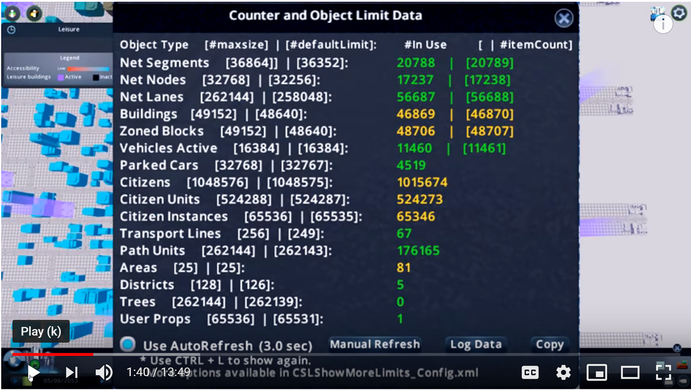

[up](https://mikewise2718.github.io/markdowndocs/)

# Intro
A Unity game - the spiritual sucessor to SIMCITY

# Mods
It's all about the mods
- Workshop <https://steamcommunity.com/app/255710/workshop/>
- Large Parking Garage: <https://steamcommunity.com/sharedfiles/filedetails/?id=485015540>
- Realistic walking speeds <https://steamcommunity.com/workshop/discussions/18446744073709551615/1733216893877711224/?appid=255710>
- Creating real maps using openstreet maps <https://steamcommunity.com/sharedfiles/filedetails/?id=1571369737>
- Debugging Joblessness <https://steamcommunity.com/sharedfiles/filedetails/?id=418467013>
- RICO (Residential, Industrial, Commercial, Office) <https://steamcommunity.com/sharedfiles/filedetails/?id=699584491>
- RICO Settings <https://www.reddit.com/r/CitiesSkylines/comments/7rlmkc/rico_settings/>
- Help with RICO <https://www.reddit.com/r/CitiesSkylines/comments/8auhg3/help_with_assets_and_rico_settings/>
- Some Youtube about RICO: <https://www.youtube.com/watch?v=42wcR4FBEVQ>
- Real Time <https://steamcommunity.com/sharedfiles/filedetails/?id=1420955187>
- crp parser <https://community.simtropolis.com/forums/topic/70728-crp-file-unpacker-prototype/>
- ModTools <https://steamcommunity.com/sharedfiles/filedetails/?id=450877484>
   - F7 opens debug log window
   - Ctrl-Q for  modtool options
 
 # Harmony Framework
 - Wierd stuff: <https://github.com/pardeike/Harmony/>
 - Transpilers: <https://gist.github.com/pardeike/c02e29f9e030e6a016422ca8a89eefc9>

# Important OSM MOds
- cimtographer <https://steamcommunity.com/sharedfiles/filedetails/?id=416064574>
- <https://www.spielerheim.de/forum/index.php?thread/6951-cimtographer-reales-stra%C3%9Fennetz-importieren/>
- OSM Import Instructions <https://github.com/rdiekema/cs-osm-import/wiki>
- Move It - Repo here: <https://github.com/Quboid/CS-MoveIt>
- Plop the Growables <https://steamcommunity.com/sharedfiles/filedetails/?id=924884948>
   - Discussion: <https://www.reddit.com/r/CitiesSkylines/comments/7l1owj/plop_the_growables/>

# Modding Docs
- Really great modding info <https://cslmodding.info/>
- Reddit Posts Tool <https://github.com/mabako/reddit-for-city-skylines>
- CRP file format <http://fileformats.archiveteam.org/wiki/Cities_Skylines_CRP>
- CRP file paths <https://skylines.paradoxwikis.com/User_path>
- Asset Editor <https://skylines.paradoxwikis.com/Asset_Editor>
- Importing OSM Maps <https://steamcommunity.com/app/255710/discussions/0/1456202492182996717/>

# What I used
 - Modding guide: <https://media.readthedocs.org/pdf/citiesskylinesmoddingguide/latest/citiesskylinesmoddingguide.pdf>
 - References (Assemblies) Import Dir: `C:\Program Files (x86)\Steam\steamapps\common\Cities_Skylines\Cities_Data\Managed`
 - Crash Dump locations: `C:\Program Files (x86)\Steam\steamapps\common\Cities_Skylines`
    - Same directory as game executable

# Github Repos

## System Info
- City Vitals Watch <https://github.com/rob-williams/CityVitalsWatchMod>
- System Time Clock - <https://github.com/drakargx/System-Time-Clock>
- Traffic Report (show routes) <https://github.com/lisa-lionheart/TrafficReport>

## Mod Programming Tools
- Remote Console - <https://github.com/skymodteam/skymod-remotecon>
- Mod Tools <https://github.com/Skylines-ModTools/Skylines-ModTools>
- Overwatch (watching over activeIDs in CS) <https://github.com/arislancrescent/CS-SkylinesOverwatch>
- Prefab hook <https://github.com/boformer/PrefabHook>
- Skeleton Source <https://github.com/SkylinesModEngineer/CitiesSkylinesSkeletonSrc>
- Options Framework <https://github.com/bloodypenguin/OptionsFramework>
- Crp parser Source (see above for link) <https://github.com/tony56a/crp-parser>

## Interesting Features
- Enhanced Garbage Truck <https://github.com/arislancrescent/CS-EnhancedGarbageTruckAI/blob/master/Dispatcher.cs>
- Real Time (real sleep, work, rush hour, etc) <https://github.com/dymanoid/RealTime>
- Precision Engineering <https://github.com/Simie/PrecisionEngineering>
- Unlimited outside Connections <https://github.com/bernardd/Crossings>
- Pedistrians Crossings <https://github.com/bernardd/Crossings>
- Sunshafts <https://github.com/bloodypenguin/Skylines-SunShafts/tree/master/SunShafts>
- Traffic Report (show routes) <https://github.com/lisa-lionheart/TrafficReport>
- Lane Changer <https://github.com/crispies/LaneChanger>

# Errors and fixes
- Problem: Got a lot of crashes with the error log indicating "Attempt to access invalid address" in  UnityFont:RequestCharactersInTexture
    - Solution: Stopped updating UI text in callbacks, that seems to stop it happening. Not 100 percent so far though.
- Problem: Mod Module.dll not loaded when I went in
    - Solution: Wasn't getting copyied to the right directory
- Problem: Webrequest fails with "The authentication or decryption has failed" when trying to Async download something
    - Solution: Mostly this <https://stackoverflow.com/a/33391290/3458744>
    - But it still happens sometimes, not sure what is going on

# C:S Limits

# OSM stuff
- How to use Overpass <https://blog-en.openalfa.com/how-to-query-openstreetmap-using-the-overpass-api>
- `http://overpass-api.de/api/interpreter/?data=node(47.6317,-122.1436,47.6463,-122.1208);out;`
- `http://overpass-api.de/api/interpreter/?data=(node(47.6317,-122.1436,47.6463,-122.1208);way(47.6317,-122.1436,47.6463,-122.1208););out;`

