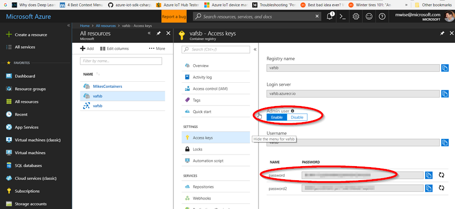

[up](https://mikewise2718.github.io/markdowndocs/)

# Intro
- Docker is a container service. Arguably *the* container service.
- Docker Cheat Sheet https://github.com/wsargent/docker-cheat-sheet#registry--repository
- This video is useful for getting startedhttps://www.youtube.com/watch?v=W3bk2pojLoU
- Docker containers vs. VMs https://stackoverflow.com/questions/16047306/how-is-docker-different-from-a-normal-virtual-machine?rq=1

# Concepts
* `dockerfile` - a list of commands that builds a series of images, resulting in a named image that you can use to start a container
* `image` - the bits that need to be instanced to form a container
* `dangling image` - an image without a name https://stackoverflow.com/questions/45142528/docker-what-is-a-dangling-image-and-what-is-an-unused-image
* `container` - an instance of a running or exited image
* `entry point` - the program that will be runing
* `tag` - Tag is alphanumeric identifier of the image within a repository like `vafsb/faketemp:latest`
* `numeric ID` - a 12 digit hex numeric id identifying a running or exited container like `15fa59af0e7d` 
* `container ID` - anothor word for numeric ID
* `container states` - containers can be "created", "up" or "exited" https://stackoverflow.com/questions/43734412/what-does-created-container-mean-in-docker
* `registry` - a Docker registry is a service that stores docker images like `vafsb.azurecr.io`
* `repository` - a collection of different images with the same nab, but that have different tags, like `vafsb.azurecr.io/faketemp`

# Questions
* What is the short name of the running docker container called? For example "edgeAgent" in IoT Edge. "Name" maybe? "ModuleID"?

# Useful articles and links
* Pruning images and containers - especially Ulises answer https://stackoverflow.com/questions/17665283/how-does-one-remove-an-image-in-docker
* What are \<none\>:\<none\> images - https://www.projectatomic.io/blog/2015/07/what-are-docker-none-none-images/

# Misc things to know
- Docker can't give you a listing of the remote repository via its CLI, you need to use the R
- Get rid of need for sudo on Linux
   -  `sudo usermod -aG docker user_name`  # add user_name to docker group
   -  `groups`                             # check your group membership
   -  `cut -d: -f1 /etc/group`             # list all groups on that machine 

# Windows
- Docker uses a single hyper-v, and thus is subject to any hyper-v nuances and limitations
- When docker is running there will be tray app running where you can get some info
- However most interaction with docker is via command line, be it cmd, PowerShell, or some form of bash
 
 # Basic commands
* `docker -?`                    (list all commands)
* `docker -v`                    (version)
* `docker version`               (long client/server version)
* `docker -p2`                   (list running containers)
* `docker search tensorvlow`     (search docker hub for an image)
* `docker ps`                    (see what containers are running)
* `docker ps -q`                 (see running containers but just show their numeric IDs)
* `docker kill containername`    (kill a particular container)
* `docker ps -a`                 (see running and exited container)
* `docker rm containername`      (remove an exited container)
* `docker -i`                    (allocate a pseudo-tty)
* `docker -t`                    (keep STDIN open even if not attached)
* `docker -e`                    (set environment variable)
* `docker images`                (list all the images)
* `docker images | grep vafsb`   (filtered image list)

# Copying stuff
* `docker cp CONTAINER:SRC_PATH DEST_PATH`

# Building
* `docker build -t tag .` (build an image using the Docker file in the cwd)

# Docker Daemon
- https://docs.docker.com/config/daemon/#configure-the-docker-daemon
- Directories:
    - `/var/lib/docker`
    - `c:\ProgramData\docker`
- Docker Daemon logs
    - SO Post: https://stackoverflow.com/questions/30969435/where-is-the-docker-daemon-log 
    - Ubuntu: `sudo journalctl -fu docker.service`
    - Windows (PowerShell): `Get-EventLog -LogName Application -Source Docker -After (Get-Date).AddMinutes(-5) | Sort-Object Time`

# Repositories
* `docker vafsb/faketemp login -u vafsb -p xxxxxxx`   (login)
* `docker pull vafsb/faketemp:arm-latest` (pull an image)
* For Azure Container Registries you need to enable the use of the registry name as a user
   * The password can be found there too - see below 
   

# Inspecting a docker image
* `docker image inpsect 19caaf3fbbf3`   # outputs various parameters formated in json
* `docker run -it f7190e39d56b bash`         # run an image, login to it and poke around

# Inspecting a running docker container
* `docker inpsect edgeHub`        # outputs various parameters formated in json
* `docker exec -it edgeHub bash`  # login to a running container and poke around

# Pruning and deleting things
* `docker rm -v $(docker ps -a -q -f status=exited)`  # delete all exited containers)
* `docker rm -f $(docker ps -qa)`                     # !!! delete all stopped and running containers !!!
- `docker rmi $(docker images -f "dangling=true" -q)` # prune dangline images             
- `docker rmi $(docker images --quiet test*)`         # prune images begin with word "test"

# Terminal commands
* `docker exec -it tf /bin/bash`  # Open a terminal on a docker
* `docker run -it f7190e39d56b bash`         # run an image, login to it and poke around

# Useful 
* `docker run --name tf -p:8888:8888 -v //d/tensorflow/notebooks:/notebooks tensorflow/tensorflow`
* `docker run --name tf -p:8888:8888 -v //d/tensorflow/boltzmann-machines:/rbms tensorflow/tensorflow`

# Remove all images with <none>
* `docker rm -v $(docker ps -a -q -f status=exited)`
* `docker rmi $(docker images | grep \<none\> | tr -s ' ' | cut -d ' ' -f 3)`

# Docker foreground/background process killing advice
- See the comments from GHETTO.CHILD in his answer
- https://stackoverflow.com/questions/32224101/kill-a-running-process-like-a-webserver-inside-a-docker-container-without-killin
docke

# Clearing logs
* Haven't found an explict way to do this, but stopping the tasks and deleting the exited containers does the trick.

# Docker and .NET core and Python
* Blog - https://andrewlock.net/exploring-the-net-core-docker-files-dotnet-vs-aspnetcore-vs-aspnetcore-build/
* Docker images for Python - https://snarky.ca/what-are-the-popular-docker-images-for-python/
* COTW - Container of the Week - https://elegantinfrastructure.com/tag/cotw/

# Important things to understand
* COPY vs. ADD - https://stackoverflow.com/questions/24958140/what-is-the-difference-between-the-copy-and-add-commands-in-a-dockerfile
* #(nop) - https://forums.docker.com/t/what-is-nop-and-where-does-it-come-from/32665
* Docker and TensorFlow - https://medium.com/@cswiggz/quick-start-to-tensorflow-in-docker-with-a-gui-39414245251f
