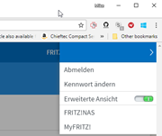
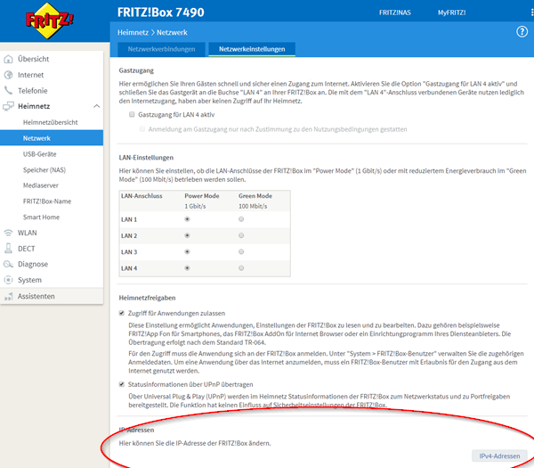
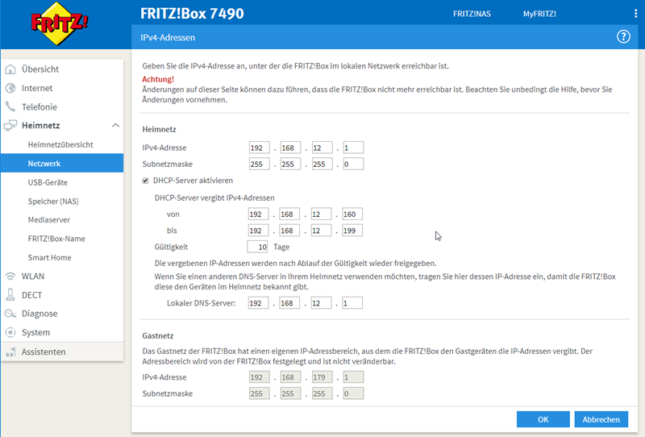
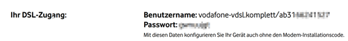
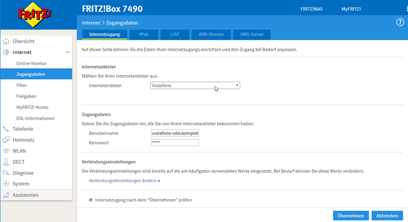
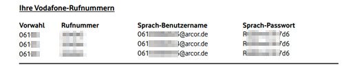
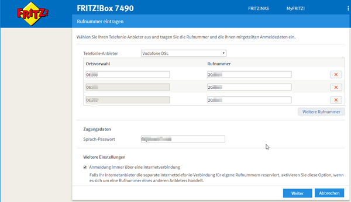
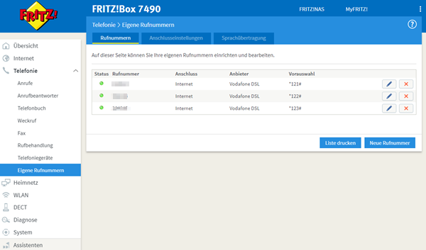

[up](https://mikewise2718.github.io/markdowndocs/)

# Intro
A ubiquitous router - in Germany at least.

# Inital Setup in your Local Network
1. The initial challenge is that you can't configure the FritzBox network settings without a network connetion to it. Chicken and Egg problem. 
    * In the past I have succedded with adding a network address that can talk to the FB default (192.168.178.1 or 169.254.1.1), but this does not always work for whatever reason.
    * so it is easist to set it up by connection to its Wifi because then there is no problem figuring out the IP address.
    * the FB default Wifi config information is usually printed on the box.
2. After you can get a web setup page  connection with http://frtiz.box (if you have DNS) or directly with http://168.254.1.1  
3. Next you will need to specify a password for login. Don't forget to remember it somehow (write it down?). 
4. The next thing is to enable the advanced menu settings by clicking on the top right menu like this:  . 
5. Then you want to go to Heimnetz/SomethingOrOther and set the IP address you want it to have in your network (like 192.168.12.1). 
. 
- Which then opens to this: 
. 

6. Note that in the above I also setup DHCP so that other devices would be serviced by this router.

7. Now you can wire it up to your LAN with a cable and you should be able to get to the setup with http://192.168.12.1  

# DSL
- Here is a section from the PDF letter with my signing data from Vodafone with my user data: 
. 

- I simply had to add my username and password - like this:  . 

# ISDN Phones
Turns out I didn't have an ISDN phone line anymore, I have only Internet telephony from Vodafone. Took me awhile to realize this.

- The sip numbers and their passwords from Vodafone looked like this: 
. 

- I had to enter these numbers inwith the FritzBox and the FritzBox had to register them with my provider (mVodafone). For my provider (Vodafone DSL) I only had to add the numbers and the password, becasuse it knew the pattern that vodafone uses: 
. 

- Looks like this now: . 

- Getting the wiring right was complicated. I need to use some kind of an adapter.

# Wifi
To do