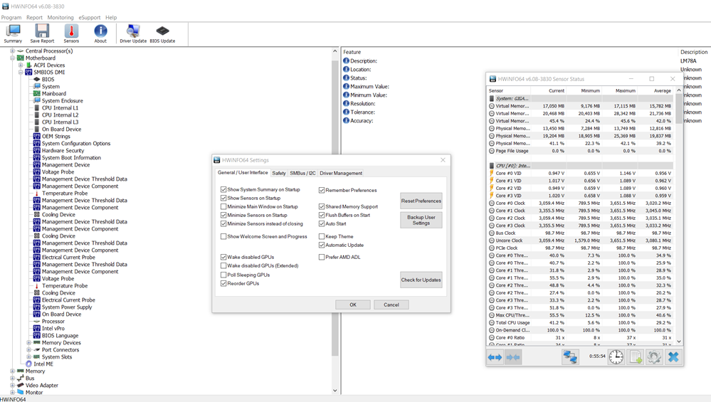
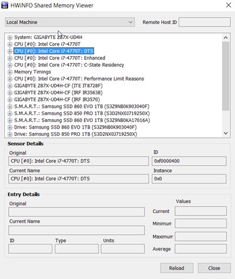
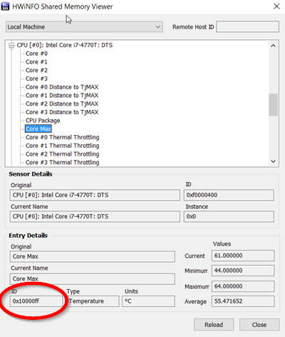

[up](https://mikewise2718.github.io/markdowndocs/)

# Intro
HWiNFO is a Windows only tool for reading sensor values - particularly those from the Motherboard, GPU, CPU, etc.

 - Main site: (https://www.hwinfo.com/)


# HwINFO Rainmeter Skin and Plugin
- The HwINFO Rainmeter Plugin seems to the best sensor reading system, even though it is not open source.
- The HWiNFO64 app needs to be installed and running for the HwINFO Rainmeter plugin to work in Rainmeter. See Below.
- Can configure with a right click on Skin Windows!!!! (keep forgetting this)
- Also the "Shared Memory" app needs to be installed. See furthur below.
- Everything is located in: `C:\Users\mike\Documents\Rainmeter\Skins\HWiNFO\`
- Demo skin location: `HWiNFO.ini`
- Skin measures reference variables location: `@Resources\HWiNFO.inc`
- Values for those measure referenc variables can be found in the HwINFO Shared Memory Viewer described below.
- Default skin has sections for
  - CPU0 (worked fine but temp did not work)
  - GPU0- is the Intel GPU that is on my Mobo, HwINFO seemingly doesn't see its sensors 
  - GPU1 - My MSI 1060 worked fine
- Remote Machine windows - didn't configure any, no Linux monitors apparently


# Installing Skin
- Instructions were broken because the web site was changed and google was confused
- Plugin installation instructions:
- The instructions were broken, but I got it installed by the following 
- Downloaded the `HWiNFO.zip` file
- Unpacked it
- Copied the `HWiNFO` subfoldoer containing the `HWiNFO.ini` file and a subfolder called `@Resources` 
the `Documents\Rainmeter\Skins` subfolder
- Look for errors in Rainmeter log (open Rainmeter from Tray (raindrop icon), `Manage` Rainmeter, `Open Log` button towards the bottom)
- 126 load error means it can't find the plugin dll
- Useful discussion of where plugin dlls go (https://forum.rainmeter.net/viewtopic.php?f=103&t=22019&sid=8e218e71d52c0edb378e052012598c26&start=10#p116764)
  - Plugins dlls that come with Rainmeter go directly into  `C:\Program Files\Rainmeter\Plugins`
  - custom Plugins dlls go directly into  `C:\Users\YourName\AppData\Roaming\Rainmeter\Plugins`

# HwINFO App
- Has blue icon when running, can be viewed in tray.
  - Keystrokes: `Alt-Windows Key-HwInfo`
- This is how it needs to be configured
   - "Minimize Sensors instead of Closing" is checked
   - "Shared Memory support" is checked<br>

- Some rather old docs in a forum from the author (https://www.hwinfo.com/forum/Thread-Rainmeter-plug-in-for-HWiNFO)
- New docs (pointing out how badly documented it is) (https://www.hwinfo.com/forum/Thread-Getting-Started-Confusion)

# HwINFO Shared Memory Viewer
- Seperate app to view the Shared Memory values with purple instead of blue icon.
  - Keystrokes: `Alt-Windows Key-HwInfoShared`
  - Looks like this:<br>
   
- The CPU temp was not registering, we had to make the following change to HWINFO.Inc:
```
C:\Users\mike\Documents\Rainmeter\Skins\HWiNFO\@Resources>diff HWiNFO.inc HWiNFOorig.inc
11c11
< HWiNFO-CPU0-DTS-CoreMax=0x10000ff
---
> HWiNFO-CPU0-DTS-CoreMax=0x100007f
```
- The values was found using the HwINFO Share Memory Viewer here:<br>
 

# Installed and first draft on 2019-06-24
- Rudimentary docs

# 2019-07-10
- retrived documented what I did back then 

## To Do
- Get rid of the unused windows (check)
- Add wattage values (check)
- Add new windows for all 4 different cores 

# 2019-07-31
- Setup remote monitoring on Nyx

# 2019-08-01
- Upgraded to 6.10
- 


