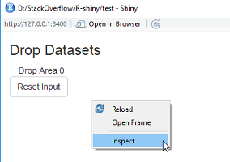
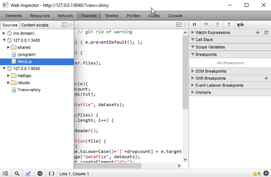
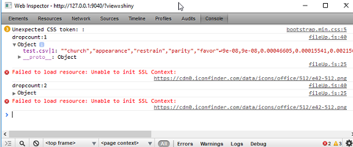

[up](https://mikewise2718.github.io/markdowndocs/)

# In general
JavaScript is not my favorite language, but I think it has some great features. It is in many ways close to being a functional language than the C dervitive that it pretends to be. But it has a lot of gotchas. Typescript, Microsoft's typed variant of Javascript is probably a better engineering language, if that is what you need. I mostly use it for hacking user interface stuff in R.

#  Good JavaScript links
Fizzbizz and other things you should remember: [link](https://ilikekillnerds.com/2015/03/things-every-javascript-developer-should-know/)
7 JavaScript Things I Wish I Knew ealier: [link] (https://www.smashingmagazine.com/2010/04/seven-javascript-things-i-wish-i-knew-much-earlier-in-my-career/)

#  Javascript with VS Code
VS Code works find with JavaScript, but I am not going into that now.

# Console
You debug using the JavaScript console which most browsers support well. Should have a page just on using it as I always have to relearn stuff there.

# Events
I recall there are two families of events - but somehow I can only find one now:
[DOM events](https://en.wikipedia.org/wiki/DOM_events)

# Shiny
There are several ways to integrate javascript into shiny. 

- shinyjs - One uses the shinyjs package, you can keep the code inline and is best for Stackoverflow as it can all stay in an single file. Here is a simple example where it is used: [shinyjs example](http://stackoverflow.com/questions/41400107/). The disadvantage is you have to be careful with quotes and can only use one kind - and sometimes you can not do this. 

 - js files - Another way is to put the javascript into a file and put the file in a www subdirectory where the server/ui/shinyApp file resides. Seemingly this does not have to be the working directory - at least for R-Studio (which is a bit odd I find, but I guess it knows where the file was last saved). An example of this can be found here:
 [js file in www example](http://stackoverflow.com/questions/43819250/r-shiny-input-reactivity-error-on-drag-and-drop/43822586#43822586)

 -  You can also use a script tag directly, although this also has the quotes issue.
 [tags$script example](http://stackoverflow.com/questions/43392748/automatically-scroll-on-button-click-in-shiny/43432462#43432462)

# Javascript, CSS, and HTML
The unholy trinity. One needs to know them all, and they are quite different. Enough said for now.

# HTML DOM model
HTML uses the famous DOM model. A lot of it functionality is becoming obsolset as various javascript libraries are written to do the same things better. It is quite hard to keep up.

Dom Events:
The Wikipedia article is quite good: https://en.wikipedia.org/wiki/DOM_events

# jQuery

Is a powerful library to search and maniuplate the DOM model. Some important things:
A basic call:
```
 jQuery('#drop-area').html(txt);   // sets the innerhtml to be whatever is in txt
 $('#drop-area').html(txt);   // the elite way to write it (dollar sign magic)
```

It is important to realize that a jQuery returns a different kind of object that a DOM query like document. Mixing methods can be tricky.

A page cannot be manipulated until it is ready. There is a jQuery function for this. It is where you normally assign all the event handlers on a page to do your magic. https://learn.jquery.com/using-jquery-core/document-ready/ 
```
 $( document ).ready(function() {
    console.log( "ready!" );
});

// The elite way to write this:
$(function() {
    console.log( "ready!" );
});
```
For more on $ vs. $() look at this: https://learn.jquery.com/using-jquery-core/dollar-object-vs-function/

jQuery FAQs: https://learn.jquery.com/using-jquery-core/faq/


# Debugging
THere are integrated debuggers in practically every browser and in R-Studio as well. Simply click on the running program and click Inspect.



Once there you can find the code you loaded in the source menu:



your javascript can output to the console.log which can be found here too. This also should be checked for various error messages. If you output an object with console.log you can drilldown which is highly useful for figuring out what is going on:


