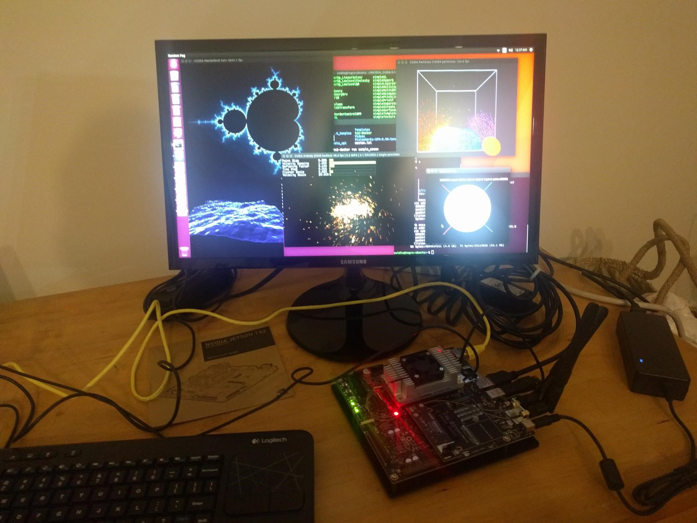

[up](https://mikewise2718.github.io/markdowndocs/)

# Intro ()
- The Nvidia Jetson TX2 is an embeded ARM device for High Performance Computing on the IoT edge. 
- It runs Linux 4 Tegra (L4T) which is an Ubuntu derived Linux distirubtion running on ARM.
- The actualy module is quite small, but the Dev Kit contains a carrier board which is a little ITX form factor main board that hosts it.
* You can pretty much only manage it with another Ubunut computer.
* I suppose you could get it to work from a VM - but since Hyper-V doesn't play that well with USB devices, it might be a challenge.
* A lot of information carries over from the Jetson TX1 which had the same carrier board.
* It only runs with Docker as of Jetpack 28.2 released for preview in Dec 2017
* Useful Docs:
  * Uboxing the TX2 is [here](https://www.youtube.com/watch?v=kl2rMlHde4k)
  * Putting Jetson in [forced recovery mode](https://www.youtube.com/watch?v=4JUWS9i_FCQ)
  * Installing Docker is [here](https://github.com/Technica-Corporation/Tegra-Docker)

# Installation of L4T and CUDA on the TX2
* Docs (not that up-to-date) are [here](http://docs.nvidia.com/jetpack-l4t/2_1/content/developertools/mobile/jetpack/jetpack_l4t/2.0/jetpack_l4t_install.htm)
* They assume you are doing this from another Ubunu ucomputer called the "host", the Jetson is called the "target"
* Apparently it comes with the operating system installed, but I never saw it, somehow I only got my HDMI monitor to display it after I had flashed it once.
* You download a Jetpack package and kick off the installl by setting the x flag and running it
* The install has three parts
  1. An installation of various things on the Ubuntu Host computer.
  2. The target machine gets flashed with the new version of L4T which goes over a USB/Micro-USB cable.
  3. Post-installation steps install things like CUDA, etc after that which require that the machines talk over IP.
* To redo an installation you need to nuke a hidden (I think) install directory(named _installer) that is owned by a "dip" user.
* It can be difficult to figure out what ethernet interfaces are what, the two shorter ones turned out to run over the USB cable (, the longer one turned out to be running from my usb/ethernet adapter, and the one starting with "w" was the wifi.
  1. enp0s20u2 - this was associated with the host USB to target USB-micro connnection
  2. enp0s20u2i5 - this was also associated with the host USB to target USB-micro connnection
  3. enx00b56d02715f - this was assocoated with the host USB-ethernet adapter to target ethernet connection
  4. wlp3s0 - this was associted with the wifi connection
* Oddly, installing the Jetpack seems to be the only publicly supported way of getting CUDA on a TX2 - see [this](https://devtalk.nvidia.com/default/topic/1001520/setting-up-cuda-manually-on-tx2/)
* Details about what the post-installation does can only be obtained by inspecting the code in that directory. Someone does it [here](https://devtalk.nvidia.com/default/topic/982848/jetson-tx1/tx1-specific-arm64-deb-repo-for-cuda-8/post/5063053/#5063053) for examples.
* The login is then user:nvidia, password:nvidia
* In the root directory is a program "tegrastats" that can be used to show the utilization of the CPU and CUDA cores, temperature, etc.
* Compiled CUDA examples can be found under ~/NVIDIA_CUDA-9.0_Samples/bin/aarch64/linux/release", the one to start with is "deviceQuery" which shows Cuda Capability states.
* A lot of the examples use OpenGL (like OceanFFT) which are cooler to look at.



# Installation of Docker on the TX2
Not really that trival, described in some detail in the github repo [here](https://github.com/Technica-Corporation/Tegra-Docker)
* That description has two parts
   1.  one on compling a kernal from scratch on a host computer that has the setting necessary to support docker. This is no longer necessary since Jetpack 28.2.
   2. one on actually installing docker on the TX2 and running "deviceQuery" in that container.
   3. The scripts there do not actually run CUDA samples using OpenGL, I made some modifications that handle that as well, see my entry under the issues tab on the above repo.


# Installation of CudNN
- You have to install the sources and build it - don't forget to build the samples
- the docs are here: http://docs.nvidia.com/deeplearning/sdk/cudnn-install/index.html
- You can test it with the mnist example

# Installation of Tensorflow
- You need to download this guy's pip wheels and install from there
  - git clone https://github.com/peterlee0127/tensorflow-nvJetson
  - He lists what combinations of Jetpack, cuDNN, Cuda, and Python he managed to get to to work - stick with those versions

# Installation of Object Detection Zoo
  - git clone https://github.com/tensorflow/models/object_detection
  - Follow the instructions in the readme page
  - Needed to install coco api
    - see instructions
    - need to install cython
      - pip install cython


# Installing as IoT Edge device (22 Mar)
The usual spiel with a few things
- I still had the Jetpack 28.2 preview from Dec 2017 installed on my jetson Tx2
- Installing  order to get the to work
- I had to do add the following packages to get azure-iot-edge-runtime-ctl to install
   - `sudo apt-get update && sudo apt-get install libffi-dev`
   - `sudo apt-get install libssl-dev`
   - then finally `sudo pip install -U azure-iot-edge-runtime-ctl`
- The default docker image is only for x64 so you have to pick a new image from 
   - [https://hub.docker.com/r/microsoft/azureiotedge-agent/tags/)]
   - Note there is no arm64 runtime yet (this will be a problem I think)
   - Then you have to edit the json configuration 
   - It is in `/etc/azure-iot-edge/config.json`
   - You will also need this guy [https://hub.docker.com/r/microsoft/azureiotedge-hub/tags/] 

These are the current contents of config.json:
```
{
  "deployment": {
    "docker": {
      "edgeRuntimeImage": "microsoft/azureiotedge-agent:1.0.0-preview021-linux-arm32v7",
      "loggingOptions": {
        "log-driver": "json-file",
        "log-opts": {
          "max-size": "10m"
        }
      },
      "registries": [],
      "uri": "unix:///var/run/docker.sock"
    },
    "type": "docker"
  },
  "deviceConnectionString": "HostName=MikesIoThub1618.azure-devices.net;DeviceId=joltik-l4t-aarch64;SharedAccessKey=xxxxxxx",
  "homeDir": "/var/lib/azure-iot-edge",
  "hostName": "tegra-ubuntu",
  "logLevel": "info",
  "schemaVersion": "1",
  "security": {
    "certificates": {
      "option": "selfSigned",
      "selfSigned": {
        "agentCAPassphraseFilePath": null,
        "deviceCAPassphraseFilePath": null,
        "forceNoPasswords": true
      },
      "subject": {
        "commonName": "Edge Device CA",
        "countryCode": "US",
        "locality": "Redmond",
        "organization": "Default Edge Organization",
        "organizationUnit": "Edge Unit",
        "state": "Washington"
      }
    }
  }
}
```
