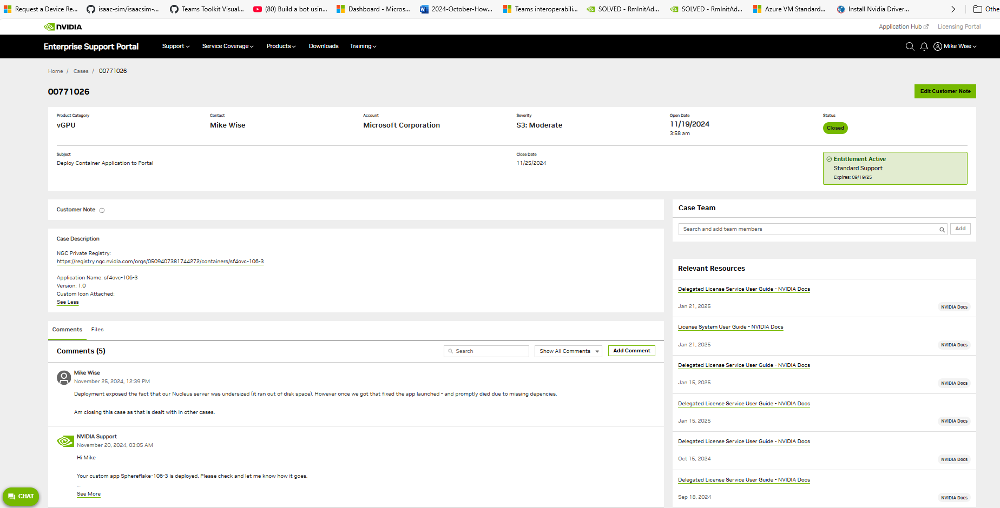

[up](https://mikewise2718.github.io/markdowndocs/)

# Intro
- Nvidia's Omniverse

# Docs
- Omniverse API docs: (https://docs.omniverse.nvidia.com/kit/docs/kit-manual/latest/API.html)

- Frequently used snippets: (https://docs.omniverse.nvidia.com/app_isaacsim/app_isaacsim/reference_python_snippets.html)
- Omni Cheat Sheet (a bit old): (https://mtw75.medium.com/omniverse-kit-cheat-sheet-9d2a7cce9fb)
- USD Cookbook: (https://github.com/ColinKennedy/USD-Cookbook)
- Finding commands (search in commands): (https://forums.developer.nvidia.com/t/is-there-a-naming-convention-for-commands-in-omni-kit-commands/212926)
- Packman - (https://packman.readthedocs.io/en/latest/)
- View Navigation Basics - (https://www.youtube.com/watch?v=kb4ZA3TyMak)
- Camera Tool - (https://www.youtube.com/watch?v=mAcFVeb0MsE)
- Licensing -(https://www.nvidia.com/en-us/omniverse/download/)
- OV Code Samples - (https://docs.omniverse.nvidia.com/dev-guide/latest/programmer_ref.html)

# Configuration
- look in `C:/User/mike/.nvidia-omniverse/config/omniverse.toml`
- Date seems to be updated at boot time?
```
[bookmarks]
localhost = "omniverse://localhost"
"nucleus.azurenucleus.co.uk" = "omniverse://nucleus.azurenucleus.co.uk"

[cache]
data_dir = "D:\\nv\\ov\\cache\\Cache"
proxy_cache_enabled = false
proxy_cache_server = ""

[connection_library]
proxy_dict = "*#localhost:8891,f"

[paths]
cache_root = "D:\\nv\\ov\\cache"
confirmed = true
content_root = "H:\\Omniverse"
data_root = "D:\\nv\\ov\\data"
extension_root = "C:\\Users\\mike\\Documents\\kit\\shared\\exts"
library_root = "D:\\nv\\ov\\pkg"
logs_root = "C:\\Users\\mike\\.nvidia-omniverse\\logs"
```

# UI docs
- Omni.ui (https://docs.omniverse.nvidia.com/kit/docs/omni.ui/latest/omni.ui.html)
   - Overview: (https://docs.omniverse.nvidia.com/kit/docs/omni.ui/latest/Overview.html)
   - Uses imgui under the hub (I think) (https://github.com/ocornut/imgui)
- Went dumpster diving in `_ui.pyi` to find various things like how to find a window handle
   - Get there by going to the definition of `ui.Window`
   - The function in question was `handle = ui._ui.Workspace.get_window(wintitle)`

```
    def DockWindow(self, wintitle="Property"):
        print(f"Docking to {wintitle} (trc)")
        handle = ui._ui.Workspace.get_window(wintitle)
        self.dock_in(handle, ui._ui.DockPosition.SAME)
        self.deferred_dock_in(wintitle, ui._ui.DockPolicy.TARGET_WINDOW_IS_ACTIVE)
```

# Omniverse Launcher
- Overview (https://docs.omniverse.nvidia.com/launcher/latest/index.html)
- Download (https://www.nvidia.com/en-us/omniverse/download/)
- An OV installation always starts with launcher installation
- There is a cleanup tool will delete everything  installed, this is how you "reinstall Omniverse"
- To get version see "profile-man/About"
- !!! Make sure you backup your code, it does delete things and it isn' clear exactly what!!!!
- Need to know your library path, data path, and cache path - see "profile-man/Settings"
  - library path: `d:\nv\ov\pkg`
  - data path: `d:\nv\ov\data`
  - cache path:
  - content path: `h:\Omniververse``
- Cleanup tool: ((https://docs.omniverse.nvidia.com/utilities/latest/cleanup-tool.html))
- There are brainshark videos on how to configure it
- Launcher plays a key role in not only launching, but also building apps
   - Building apps seem to connect to it at build time
   - It seems to connects to a central OV website and attempt to satisfy missing python and other references
   - Building apps Create 2023.1.0 didn't work with the newest version of the OV launcher (1.8.11 probably) so downgrade to 1.5.7
- Old launcher versions: ()

# Interesting Extesions
- Omni Replicator - shows how it gets hooked into the Window menu

# Stage Events
- Stage isn't consturcted until around 16 seconds (Create 2022.3.3)
- 

# Installing
- Can't remember how I installed it
- There is a "Cleanup tool", which doesn't exactly deinstall it but puts things in the launcher back to before anything was installed
- So probably the install program just installs the launcher

# Nucleus
- Localhost sometimes needs you to log in again:
   - Typical prompt `http://localhost:3180/?server=localhost&nonce=d32cdaca93d245a29e7fc010f0f90ac33975d30900834e3f8975d7b69f66ac6b`

# Version numbers
- There are a lot of them
- Kit - was using 104.2 (I think), now up to 105.0
    - 104.2 used USD version ?? and Python 3.7
    - 105.0 uses USD version 22.1 and Python 3.10

# Doc Problems
- "NoSuchKey" Broken links:
   - 
```
404 Not Found
Code: NoSuchKey
Message: The specified key does not exist.
Key: kit/docs/repo_docs/0.33.1/docs/DoxygenGuide.html
RequestId: 6QQZB8Z03XV0E6MN
HostId: x7pR37eMNpEJANFydOnn6ItWw7oGVL7J2MrLBDZ1YqdVpe4CT4/xj3imniTQXID3lz07zFlqYlQ=
```

- Incomplete Links
   - "No module docstring provided" - (https://docs.omniverse.nvidia.com/kit/docs/kit-manual/latest/API.html)
   - `omni.ui` not listed at all


# Extensions
- There are a few of these too (like Apps below)
- Extensions in depth (https://docs.omniverse.nvidia.com/kit/docs/kit-manual/latest/guide/extensions_advanced.html)
- there is `kit-extension-template` (https://github.com/NVIDIA-Omniverse/kit-extension-template)
- There is C++ `kit-extension-template-cpp` (https://github.com/NVIDIA-Omniverse/kit-extension-template-cpp)
  - Docs:(https://docs.omniverse.nvidia.com/kit/docs/kit-extension-template-cpp/latest/index.html)
- There is an example extension (omni.hello.world) in the app template `kit-project-template`


# Debugging Extensions
- Debugging: (https://docs.omniverse.nvidia.com/extensions/latest/ext_vs-code-link.html)
- Need to enable the Omniverse VS Code Link extensions
   - KIT DEBUG VSCODE and A DEBUGGER FOR PYTHON
   - Can find them by filtering on the word "debug"
   - When enabled there is a VS Code Link window with useful status info (like attached or not)
   - see link above for more info
- `launch.json` for debugging an extension - seems some of these parameters are obsolete
```
{
  "version": "0.2.0",
  "configurations": [
    {
      "name": "Python: Attach (bla bla)",
      "type": "python",
      "request": "attach",
      "localRoot": "${workspaceFolder}",
      "remoteRoot": "${workspaceFolder}",
      "port":3000,
      "host": "localhost",
      "subProcess": true,
      "runtimeArgs": [
        "-preserve-symlinks",
        "-preserve-symlinks-main",
      ]
    }
  ]
}
```
# Apps
- There are at least two:
  - https://forums.developer.nvidia.com/t/comparison-between-kit-app-template-and-kit-project-template/271512
  - `kit-app-template` - (https://github.com/NVIDIA-Omniverse/kit-app-template)
      - see readme
      - Think it works with 104 better than with 105
      - https://docs.omniverse.nvidia.com/kit/docs/kit-app-template/latest/intro.html

  - `kit-project-template` - (https://github.com/NVIDIA-Omniverse/kit-app-template)
      - https://docs.omniverse.nvidia.com/kit/docs/kit-project-template/latest/tutorial.html
      - Think it might be version 105 only


- Kit app template github (readme is great): (https://github.com/NVIDIA-Omniverse/kit-app-template)
   - To start the base app: `_build\windows-x86_64\release\my_name.my_app.bat``
   - To start the base viewport app: `_build\windows-x86_64\release\my_name.my_app.bat`
   - To start the base viewport app: `_build\windows-x86_64\release\my_name.my_app.viewport.bat`

- All live in `c:\users\mike\AppData\local\ov\pkg\*`
- For Spearrow I installed into `d:\nv\ov\pkg`
- Launcher lives elsewhere `c:\users\mike\AppData\
- Command line: (Where did I get this?)
   - `"C:\Users\mike\AppData\Local\ov\pkg\create-2022.2.0\kit\kit.exe"  "C:\Users\mike\AppData\Local\ov\pkg\create-2022.2.0\apps/omni.create.kit"  `
- Kit App initialization and configuration explained: (https://docs.omniverse.nvidia.com/kit/docs/kit-manual/latest/guide/configuring.html)
- Omniverse Laucher using Create "Launch" button starts `D:\nv\ov\pkg\create-2022.3.3\omni.create.bat`
- There are alternate bats you can launch from instead
Original `omni.create.bat`:
```
@echo off
setlocal
call "%~dp0kit\kit.exe" "%%~dp0apps/omni.create.kit"  %*
```
Paul Rance's:
```
call "%~dp0kit\kit.exe" "%%~dp0apps/omni.create.kit" --/exts/omni.ui/raster/default_rasterpolicy_enabled=true --/renderer/multiGpu/enabled=true --/exts/omni.kit.widget.graph/raster_nodes=true %*
```


# Expanding a hard disk
- Link: (https://learn.microsoft.com/en-us/azure/virtual-machines/linux/expand-disks?tabs=ubuntu)
- Inastalled `az cli`
- power shell prompt is best
- `az login`
```
PS C:\Users\mwise> az vm list -g ov-rg --query "[].id" -o tsv
/subscriptions/f537e965-f080-4572-ba15-f6fcd113fe35/resourceGroups/ov-rg/providers/Microsoft.Compute/virtualMachines/vdi-ov-mw
/subscriptions/f537e965-f080-4572-ba15-f6fcd113fe35/resourceGroups/ov-rg/providers/Microsoft.Compute/virtualMachines/vdi-ubu22-mw
PS C:\Users\mwise>
```


# Making a Kit App (106)
- I forked it first ....
- Clone the kitapp repo - maybe give it a new name (here `sf4ovc`) and make a new branch to track changes
   - `git clone -b 106.0 https://github.com/NVIDIA-Omniverse/kit-app-template.git sf4ovc`

   - failed with a dependency conflict message

# Making a Kit App (106.3)
   - Following docs at: (https://docs.omniverse.nvidia.com/kit/docs/kit-app-template/latest/docs/kit_sdk_overview.html#hands-on-exploration)
   - And email at:
 ## Making the Kit App
   - `git clone https://github.com/NVIDIA-Omniverse/kit-app-template.git sf4ovc-106-3`
   - `./repo.sh template new`
       + name is `msft.sphereflake22`
       + display name is `Sphereflake22`
       + version is `1.0.1`
   - `./repo.sh build`
       + Downloaded a bunch of stuff and took 87 secons to build
   - `./repo.sh launch -d`
       + Launched in developer mode
       + Enabled extension `omni.kit.collaboration.channel_manager`
       + Exited app
   - Added `sphereflake22` to the newly created `_build/linux_x.../release/exts`folder
       + `cd release/exts`
       - `git clone https://github.com/mikewise2718/sphereflake22`
   - kit files are in ./source/apps
   - Modified the `[dependencies]` in the kit streaming app (actually did it to both kit apps)
       +   `"sphereflake22" = {}`
       +   `"omni.kit.collaboration.channel_manager" = {}`
   - Tested
       + `./repo.sh launch`
       +
 ## Packaging the Kit App
-`./repo.sh package --container --name sf4ovc-106-3:0.1`
- `./repo.sh launch --container --name sf4ovc-106-3:0.1`
- if the repo package tpp; is still broken
   - copy over repo_tools.toml from a working version
   - replace the repoman subdir where all the tools are
   - note that package changed (a new file had been added) so I had to copy the package.py over localpack.py
- then use localpack
- select the kit option that has the streaming enabled !! Important
- start it and test
   -
- to test need to use the webviewer
   - github repo at `https://github.com/NVIDIA-Omniverse/web-viewer-sample`
   - `cd apps/web_viewer_sample`
   - `npm run dev`

- Then run it
   - `./repo.sh launch --container`
   - it will ask you which container to run, make sure it is the one built with the streaming option

# Uploading the container to OVC
   - Login to the IAI Dev sub and start vm_nucleus
   - connect the to the `vnet-ovc` VPN with the Azure VPN Client
   - should get a list of uploaded containers you can start
   - now go to the box you built it on
   - `docker login nvcr.io`
   - "Username: $oauthtoken"
   - "Password: < Insert private key here >"
   - Identity Private key comes from somewhere in the NGC site
   - in the following 05...72 is my org id,retrieved from my NGC profile
   - `docker tag sf4ovc-106-3r:latest nvcr.io/0509407381744272/sf4ovc-106-3r:1.0`
   - `docker push nvcr.io/0509407381744272/sf4ovc-106-3r:1.0`


# NGC Login
- Link: (https://org.ngc.nvidia.com/)
- Service is confusing opening screen is "getting started stuff"
- To get to dashboard
   - Scroll down and find "CLI" tile
   - CLick on "Download" link in that tile
- Service keys can be found from dashboard - but they are not identity keys
- To generate a personal identity key
   - Click on user name in the upper right
   - In the dropdown click "Setup"
   - Click on "Generate Personal Key"
- To see all personal identity keys
   - Click on Users
   - Click on your name
   - Click on "Personal Keys" tab

# Nvidia Enterprise Support Portal
   - Link: https://enterprise-support.nvidia.com/s/
- Go to cases
- Click on filter
   - On left activate Filter
   - Filter on "Case Owner"
   - Select radio button "My Cases"
   - Currently have 7 of them


    - Submit case:



#  OVC docs
Procedure:
- Install Kit 105.1
- make an extension template `./repo.sh template new` (to make a new extension)
- build `./repo.sh build`
- see what it builds - these are defined in `premake5.lua`
    - `ls ./_build/linux-x86_64/release/*.sh`
- run it `./_build/linux-x86_64/release/my_name.my_app.sh`
- trim excess builds from `premake5.lua`
- fat package it `./repo.sh package`
-

- KAT 105.1 howto - https://docs.omniverse.nvidia.com/kit/docs/kit-app-template/105.1/app_from_scratch.html
- packaging it: `https://docs.omniverse.nvidia.com/kit/docs/kit-app-template/105.1/packaging_app.html`
- containerizing - `https://docs.omniverse.nvidia.com/ovc/latest/developing_for_ovc/containerizing_val.html`cd sf
- uploading - `https://docs.omniverse.nvidia.com/ovc/latest/developing_for_ovc/uploading_pub.html`

# Kit docs
- Companion Tutorial (good) - https://docs.omniverse.nvidia.com/kit/docs/kit-app-template/latest/docs/intro.html


# Streaming
- This changes a lot
- Apparently obsolete - works up to Kit version 105 - does not work with 106 and above
   - https://docs.omniverse.nvidia.com/extensions/latest/ext_livestream/webrtc.html
- Designed for kit template and version 106:
   - https://github.com/NVIDIA-Omniverse/web-viewer-sample
   - requires Node.js installation (https://nodejs.org/en/download)
   - Windows
   ```
   # installs fnm (Fast Node Manager)
   winget install Schniz.fnm
   # configure fnm environment

   fnm env --use-on-cd | Out-String | Invoke-Expression
   # download and install Node.js
   fnm use --install-if-missing 20

   # verifies the right Node.js version is in the environment
   node -v # should print `v20.18.0`

   # verifies the right npm version is in the environment
   npm -v # should print `10.8.2`
   ```
   - Linux
   ```
   # installs fnm (Fast Node Manager)
   curl -fsSL https://fnm.vercel.app/install | bash

   # activate fnm
   source ~/.bashrc

   # download and install Node.js
   fnm use --install-if-missing 20

   # verifies the right Node.js version is in the environment
   node -v # should print `v20.18.0`

   # verifies the right npm version is in the environment
   npm -v # should print `10.8.2`
   ```
   - Activate with `source ~.bashrc` this should have the `eval "``fnm env``"` command in it
   - Compile with `npm install`
   - Run with `npm run dev`


# Versions
Isaac Sim 2023.1.0-hotfix.1 (2023.1.0-rc.42) uses Kit 105.1 and Client Library 2.38.7
Isaac Sim 2023.1.1-rc.8 uses Kit 105.1.2 and Client Library 2.38.12
Isaac Sim 4.0.0-rc.21 uses Kit 106.0.0 and Client Library 2.47.1
Isaac Sim 4.1.0-rc.7 uses Kit 106.0.1 and Client Library 2.49.0
Isaac Sim 4.2.0-rc.17 uses Kit 106.1.0 and Client Library 2.49.2


# App Adaptation (104 - so the kit-app-template repo)
- This was my first pass and NOT how it was intended to be used.
- To see how you really do it, just read the instructions....

- An app will come with lots of names that are inappropriate (like "my_name_, "my-app", etc.) so it must be adapted
- To deploy a new app, first clone the latest kit-app-template (https://github.com/NVIDIA-Omniverse/kit-app-template.git)
- You can test by runing  `build.bat` and you should do this before you clone it again and rename it
   - There are three apps it builds, you can run them sa folows:
      - `_build\windows-x86_64\release\my_name.my_app.bat`
      - `_build\windows-x86_64\release\my_name.my_app.viewport.bat`
      - `_build\windows-x86_64\release\my_name.my_app.editor.bat`
- Don't delete this, use it as a reference to debug things if you break it while editing the config files during adaptation
- Now reclone it into another directory
- Rename the directory to a better name for the app (in my example sfapp)
- Now in the root directory edit the `premake5.lua` and change the names appropriately (I used `wise.sfapp` instead of `my_name.my_app`)
   - `define_app("my_name.my_app")`
   - `define_app("my_name.my_app.viewport")`
   - `define_app("my_name.my_app.editor")`
- In the `../source/apps` subdirectory change the names of the kit files in the same wayapproprately
  -`my_name.my_app.editor.kit`
  - `my_name.my_app.kit`
  - `my_name.my_app.viewport.kit`
- In those `.kit`` files you will want to edit some of the fields like:
  - `title`
  - Maybe some of the dependincies
- There is a startup extension that creates and positions the windows etc.
  - It is called `myapp.startup`
- You may want to change the "Base App" from which this app will draw its extensions (default is `create`). This is set in `repo.toml`
  - This is documented in the `README.md``
- Setup extensions:
  - `my_name.my_app.setup-1.0.0`
  - `wise.sfapp.view-1.0.0` (this doesn't seem to be an actual extension - it has the word "Launch" on it's extension page for example)
  - `omni.code.app.setup` is the one for code, fwiw
  - Layouts can be saved in the setup extension
- Configuring the extensions you want
 - In the `source/app.kit` file you can list the dependencies
 - Copy in entries from the "Base App" configuation kit file you based it on
 - In my case that is `d:\nv\ov\pkg\code-2022.3.3\apps\omni.code.kit`
 - I copied in `# Microservices`
 - Note that it will fail to load if an extension is listed twice
```
[dependencies]
# Create Kit UI Based applications
"omni.kit.uiapp" = {}
"omni.kit.renderer.core" = {}

# Microservices
"omni.services.transport.server.http" = {}
```


# Timeline Window
- Not a lot of docs: (https://docs.omniverse.nvidia.com/extensions/latest/ext_animation-timeline.html)
- YouTube: (https://www.youtube.com/watch?v=0RRobfS0UgQ)
- Looks most like Maya Timeline
- Good video on Maya Timeline: (https://www.youtube.com/watch?v=SYuaAMHzY_8)
- Another one: (https://www.youtube.com/watch?v=Q6MTI7_zLS0)
- PlayHead, Keys, etc.
- Can select keys with "Shift Select"

# Nvidia Sales Docs (pretty good)
- Brainshark: (https://www.brainshark.com/1/learning/en/my-enrollments)


# Extensions
- Docs: (https://docs.omniverse.nvidia.com/kit/docs/kit-manual/latest/guide/extensions_advanced.html)
- Extension


# Connectors
- docs: (https://docs.omniverse.nvidia.com/connect/latest/connect-sample.html)
- Connectors use the "Omniverse Client Library" - (https://docs.omniverse.nvidia.com/kit/docs/client_library/latest/index.html)
- Creating a USD app from the connect sample: (https://forums.developer.nvidia.com/t/creating-an-omniverse-usd-app-from-the-connect-sample/189557)
- YouTube Video of the above: ()
- I could not get most kit python APIs to work

# Microservices
- HttyAsyncConsumer is in
  - `d:\nv\ov\pkg\code-2022.3.3\extscache\omni.services.transport.client.http_async-1.3.4\omni\services\transport\client\http_async` in `consumer.py`


# VS Code setup
- Python Language Server is "Pylance" named after Sir Lancealot
- Pylance docs: (https://marketplace.visualstudio.com/items?itemName=ms-python.vscode-pylance)
   - Github repo: (https://github.com/microsoft/pylance-release)
   - Interesting note on caching (https://github.com/microsoft/pylance-release/issues/2932)
   - Troubleshooting and trace mode: (https://github.com/microsoft/pylance-release/blob/main/TROUBLESHOOTING.md)
- Rename was not working (takeing too long then timing out) and trailing whitespace was not being stripped so
- in `.vscode\settings.json` I added these things:
```
    "editor.rulers": [120],
    "[python]": {
        "files.trimTrailingWhitespace": true,
    },
    // Python modules search paths:
    "python.analysis.extraPaths": [
        "${workspaceFolder}/exts/omni.sphereflake",
    ],

    "python.analysis.exclude": [
        "${workspaceFolder}/app",
    ],
```

- Couldin't find things so added this:
```
                # Write out the python path to a file for the settings.json python.analsys.extraPaths setting
                pplist = sys.path
                with open('d:/nv/ov/pythonpath.txt', 'w') as f:
                    for line in pplist:
                        nline = line.replace("\\", "/")
                        nnline = f"        \"{nline}\",\n"
                        f.write(nnline)

```
And added those lines to my `.vscode\settings.json`
```
    "python.analysis.extraPaths": [
      ...
    ]
```
- Renamming issue, first rename takes 45 seconds

# API Basics
- Its all based on Pixar's stuff, you have to know their docs too
- USD Main page - (https://openusd.org/dev/api/index.html)
- USD Core Docs - (https://openusd.org/dev/api/usd_page_front.html)
- USD Python API - (https://docs.omniverse.nvidia.com/prod_usd/prod_kit/dev_usd/quick-start/api.html)
```
# analog to the UsdGeomSphere() constructor in C++
from pxr import Usd, UsdGeom

invalid_prim = Usd.Prim()
sphere = UsdGeom.Sphere(invalid_prim)
```


# Useful BAT things
- The %~dp0 (that's a zero) variable when referenced within a Windows batch file will expand to the drive letter and path of that batch file
`run_pip.bat` - for run python just trim off the `-m pip install %*` below
```
@echo off
setlocal
pushd "%~dp0"
set ROOT_DIR=%~dp0
set USD_LIB_DIR=%ROOT_DIR%_build\windows-x86_64\release
set PYTHON=%ROOT_DIR%_build\target-deps\python\python.exe
set PATH=%PATH%;%USD_LIB_DIR%
set PYTHONPATH=%USD_LIB_DIR%\python;%USD_LIB_DIR%\bindings-python
set CARB_APP_PATH=%USD_LIB_DIR%
if not exist "%PYTHON%" (
    echo Python, USD, and Omniverse Client libraries are missing.  Run prebuild.bat to retrieve them.
    popd
    exit /b
)
"%PYTHON%" -m pip install  %*
popd
EXIT /B %ERRORLEVEL%
```


# Pip
- The pip api - (https://docs.omniverse.nvidia.com/kit/docs/omni.kit.pipapi/latest/Overview.html)
- Youtube - (https://www.youtube.com/watch?v=Rp3-jRQ-V0A)


# Kit
- Kit docs - (https://docs.omniverse.nvidia.com/kit/docs/kit-manual/latest/guide/kit_overview.html)
- Scripting a kit app - (https://docs.omniverse.nvidia.com/kit/docs/kit-manual/latest/guide/python_scripting.html)
- Writing an extension - (- https://docs.omniverse.nvidia.com/kit/docs/kit-manual/latest/guide/extensions_basic.html)
- printed python path with "import sys; print(sys.path)" - for code it was 21k long!

# Services
- List of services running: (http://localhost:3080/)

# Misc
- For GPU status: `nvidia-smi`
- Issac Sim - Hello World: (https://docs.omniverse.nvidia.com/app_isaacsim/app_isaacsim/tutorial_core_hello_world.html)
- Python Snippets: (https://docs.omniverse.nvidia.com/app_isaacsim/app_isaacsim/reference_python_snippets.html)
- Forums - (https://forums.developer.nvidia.com/)

# Cortex
- Video

# Connectors
- Installed Connectors from "Nvidia Omniverse Launcher"
   - EXCHANGE, then scroll down to connectors, then install "Connect Sample Omniverse Connector" (version 201.0.0)


- It installed into "d:\nv\ov\pkg\connectsample-201.0.0"
- Interested in running "run_py_live_session.bat"
- Had to run "prebuild.bat" first
- Had to have a Nucleus server available (used a localhost)
- Using an OV app like "Create"
- Created a file with a single object "Sphere" and saved it to:
     - Make sure it is a "Mesh" (should say so in the Stage window)
     - "Omniverse://localhost/mike/testconnector.usda"
     - Clicked on "Live" upper right and created a session "sphere1"
     - Ran it specifying the file and the Sphere, and the session
     - When I pressed "t" the sphere moved around - so it worked
```
D:\nv\ov\pkg\connectsample-201.0.0>run_py_live_session.bat -e Omniverse://localhost/Users/mike/testconnector.usda -m Sphere
[2023-05-31 14:55:05 PyChannelManager (INFO)] Starting Omniverse Channel Manager...
Select a live session to join:
 [0] sphere1
 [n] Create a new session
 [q] Quit
Select a live session to join: 0
[2023-05-31 14:55:10 PyLiveSessionChannelManager (INFO)] Awaiting a join channel: omniverse://localhost/Users/mike/.live/testconnector.live/sphere1.live/__session__.channel
[2023-05-31 14:55:10 PyChannelManager (INFO)] Starting to join channel: omniverse://localhost/Users/mike/.live/testconnector.live/sphere1.live/__session__.channel
[2023-05-31 14:55:10 PyChannelManager (INFO)] Join channel omniverse://localhost/Users/mike/.live/testconnector.live/sphere1.live/__session__.channel successfully.
[2023-05-31 14:55:10 PyChannelManager (INFO)] Send JOIN message to channel omniverse://localhost/Users/mike/.live/testconnector.live/sphere1.live/__session__.channel, content: {}
[2023-05-31 14:55:10 PyLiveSession (INFO)] Selected session URL: omniverse://localhost/Users/mike/.live/testconnector.live/sphere1.live/root.live
[2023-05-31 14:55:10 PyLiveSession (INFO)] Begin Live Edit on /World/Sphere
[2023-05-31 14:55:10 PyLiveSession (INFO)] Enter an option:
 [t] transform the mesh
 [o] list session owner/admin
 [u] list session users
 [g] emit a GetUsers message (note there will be no response unless another app is connected to the same session)
 [c] log contents of the session config file
 [v] validate the current state of the session layer
 [m] merge changes and end the session
 [q] quit.

[2023-05-31 14:55:10 PyChannelManager (INFO)] Message received from user with id W8DFGDY2WU0T27KQ.
[2023-05-31 14:55:10 PyChannelManager (INFO)] Hello message from user with id W8DFGDY2WU0T27KQ, name mike.
[2023-05-31 14:55:10 PyLiveSessionChannelManager (INFO)] User mike joined.
[2023-05-31 14:55:10 PyLiveSession (WARNING)] mike - Create is in the live session
[2023-05-31 14:55:14 PyLiveSession (INFO)] Setting pos [-149.88, -0.00, 77.19] and rot [0.00, 15.00, 0.00]
[2023-05-31 14:55:14 PyLiveSession (INFO)] Setting pos [-144.88, -0.00, 85.85] and rot [0.00, 30.00, 0.00]
```


# Code
`C:\Users\mike\AppData\Local\ov\pkg\isaac_sim-2022.1.1\exts\omni.isaac.demos\omni\isaac\demos\utils`
`C:\Users\mike\AppData\Local\ov\pkg\isaac_sim-2022.1.1\exts\omni.isaac.demos\omni\isaac\demos\ur10_scenarios`
`C:\Users\mike\AppData\Local\ov\pkg\isaac_sim-2022.1.1\exts\omni.isaac.examples\omni\isaac\examples\hello_world`

# Logs
- Start with logs outputting to a CMD windows:
   - `cd C:\Users\mike\AppData\Local\ov\pkg\create-2022.2.0`
   - `ommi.create.bat`
- `https://forums.developer.nvidia.com/t/create-crashing-on-launch/179671`


# Extension Settings
- carb settings are stored for Kit apps under a seperate data directory - for example for my "Code 2022.3":
   - `d:\nv\ov\data\Kit\Code\2022.3\user.config.json`


# Getting Started writing extensions
- https://docs.omniverse.nvidia.com/kit/docs/kit-manual/latest/guide/extensions_basic.html
- Can create directory wherever you want
   - The selected folder will be prepopulated with a new extension.
   - `exts` subfolder will be automatically added to extension search paths.
   - `app` subfolder will be linked (symlink) to the location of your Kit based app.
   - The folder gets opened in Visual Studio Code, configured and ready to hack!
   - The new extension is enabled and a new UI window pops up:
   - Note the TOML config file location (under `config` subfolder)


# Code Places
- Directory of `Mesh Seperate` extension in `Audio2Face` app:
    - Go to `Window\Extensions\` then serch for `Mesh`, click on `Mesh Seperate` then click on the folder icon on the top to get: above
```
D:\nv\ov\pkg\audio2face-2022.2.1\extscache\omni.kit.mesh_separate-1.1.7
```
- Diector of `Hello World` example from `Isaac Sim` app
    - Go to `Menu\Isaac Examples\Hello World` then in the dialog that opens, click on the folder icon on top to get `HelloWorld.py` in this:
```
D:\nv\ov\pkg\isaac_sim-2022.2.0\exts\omni.isaac.examples\omni\isaac\examples\user_examples
```


# CloudXR
- Docs for setting up: (https://docs.nvidia.com/cloudxr-sdk/usr_guide/cxr_server.html)
- Need to register in CloudXR program


## Installation Notes
- Hmm...  what was I thinking?


## Operations Order
- The order of operation for a prim with an XForm can be inspected by clicking on a primitive, going to properties and then scrolling to the `Raw USD Properties` blade/dialog at the very bottom
- There is a list of raw properties and there is a record `xformOpOrder` - usually at the very end of the list
- You can read the order of the operations from left to right
- So like `[xformOp:scale, xformOp:translate, xformOp:rotateY]` is a "Scaling, followed by a Translate, then followed by a rotation around the Y axis"