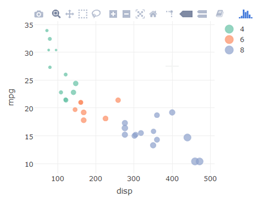
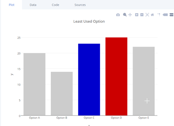
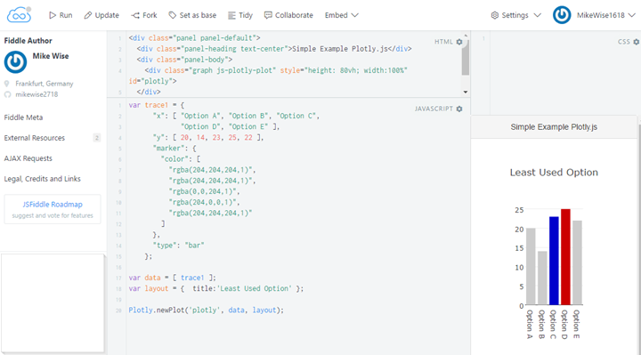
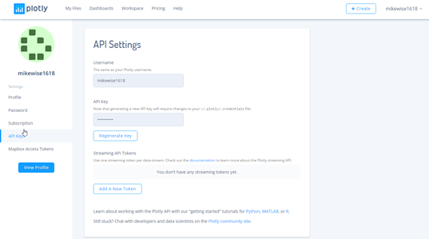
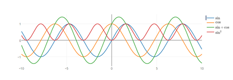

[up](https://mikewise2718.github.io/markdowndocs/)

# Plotly notes
An overview with some of the information I might need in the future when I come back to this having forgotten everything.

## Intro
From the SO tag: `Plotly.js` is an open source, high-level, declarative charting library, built on top of `d3.js` and `stack.gl`. It ships with 20 chart types, including 3D charts, statistical graphs, and SVG maps.

Some interesting things about Plotly:
 - it can be used from Javascript, Python,R, node.js, and Julia (so far). 
 - it can automagically convert a ggplot into a plotly call (obviously not everything comes over)
 - it has a large amount of interactivity built in (tooltips, zooming, and some other things)
 - it has a scaleale cloud hosting option


Some weak points:
 - legends are a fairly weak, not many options no title, etc.
 - not as many primitives as ggplot has ... yet

There are two main ways to view plots, one produces them locally, the other produces them on their "cloud": [plotly website](https://plot.ly)
Above a certain number of calls (50 v1 API and 250 v2 API calls per day) you need a subscription which will run you 396 USD a year and gets you 10k API calls a day.

## Simple plot
Here is a minimal example:
```
 mtcars %>%  plot_ly(x = ~disp, y = ~mpg, color = ~factor(cyl), size = ~wt,type="scatter",mode="markers")
```
yielding:



## Plotly structure
I have seen up to three objects in a root json object (a dictionary).
Plotly organizes things in "traces" which are similar to ggplot's layers. 

Some notes:
  - These are stored under a misnamed key "data"
  - You need at least one trace, a trace has a type (usually "scatter") and a mode (like "lines" or "markers")
  - Each trace carries its own copy of the data, which can be inefficient

It also has a "layout", which regulate things like titles, axes, margins, background, etc.
  - stored under the key "layouts"
  - a layout is optional

Finally there is a set of "frames", which are used for animation.
  - often this key is entirely missing.

Here is a simple example:[BarChart Demo](https://plot.ly/~mikewise1618/3)
```
{
  "data": [
    {
      "uid": "6cd75b",
      "marker": {
        "color": [
          "rgba(222,204,204,1)",
          "rgba(204,204,204,1)",
          "rgba(0,0,204,1)",
          "rgba(204,0,0,1)",
          "rgba(204,204,204,1)"
        ]
      },
      "y": [  20, 14, 23, 25,  22 ],
      "x": [  "Option A", "Option B", "Option C",
              "Option D", "Option E"  ],
      "type": "bar",
      "name": "y"
    }
  ],
  "layout": {
    "autosize": true,
    "title": "Least Used Option",
    "xaxis": {
      "range": [ -0.5, 4.5 ],
      "type": "category",
      "autorange": true,
      "title": "x"
    },
    "yaxis": {
      "range": [ 0, 26.315789473684212 ],
      "type": "linear",
      "autorange": true,
      "title": "y"
    }
  }
}
```

of this plot:

  

Note you can open an editor and edit it in place.

And as an aside, we can create this code in R directly and compactly with this:
```
x <-   c("Option A", "Option B", "Option C", "Option D", "Option E")
y <-   c(20, 14, 23, 25, 22) 
clr <- c("#CCCCCC","#CCCCCC","#0000ff","#ff0000","#CCCCCC")
df <- data.frame(x=x,y=y,clr=clr)
df %>% plot_ly( x=~x,y=~y,marker=list(color=df$clr),type="bar") %>% 
       layout(title="Least Used Options")
```
Even if the "marker=list(...)" construct is a bit wierd. We could have added the 

## Fiddles
One way to mess around with them is to put them in a fiddle. Here is the above plot put in a fiddle:

  

I haven't figured out how to view the javascrip console output in jsfiddle yet though...


## API Key
you need an api key to login. This is where you set it, but note that you cannot see it here:

  

You set it for a R session with this command:
```
Sys.setenv("plotly_username"="DemoAccount")   # mikewise1618
Sys.setenv("plotly_api_key"="YOUR_API_KEY_HERE")     # save it somewhere
```
If you use it every day it should go in your .Rprofile

```
p <- mtcars %>% plot_ly(x=~disp,y=~mpg)
chart_link <- api_create(p, filename="minMtcars",sharing="public",fileopt="overwrite")
chart_link
```

And for python like this:
```
import plotly 
plotly.tools.set_credentials_file(username='DemoAccount', api_key='YOUR_API_KEY_HERE')
#plotly.offline.plot(fig, filename='polarplot-1.html') 
plotly.plotly.iplot(fig, filename='polarplot-1')

```


## Examples
Here are a large searchable set of examples, with code in all languages. Here is a simple one:
  
  [Sines and cosines](https://plot.ly/~IPython.Demo/3774#plot)

A picture:

  


## Subplots

Basically you specify the traces, then call subplot. There is an option nrows parameter, and you can specify the relative widths and heights.

It is pretty clear how the data structure works and I assume you could just hack the values in their yourself.

An example
```
library(plotly)
eco <- economics[1:6,]
p1 <- plot_ly(eco, x = ~date, y = ~unemploy,line=list(color="#ff0000")) %>%
  add_lines(name = ~"unemploy")
p2 <- plot_ly(eco, x = ~date, y = ~uempmed,line=list(color="#0000ff")) %>%
  add_lines(name = ~"uempmed")
p <- subplot(p1, p2)
p
Sys.setenv("plotly_username"="mikewise1618")   # mikewise1618
Sys.setenv("plotly_api_key"="YOUR_API_KEY_HERE")
chart_link <- api_create(p, filename="subplotExample",sharing="public",fileopt="overwrite")
chart_link
```
A link:[plot of the above using subplot](https://plot.ly/~IPython.Demo/3774#plot)

Here is the generating data:
```
{
  "data": [
    {
      "name": "unemploy",
      "yaxis": "y",
      "mode": "lines",
      "xaxis": "x",
      "y": [ 2944, 2945, 2958, 3143, 3066, 3018 ],
      "x": ["1967-07-01","1967-08-01", "1967-09-01",
            "1967-10-01","1967-11-01", "1967-12-01"],
      "line": {
        "color": "#ff0000"
      },
      "type": "scatter"
    },
    {
      "name": "uempmed",
      "yaxis": "y2",
      "mode": "lines",
      "xaxis": "x2",
      "y": [  4.5, 4.7, 4.6, 4.9, 4.7, 4.8 ],
      "x": ["1967-07-01","1967-08-01", "1967-09-01",
            "1967-10-01","1967-11-01", "1967-12-01"],
      "line": {
        "color": "#0000ff"
      },
      "type": "scatter"
    }
  ],
  "layout": {
    "showlegend": true,
    "yaxis": {
      "domain": [ 0,  1 ],
      "anchor": "x"
    },
    "xaxis2": {
      "domain": [ 0.52, 1 ],
      "anchor": "y2"
    },
    "yaxis2": {
      "domain": [ 0, 1],
      "anchor": "x2"
    },
    "xaxis": {
      "domain": [ 0, 0.48 ],
      "anchor": "y"
    },
    "hovermode": "closest",
    "margin": {
      "r": 10, "b": 40, "l": 60, "t": 25
    }
  }
}
```

Python:
```
import plotly
import plotly.graph_objs as go
import numpy as np

fig = plotly.tools.make_subplots(rows=1, cols=2, specs=[[{}, {}]])


trace1 = go.Histogram(
    x=np.random.uniform(1,6,size=62),
)
fig.append_trace(trace1, 1, 1)


trace2 = go.Scatter(
    x = np.random.uniform(1,6,size=62),
    y = np.random.uniform(30,5,size=62),
    mode='markers',
)
fig.append_trace(trace2, 1, 2)

fig1 = go.Figure(data=[trace2])
plotly.offline.plot(fig1, filename='temp1.html')
#   plotly.plotly.iplot(fig, filename='polarplot-1') # on the plotly site
```