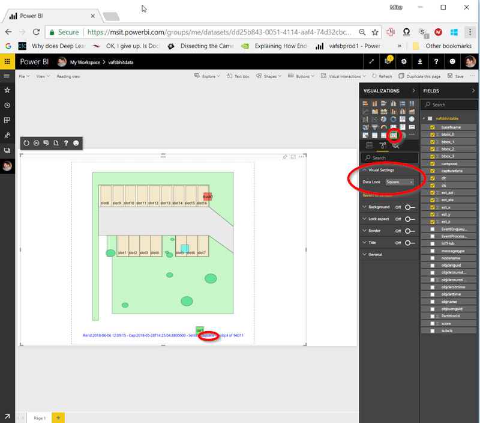

[up](https://mikewise2718.github.io/markdowndocs/)

# Intro
* Power BI - it could be better...
* My site: https://msit.powerbi.com/groups/me/contentlist
* There is the `PowerBI Desktop` and the `PowerBI Service`. They are quite different.
* Best place to look for info is the PBI community 
   * User: MikeWise1618  - pass: bpi... email: mwise@microsoft.com
   * https://community.powerbi.com/t5/Developer/Get-data-using-REST-API/td-p/122055
   * https://community.powerbi.com/t5/Developer/A-way-to-use-REST-API-to-Extract-Data-from-Dataset/td-p/329635

# Overview 
* It is all about licnsening: https://www.encorebusiness.com/blog/power-bi-free-vs-pro-vs-premium/
* REST API Limitations: https://msdn.microsoft.com/en-us/library/dn950053.aspx
* Embedded complications: https://www.encorebusiness.com/blog/power-bi-free-vs-pro-vs-premium/

# PBI Service Data Export
* You cannot use the REST API to do this (https://community.powerbi.com/t5/Developer/Get-data-using-REST-API/td-p/122055)
* You have to create a report from a dataset and select all the columns, then export to Excel (or sometimes CSV is possible directly)
* Data silently ends up in `~\Downloads\data.xlsx`
* Limit of 30k rows, or 150k rows for Pro user

# PBI Developer Links
* PBBWI Developer Center (link changed) - https://pbiwebprod-docs.azurewebsites.net/en-us/developers 


# PBI Web Settings
* They are under Gear/Settings:<br>


# License type
* What kind of License do I have? http://community.powerbi.com/t5/Service/Power-BI-Pro-how-to-tell/td-p/186195
* Pricing: https://powerbi.microsoft.com/en-us/pricing/
* It is under Gear/Manage Storage (oddly)<br>
* According to this Picture I am a `Pro User` - so I can use the REST API:<br>


# Streaming Real-time data
* Go to the PBI web thing (https://msit.powerbi.com/groups/me/contentlist/ )
* Create a new dashboard (+Create in the upper right corner)
* Add a tile (+ Add tile in menu)
* Click on "Custom Streaming Data" then next
* Add streaming data set

# Authentication
* PowerBI and Swagger - Doesn't really work - https://community.powerbi.com/t5/Report-Server/Swagger-URL-for-PBI-Report-Server/td-p/295076
* See the login script in PowerBIPS for one way to do this


# Issues
* 403 (Not Authorized) - This can mean a bad token, or you haven't given your app the right permissiosn
* 404 (URL not found) - you used the wrong URL somehow
* 400 (Bad Request) - I got this trying to use a Guid (which is not a valid datatype I suppose, but I also got it when I didn't have matching brackets, etc)
* Streaming Data Set wasn't showing up in PBI even though I had provisioned and authenticated it in ASA - Turned out I had everything going to storage endpoints (using routes), so there was no data going to PBI, and it seemingly only provisions the dataset visibly when the first data arrives. Killed an hour or so of work looking for that.

# Tiles
* No Text Tiles Possible :https://ideas.powerbi.com/forums/265200-power-bi-ideas/suggestions/16982443-text-tile-for-real-time-data


# Custom Visuals
* Usage docs - https://docs.microsoft.com/en-us/power-bi/power-bi-custom-visuals
* Github sources and instructions - https://github.com/Microsoft/PowerBI-visuals
* R Custom Visuals - https://github.com/Microsoft/PowerBI-visuals/blob/master/RVisualTutorial/CreateNewVisual.md

# Workspaces
* Works spaces are created from the icon menu on the left - the one with all the overlaping-overlaid boxes
-*This opens up a list of all the workshapces you have access to. At the very bottom is an option to create a workspace
* This option (the right to create PBI groups (workspaces apparenatly) can be turned off by an administrator.

# Creating R Custom Visuals
* Installation notes:
        -* Just followed the instructions.
            * Install the PBI tools. `npm install -g powerbi-visuals-tools`
            * Test it: `pbiviz`
            * Create an SSL cert: `pbiviz --create-cert` (note the password)
            * Install the SSL cert: `pbiviz --install-cert` 
                * Browse to the "Trusted Root Certification Authorities" Certificate Store
            * Enable "Developer Visual" in "Settings" on the PBI Web Page 
        * Have to install a cert for it to work.
        * Got `ERR_SSL_VERSION_OR_CIPHER_MISMATCH` error in browser (after digging past the "Could not connect to server")
        * https://github.com/Microsoft/PowerBI-visuals/issues/107
        * Had to  `npm install` a couple of times, and then reinstall the certs aftwards or the browser complained it could not get a secure SSL connection
        * `pbiviz` - General usage instructions https://github.com/Microsoft/PowerBI-visuals/blob/master/tools/usage.md 
        * Controlling R Script from Property Pane
        https://github.com/Microsoft/PowerBI-visuals/blob/master/RVisualTutorial/PropertiesPane.md


* Starting a new project
    * Always create it in a new directory so as not to destroy the old project
        * This creates a templateed `pbiviz new parkmapviz1 -t rvisual` project
        * To get your visual to work you then just have to replace `script.R`
        * To get a custom PBI "Property Pane" for you have to edit:
            * `../capabilities.json`
            * `../src/visual.ts`
            * See above PropertiesPane link for what to change (it is obsolete now and does not work - see below) * there is also a github repo
        * To build the package you do:
            * `pbiviz package`
            * This creates a `*.pbiviz` file in the `../dist` subdirectory
            * Documented here: https://github.com/Microsoft/PowerBI-visuals/blob/master/tools/usage.md#packaging-your-visual-for-distribution 
            * Updating to version 1.6
                * had a lot of trouble compiling with the pane extension, the guidance above is obsolete
                * Did a `git clone` of the `PowerBi-visual-sampleCorrPlotRVisual`
                * Did a `pbiviz update 1.6.0` in order to get the `pbiviz package` to work
                * Then copyied over the `src/*.ts` files
                * And the `capabilites.json` file
            * To test you have to run `pbiviz start` from the root of your pbi visual project directory
            * Then create a report in your PBI workspace, and add a visualization with the "</>" icon  in it (near the end nex to the world icon (the ARCgis Maps for PBI icon.)<br>
            <br>
    

# PowerBIPS
* PowerShell wrapper for PBI REST API
* GitHub repo - https://github.com/DevScope/powerbi-powershell-modules/
* Module source code (from PowerShell Gallery): https://www.powershellgallery.com/packages/PowerBIPS/2.0.1.0/Content/PowerBIPS.psm1
    * If you really want to see how it works...
* Newish docs: https://github.com/DevScope/powerbi-powershell-modules/tree/master/Modules/PowerBIPS/doc   
* And here:  https://github.com/DevScope/powerbi-powershell-modules/blob/master/Modules/PowerBIPS/PowerBIPS.md
* The codez: https://github.com/DevScope/powerbi-powershell-modules/blob/master/Modules/PowerBIPS/PowerBIPS.psm1
  
* Available on PowerShell Gallery: https://www.powershellgallery.com/packages/PowerBIPS
* Install with `Install-Module -Name PowerBIPS`

* https://stackoverflow.com/questions/6354317/how-do-i-retrieve-the-available-commands-from-a-module
* No real API doc but here is a listing of the commands. They don't correpsond closely to the REST API at first glance: https://docs.microsoft.com/en-us/rest/api/power-bi/ - more like a subset
* Actually this listing does not contain all the functions, for excample `Get-PBIWorkspace` and `SetPBIWorkspaces` is not listed, but it is in the PowerShell Gallery listing above.
```
PS C:\WINDOWS\system32> Import-Module PowerBIPS
PS C:\WINDOWS\system32> Get-Command -Module PowerBIPS

CommandType     Name                                               Version    Source
-----------     ----                                               -------    ------
Alias           Get-PBIWorkspace                                   2.0.1.0    PowerBIPS
Alias           Get-PBIWorkspaceUsers                              2.0.1.0    PowerBIPS
Alias           New-PBIWorkspace                                   2.0.1.0    PowerBIPS
Alias           New-PBIWorkspaceUser                               2.0.1.0    PowerBIPS
Alias           Set-PBIWorkspace                                   2.0.1.0    PowerBIPS
Alias           Update-PBIDataset                                  2.0.1.0    PowerBIPS
Function        Add-PBITableRows                                   2.0.1.0    PowerBIPS
Function        Clear-PBITableRows                                 2.0.1.0    PowerBIPS
Function        Copy-PBIReports                                    2.0.1.0    PowerBIPS
Function        Export-PBIReport                                   2.0.1.0    PowerBIPS
Function        Get-PBIAuthToken                                   2.0.1.0    PowerBIPS
Function        Get-PBIDashboard                                   2.0.1.0    PowerBIPS
Function        Get-PBIDashboardTile                               2.0.1.0    PowerBIPS
Function        Get-PBIDataSet                                     2.0.1.0    PowerBIPS
Function        Get-PBIDatasetParameters                           2.0.1.0    PowerBIPS
Function        Get-PBIDatasetRefreshHistory                       2.0.1.0    PowerBIPS
Function        Get-PBIDataSetTables                               2.0.1.0    PowerBIPS
Function        Get-PBIDatasources                                 2.0.1.0    PowerBIPS
Function        Get-PBIGroup                                       2.0.1.0    PowerBIPS
Function        Get-PBIGroupUsers                                  2.0.1.0    PowerBIPS
Function        Get-PBIImports                                     2.0.1.0    PowerBIPS
Function        Get-PBIModuleConfig                                2.0.1.0    PowerBIPS
Function        Get-PBIReport                                      2.0.1.0    PowerBIPS
Function        Import-PBIFile                                     2.0.1.0    PowerBIPS
Function        Invoke-PBIRequest                                  2.0.1.0    PowerBIPS
Function        New-PBIDashboard                                   2.0.1.0    PowerBIPS
Function        New-PBIDataSet                                     2.0.1.0    PowerBIPS
Function        New-PBIGroup                                       2.0.1.0    PowerBIPS
Function        New-PBIGroupUser                                   2.0.1.0    PowerBIPS
Function        Out-PowerBI                                        2.0.1.0    PowerBIPS
Function        Request-PBIDatasetRefresh                          2.0.1.0    PowerBIPS
Function        Set-PBIDatasetParameters                           2.0.1.0    PowerBIPS
Function        Set-PBIGroup                                       2.0.1.0    PowerBIPS
Function        Set-PBIModuleConfig                                2.0.1.0    PowerBIPS
Function        Set-PBIReportContent                               2.0.1.0    PowerBIPS
Function        Set-PBIReportsDataset                              2.0.1.0    PowerBIPS
Function        Test-PBIDataSet                                    2.0.1.0    PowerBIPS
Function        Update-PBIDatasetDatasources                       2.0.1.0    PowerBIPS
Function        Update-PBITableSchema                              2.0.1.0    PowerBIPS
```

        
