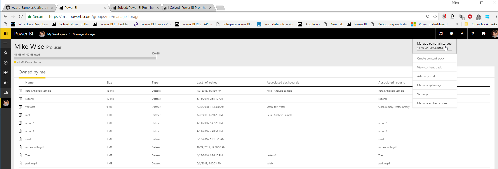

[up](https://mikewise2718.github.io/markdowndocs/)

# Intro
- Power BI - it could be better...
- My site: https://msit.powerbi.com/groups/me/contentlist

# Overview 
- It is all about licnsening: https://www.encorebusiness.com/blog/power-bi-free-vs-pro-vs-premium/
- REST API Limitations: https://msdn.microsoft.com/en-us/library/dn950053.aspx
- Embedded complications: https://www.encorebusiness.com/blog/power-bi-free-vs-pro-vs-premium/

# Settings
- They are under Gear/Settings: 

# License type
- What kind of License do I have? http://community.powerbi.com/t5/Service/Power-BI-Pro-how-to-tell/td-p/186195
- It is under Gear/Manage Personal Settings 
- According to this Picture I am a "Pro User" - so I can use the REST API: 

# Streaming Real-time data
- Go to the PBI web thing (https://msit.powerbi.com/groups/me/contentlist/ )
- Create a new dashboard (+Create in the upper right corner)
- Add a tile (+ Add tile in menu)
- Click on "Custom Streaming Data" then next
- Add streaming data set

# Authentication
- PowerBI and Swagger - Doesn't really work - https://community.powerbi.com/t5/Report-Server/Swagger-URL-for-PBI-Report-Server/td-p/295076
- PushData to 

# Issues
- 403 (Not Autorized) - This can mean a bad token, or you haven't given your app the right permissiosn
- 404 (URL not found) - you used the wrong URL somehow
- 400 (Bad Request) - I got this trying to use a Guid (which is not a valid datatype I suppose, but I also got it when I didn't have matching brackets, etc)
- Streaming Data Set wasn't showing up in PBI even though I had provisioned and authenticated it in ASA - Turned out I had everything going to storage endpoints (using routes), so there was no data going to PBI, and it seemingly only provisions the dataset visibly when the first data arrives. Killed an hour or so of work looking for that.

# Tiles
- https://ideas.powerbi.com/forums/265200-power-bi-ideas/suggestions/16982443-text-tile-for-real-time-data

# Custom Visuals
- Usage docs - https://docs.microsoft.com/en-us/power-bi/power-bi-custom-visuals
- Github sources and instructions - https://github.com/Microsoft/PowerBI-visuals
- R Custom Visuals - https://github.com/Microsoft/PowerBI-visuals/blob/master/RVisualTutorial/CreateNewVisual.md

# Creating R Custom Visuals
- Installation notes:
        - Just followed the instructions.
            - Install the PBI tools. `npm install -g powerbi-visuals-tools`
            - Test it: `pbiviz`
            - Create an SSL cert: `pbiviz --create-cert` (note the password)
            - Install the SSL cert: `pbiviz --install-cert` 
                - Browse to the "Trusted Root Certification Authorities" Certificate Store
            - Enable "Developer Visual" in "Settings" on the PBI Web Page 
        - Have to install a cert for it to work.
        - Got `ERR_SSL_VERSION_OR_CIPHER_MISMATCH` error in browser (after digging past the "Could not connect to server")
        - https://github.com/Microsoft/PowerBI-visuals/issues/107
        - Had to  `npm install` a couple of times, and then reinstall the certs aftwards or the browser complained it could not get a secure SSL connection
        - `pbiviz` - General usage instructions https://github.com/Microsoft/PowerBI-visuals/blob/master/tools/usage.md 

- Starting a new  project
    - `pbiviz new myProjectName -t rvisual`
        
