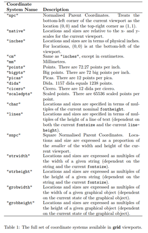

[up](https://mikewise2718.github.io/markdowndocs/)

# Intro
* -R-grid is an R package for performing basic graphics
* R-grid is the package that things like ggplot2 and lattice are built upon.
* Some basic docs from Paul Murrell - https://stat.ethz.ch/R-manual/R-devel/library/grid/doc/grid.pdf

# Coordinate Systems
* See table 1.1 in the link above (copied here):<br>
<br>
* Important to realize that SNPC uses coordinates bigger than 1.0 (unlike earlier systems I have used like PHIGS)
* Here is some Code to illustrate viewports:<br>
<br>
<br>
```
library(grid)

vpcorners <- function(colr, xmin,xmax,ymin,ymax,units="native"){
  txt <- sprintf("rt: %.3f %.3f",xmax,ymax)
  grid.text(txt,x=xmax,y=ymax,just=c("right","top"),gp=gpar(col=colr,fontsize=12),default.units=units)

  txt <- sprintf("lt: %.3f %.3f",xmin,ymax)
  grid.text(txt,x=xmin,y=ymax,just=c("left","top"),gp=gpar(col=colr,fontsize=12),default.units=units)

  txt <- sprintf("lb: %.3f %.3f",xmin,ymin)
  grid.text(txt,x=xmin,y=ymin,just=c("left","bottom"),gp=gpar(col=colr,fontsize=12),default.units=units)

  txt <- sprintf("rb: %.3f %.3f",xmax,ymin)
  grid.text(txt,x=xmax,y=ymin,just=c("right","bottom"),gp=gpar(col=colr,fontsize=12),default.units=units)
}

grid.newpage()
wmm <- convertWidth(unit(1,'npc'), 'mm', TRUE)
hmm <- convertHeight(unit(1,'npc'), 'mm', TRUE)
npcmm <- c(wmm,hmm) # Actual measurements on my sceen are about 8.8 percent larger
oaspect <- wmm/hmm
if (oaspect>1){
    snpcwid <- oaspect*0.9999
    snpcheit <- 0.9999
} else {
    snpcwid <- 0.9999
    snpcheit <- 0.9999/oaspect
}
snpcxmid <- snpcwid/2
snpcymid <- snpcheit/2
showsnpc<- T
preserveAspect <- T

if (showsnpc){
  text <- sprintf("wmm: %f hmm:%f oaspect:%f - snpc coords snpcwid:%f snpcheit:%f",wmm,hmm,oaspect,snpcwid,snpcheit)

  grid.rect(x=snpcxmid,y=snpcymid,width=snpcwid,height=snpcheit,gp=gpar(lty="dashed",col="darkred"),default.units="snpc")
  grid.text(text,x=snpcxmid,y=0.1,just=c("center","bottom"),gp=gpar(col="darkred",fontsize=12),default.units="snpc")

  text <- sprintf("midpoint at (%.3f , %.3f) in snpc units",snpcwid/2,snpcheit/2)

  grid.rect(x=snpcxmid,y=snpcymid,width=0.6,height=0.1,gp=gpar(lty="dashed",col="darkred"),default.units="snpc")
  grid.text(text,x=snpcxmid,snpcymid,just=c("center","center"),gp=gpar(col="darkred",fontsize=12),default.units="snpc")

  vpcorners("darkred",0,snpcwid,0,snpcheit,units="snpc")

}

wxlim <- c(-10,64)
wylim <- c(-2,42)
#wxlim <- c(0,2)
#wylim <- c(0,1)
wwid <- diff(wxlim)
wheit <- diff(wylim)
waspect <- wwid/wheit
print(sprintf("oaspect:%f  waspect:%f",oaspect,waspect))
if (preserveAspect) {
  if (waspect > oaspect) {
    # need extra space top and bottom
    print("need space top and bottom")
    vwwid <- snpcwid
    vwheit <- wheit*(snpcwid/wwid)
  } else { 
    print("need space left and right")
    vwheit <- snpcheit
    vwwid <- wwid*(snpcheit/wheit)
  }
}

gvp <- viewport(x=snpcxmid,y=snpcymid,width=vwwid,height=vwheit, xscale=wxlim,yscale=wylim,name="gvp",default.units="snpc")
pushViewport(gvp)
showgvp <- T
if (showgvp){
  grid.rect(x=mean(wxlim),y=mean(wylim),width=wwid,height=wheit,gp=gpar(lty="dashed",col="steelblue",fill=NA),default.units="native")
  print(wxlim)
  print(wylim)
  vpcorners("steelblue",wxlim[1],wxlim[2],wylim[1],wylim[2])
}
```

