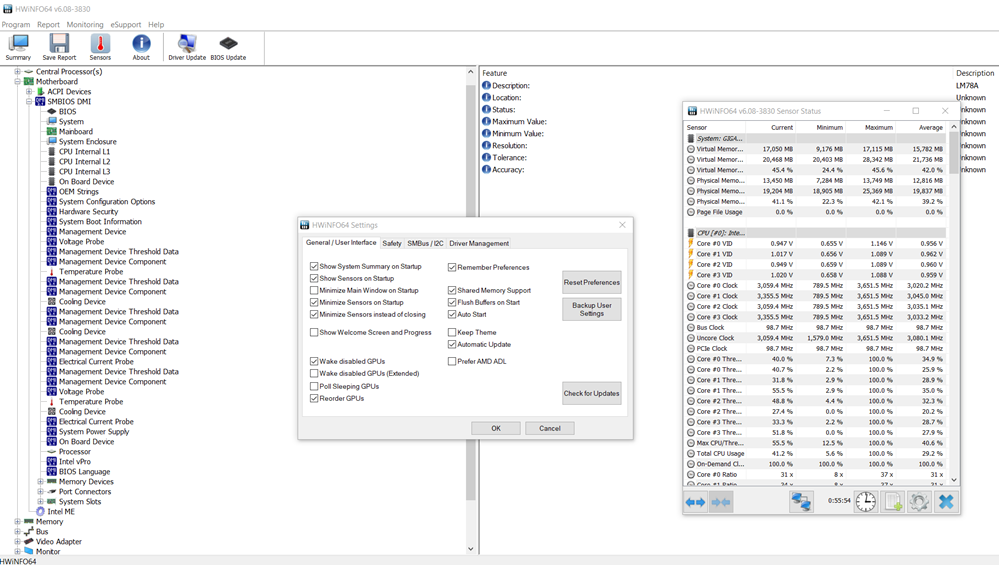
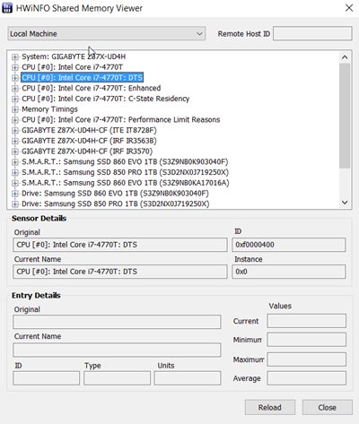
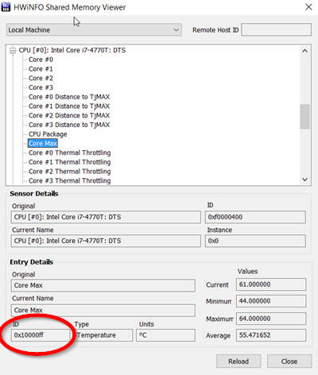

[up](https://mikewise2718.github.io/markdowndocs/)

# Intro
Rainmeter is a desktop custimization tool with a huge selection of user built content, for example for overclocking monitoring.

 - Main site: (https://www.rainmeter.net/)
 - Rainmeter forum: (https://www.hwinfo.com/forum/index.php) (MikeWise1618)
 - Getting Help on Forums (https://forum.rainmeter.net/viewtopic.php?f=5&t=28421)
 - Rainmeter Measures: (https://docs.rainmeter.net/manual/measures/)

# HwINFO App
The HwINFO Plugin seems to the best way forward, even though I haven't found source code to it.
- The HWiNFO64 app needs to be installed and running for the HwINFO Rainmeter plugin to work in Rainmeter.
- Also the "Shared Memory
- This is how it needs to be configured
   - "Minimize Sensors instead of Closing" is checked
   - "Shared Memory support" is checked

- Some rather old docs in a forum from the author (https://www.hwinfo.com/forum/Thread-Rainmeter-plug-in-for-HWiNFO)
- New docs (pointing out how badly documented it is) (https://www.hwinfo.com/forum/Thread-Getting-Started-Confusion)
- Everything is located in: `C:\Users\mike\Documents\Rainmeter\Skins\HWiNFO\`
- Demo skin location: `HWiNFO.ini`
- Skin measures reference variables location: `@Resources\HWiNFO.inc`
- Values for those measure referenc variables can be found in the HwINFO Shared Memory Viewer described below

# HwINFO Shared Memory Viewer
- Seperate app to view the Shared Memory values with purple instead of blue icon
 - Looks like this:
 
- The CPU temp was not registering, we had to make the following change to HWINFO.Inc:
```
C:\Users\mike\Documents\Rainmeter\Skins\HWiNFO\@Resources>diff HWiNFO.inc HWiNFOorig.inc
11c11
< HWiNFO-CPU0-DTS-CoreMax=0x10000ff
---
> HWiNFO-CPU0-DTS-CoreMax=0x100007f
```
- The values was found using the HwINFO Share Memory Viewer here:
 

# Installed and first draft on 2019-06-24
- Rudimentary docs

# To Do 2019-07-10
- Get rid of the unused windows
- Add wattage values
- Add new windows for all 4 different cores 


