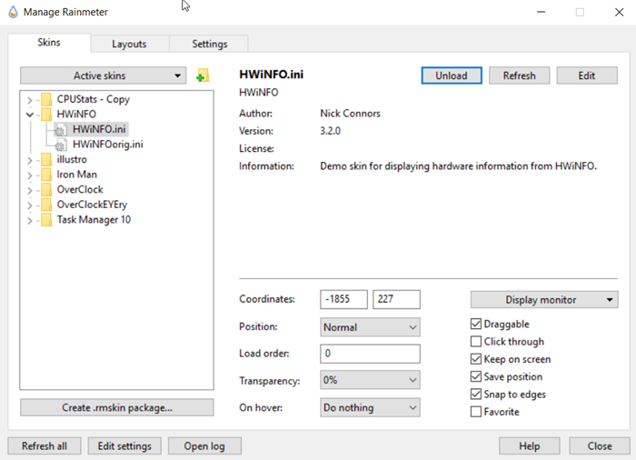

[up](https://mikewise2718.github.io/markdowndocs/)

# Intro
Rainmeter is a desktop custimization tool with a huge selection of user built content, for example for overclocking monitoring.

 - Main site: (https://www.rainmeter.net/)
 - Rainmeter forum: (https://forum.rainmeter.net/)
 - HWiNFO forum: (https://www.hwinfo.com/forum/index.php)
 - Getting Help on Forums (https://forum.rainmeter.net/viewtopic.php?f=5&t=28421)
 - Rainmeter Measures: (https://docs.rainmeter.net/manual/measures/)
 - If you want it for system monitoring you will probably want to install HWiNFO - see the HWiNFO page for that
 
# Config
- Installed into `C:\Users\mike\Documents\Rainmeter`
- Skins are best managed from app loaded from Tray icon (teardop)
- Go to Skins, expand the skin you want, click on the correct .ini file and hit `load` or `unload` 

# Installing plugins
- Useful discussion of where plugin dlls go (https://forum.rainmeter.net/viewtopic.php?f=103&t=22019&sid=8e218e71d52c0edb378e052012598c26&start=10#p116764)
  - Plugins dlls that come with Rainmeter go directly into  `C:\Program Files\Rainmeter\Plugins`
  - custom Plugins dlls go directly into  `C:\Users\YourName\AppData\Roaming\Rainmeter\Plugins`
   

