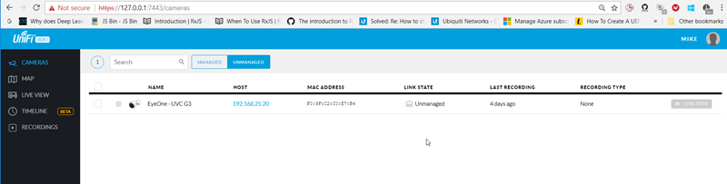
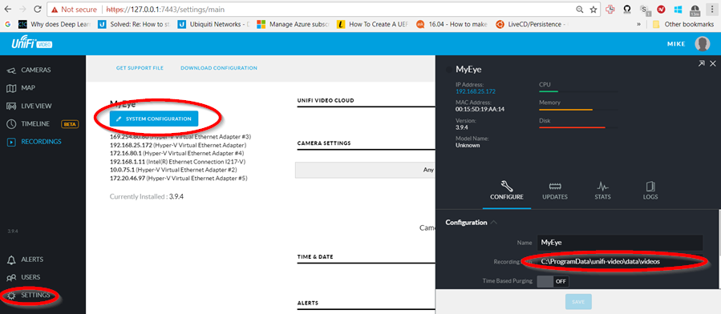

[up](https://mikewise2718.github.io/markdowndocs/)

# Intro
- Reolink RLC-411WS is an NVR (Network Video Recorder) Camera from Reolink. Info https://reolink.com/product/rlc-411/)<br>

- Impulse buy when I realized I needed something with more resolition. 
- Software is not great, but gets the job done.
- Apparently the API is closed which is terrible.
- Was hard to figure out if it actually worked, one way is to hold a finger over the IR sensor and see if the IR LEDs go on.
- Quick start guide was not much of a help
- Software https://reolink.com/software-and-manual/

# Logging into the camera
- It went out and grabbed a DHCP address under the name "Camera1" - leaving it there for now.
- Got to it by going to the web addres and logging in: Default user:admin Default pass:   (i.e. blank password)
- 


# Capturing a single shot from the command line
- There is an undocumented way to capture images with curl mentioned [here](https://community.ubnt.com/t5/UniFi-Video/unifi-3-2-2-snapshot-cgi-wget-curl-string-from-camera/td-p/1572322)
- You can't capture with `curl` if any server or client is "managing" it
- Key is to look at the "link state" in the multi-camera management web client - it should say "Disconnected" whereever it appears under MANAGED or "Unmanaged" when it appears under UNMANAGED.

- And here is the capture command I used:

```
C:\Users\mike>curl -X POST -H "Content-Type: application/json" -H "Cache-Control: no-cache" -d '{"username":"ubnt","password":"ubnt"}' "http://xxx.xxx.x.xxx/api/1.1/snapshot" -o test.jpg
  % Total    % Received % Xferd  Average Speed   Time    Time     Time  Current
                                 Dload  Upload   Total   Spent    Left  Speed
100  210k  100  210k  100    37  1233k    216 --:--:-- --:--:-- --:--:-- 1239k
```

# Installing HW
- It can use either PoE poer or something else.
- It also needs some kind of a mount, I built something out of wood and an old table leg. 
- My first attempt using a wooden pole failed because
  - The wooden pole was made out of extrodinarily hard wood (the drill barely worked and burnt the wood)
  - I didn't have the right size drill bit.
  - I striped the screw and ruined a good screwdrive because of the hard wood.
  - Etc.

# Installing SW


# Storage
- Here is where you specify where the data gets saved (Settings/Something)<br><br>
- On Windows the video ends up getting stored in `C:\ProgramData\unif-video\data\videos`
- On Windows the video ends up getting stored in `C:\ProgramData\unif-video\data\videos`
- On Ubuntu the video ends up in `/usr/lib/unifi-video/data/videos`
- On Ubuntu the snapshots ends up in `/usr/lib/unifi-video/data/`
- Screenshots store the snapshots in `~/Download` on both Windows and Ubuntu(?)

# Screenshots