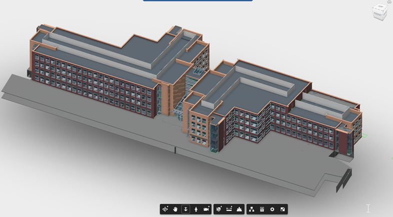
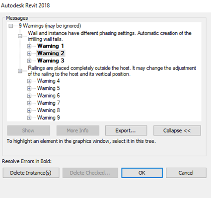
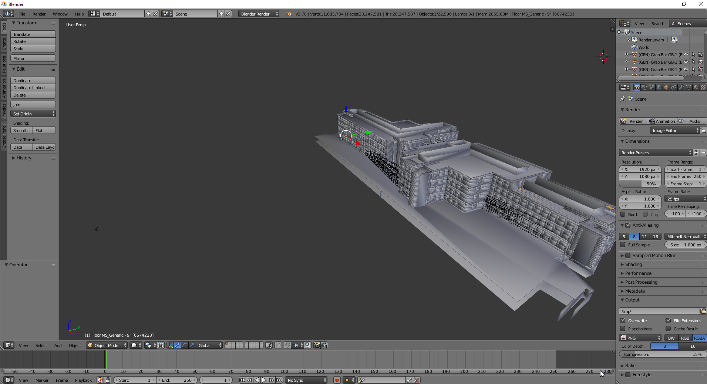
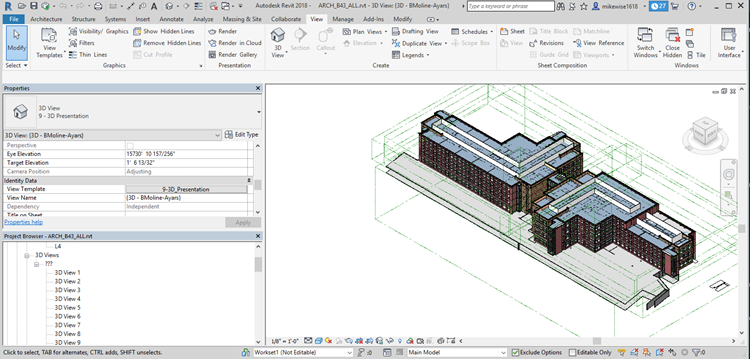
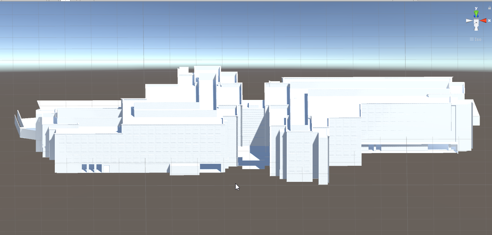

[up](https://mikewise2718.github.io/markdowndocs/)

# Revit 
Revit is a CAD program from AutoDesk specialized on Architecture, Mechanics, Construction, etc. and for working with large teams. Not cheap at 350 Euros per month, but you can get a sample version for 30 days for free.

We recieved a large set of Revit files for Building 43 in order to create some Hololens scenarios by importing some of this content into Unity3D. This document descripts the process we used, and the problems we encountered along the way

## Revit Web Viewer
There is a web-hosted Revit viewer. [Revit Web Viewer](https://a360.autodesk.com/viewer/) We uploaded the files we got to the viewer for preview purposes. While this was a help, it was difficult over relatively low bandwidth scenarios. From my home internet (limited to around 1 MBit/Sec) it would not upload a 115 MB file in 4+ hours although the bandwidth was full for that time (it was monitored) and it thus transfered something like 10 times as much data as the file was in size. Transfering it to an Azure VM and then uploading it worked fine however. Here is one of the images we obtained.

## Loading into Revit Applications

### Worksets.
When loading a file with multiple worksets Revit presents a menuavailable worksets, and for some reason only **workset1** was preselected. Later stages then however were missing much of the data, most noticably the exterior walls.

Look, no exterior walls:

### Conversion wo 2018 format
When I started up Revit and tried to load the B43 file it immediately told me I had to convert to the new 2018 format (even though we are in early 2017 now). Took about 15 minutes I think to convert.

#### Warnings
There were a few. Didn't worry about them.

## Missing external wall workset
Yep. Turns out the entire external wall was in another workset which I didn't import. Searched for a day or two for this.

## Central Server
For awhile I couldn't change or save anything because I didn't have permission and it wasn't checked out. This made it very hard to experiment and figure things out. Turns out you have to save your file locally and designate it as a stand-alone master to get around this.

## Size of Model
The model is indeed huge. I loaded it into blender (an open source 3D program) to get triangle and vertex counts:

File sizes are:
  - Revit - 115MB
  - Blender - 331MB
  - Unity - ???MB

Blender said it used 2.8 GB of memory.

So it has:
 - 20k objects
 - 20m triangles
 - 20m faces
 - 11m vertices

It was very slow to render in all platforms, Revit and Unity were slugish, Blender was practically unusable with this data set. Clearly we are going to have to work with a drastically reduced dataset.

## Views
Everything you look at in Revit is in a view, and you can have a lot of them of various types - at least 3D and 2D. 
Most views have their settings controlled through a template, which means you can't change anything in a view, you have to change it in a template. You must remove that if you want to play with the settings.

## Materials
Turns out Revit has (for historical reasons) a very complicated materials model. This explains most of it: 
- Part 1: Three Levels of Materials - [part 1](https://blog.insitevr.com/mastering-revit-materials/)
- Part 2: Common Material Problems - [part 2](https://blog.insitevr.com/mastering-revit-materials-2/)
- Part 3: Realism and Physically Based Rendering (PBR) - Seems like it never got written

## FBX Export
You can export the data sets as FBX, a proprietary format from AutoDesk but with good public support. It is meant for importing into 3DS (another AutoDesk product) and because of the complicated Revit material specifications, transfer of material information has only worked into 3DS since 2011. And it does not work on import into Unity, although the information must clearly be in the FBX file somewhere.

Here is a picture of the data imported into Unity:

## Next Steps
 - Measure Memory Usage in Revit
 - Measure Memory Usage in Unity
 - Create North

