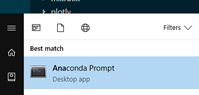

[up](https://mikewise2718.github.io/markdowndocs/)


# Intro
Tensorflow - main install link: [link](https://www.tensorflow.org/install/)
 - 9 March 2017 TF 1.0.1 installed into Anaconda3 (from file dates)
 - Actually installing TF is a royal pia every time. Switching to Docker.
    - That turned out to be a bad idea as Docker does not support GPUs on Windows

# Installing with GPU on Ubuntu
- It is a pain in the butt. The drivers, Cuda, CuDNN, must all fit to the version of TF, and it can be hard to tell.
- Following all these steps are key: https://www.tensorflow.org/install/install_linux

### Drivers
- In the end I need to install the correct driver version
    - once via the Ubuntu GUI `Software & Updates` then click on `Additional Drivers`
    - and then once using the run file installtion variant you can download from Nvidia - here is the archive: http://www.nvidia.com/object/unix.html 
        - You have to stop X to do this `sudo stop service lightdm` 
        - I ignored the errors
    - If you don't do that Tensorflow will not see the GPU as a device, although you can see it in `nvidia-smi`, and even if Cuda samples work
- You can see your driver version with `cat /proc/driver/nvidia/version`
- You can also see it with `nvidia-smi`
    

### Cuda
- you can use `sudo apt-get cuda-9-0` or whatever for this. Works fine.
- I think you need to do `sudo apt-get cuda` afterwards to get the right links.
- You can test with the samples although that is no guarentee that TF will see it
   - I actually to fixup the samples with Grep and Sed to have the right driver version numbered directories, see my Nvidia notes
- There is a script in `/usr/local/cuda/bin` that you can use to copy the examples to your home directory.
- Don't forget the export command for the environment variables.

### CuDNN
- Go to the Nvidia Download site (you have to login) https://developer.nvidia.com/cudnn 
- Then download the version of CuDNN (as a deb file) you need for your version of TF and Cuda. Important!!!!
- You can install it with `dpgk -i libcudnn7...deb` which does the right fixup thing
- If it is not installed completely (links, etc.) you will get a core dump, but no useful message.
- If it is the wrong version (too high or too low) TF will complain when it tries to load it.
- You can test with the samples although that is no guarentee that TF will see it
- It is quite possible for TF to see Cuda but not CuDNN - took me half a day to find that.

### Extra stuff
- You need the export commands for PATH and LD_LIBRARY_PATH in your `.bashrc`
- Maybe you need `CUDA_HOME` there too....
- You may need this: For CUDA Toolkit <= 7.5 do: `$ sudo apt-get install libcupti-dev`
    - I installed it, didn't seem to hurt although I am on version 9.0
- You need this: ` sudo apt-get install cuda-command-line-tools-9-0` (or whatever Cuda version you are on)
    - Installation is wrong, it omits the version numbers and then it cannot be found


# Docker
- First you ahve to install docker of course. Try [this](https://docs.docker.com/get-started/#container-diagram)
- Then this command gets you far:
  - docker run -it -p:8888:8888 tensorflow/tensorflow
- Note that docker cannot get to the GPU on normal Windows 10 hyper-v (as of Mar 2018), so don't even try

# Installing with anaconda
Start with the anaconda command prompt
  - windows key 
  - type "anaconda"
  - click on the "Anaconda Prompt" icon<br>

Start with a naked enironment and then activate it
 - conda create --name tf python=3.6
 - conda tf

Then install Tensorflow
  - pip install --upgrade tensorflow

Then test it
  - see the tensorflow install page for a little test program

Then you might want to install jupyter
 - pip install jupyter --upgrade 

# List Available devices (CPU,GPU)

```
from tensorflow.python.client import device_lib
device_lib.list_local_devices()
```

# Log stuff
TF_CPP_MIN_VLOG_LEVEL=3 python tf-program.py

# Reactivating an old anaconda
- conda info --envs

# Bringing TF up-to-date
- pip install pip --upgrade
- pip install tensorflow --upgrade


# Links
 - Repository - [link](https://github.com/tensorflow)
 - Newest Release notes - [link](https://github.com/tensorflow/tensorflow/blob/master/RELEASE.md)


# Command line commands
 - Get version:
   - "python -c 'import tensorflow as tf; print(tf.__version__)'"  # for Python 3
 - Get version with conda 
    - "--upgrade "

# Bazel
- A build and testing tool
- Installation instructions here: https://docs.bazel.build/versions/master/install-ubuntu.html
- Some usage tips here: https://stackoverflow.com/questions/34204551/run-tensorflow-unit-tests 
- This worked well: `bazel test //tensorflow/python/...`

# Running Models 
These are examples basically
- You have to download the tensorflow.models repository, it used to be part of TF, but has now been seperated out.
- You need to have "bazel" (a make tool installed) to run some of the examples
- You need to install "chocolaty" in order to install "bazel" (sheesh...)
   - [chocolaty link](https://chocolatey.org/)
   - Start powershell as administrator
   - That was just a single line powershell script:
   - "iex ((New-Object System.Net.WebClient).DownloadString('https://chocolatey.org/install.ps1'))"
   - close and restart powershell as admin
   - goes quickly
- To install bazel:
   - [bazel link](https://bazel.build/versions/master/docs/install-windows.html)
   - "choco install bazel"
   - That installed version 0.4.5 which had a bug (see my SO post)
       - bazel help gets you the version number
       - bug is here: https://github.com/bazelbuild/bazel/issues/2708
       - choco install bazel --version 0.5.0-rc6
   - It pollutes the c drive with a c:\tools\msys64 directory
   - takes ages to execute, downloads all kinds of crap, etc.
   - afterwards you have to set an environment variable:
      - BAZEL_SH=c:/tools/msys64/usr/bin/bash.exe
      - (optional) BAZEL_VS="C:/Program Files (x86)/Microsoft Visual Studio 14.0"
      - (optional)BAZEL_PYTHON=C:/Python27/python.exe
    - If you want to start over 
    - Never actually got it to work

# model - textsum
   - Model and Readme can be found here:
       -  `https://github.com/tensorflow/models/tree/master/textsum`
   - This builds all the scripts
        - `bazel build -c opt --config=cuda textsum/...`
   - Used this bash under a Powershell with admin priveleges:
        - C:\tools\msys64\usr\bin\bash
   - This does the training: 
          - `bazel-bin/textsum/seq2seq_attention --mode=train --article_key=article --abstract_key=abstract --data_path=data/training-* --vocab_path=data/vocab  --log_root=textsum/log_root --train_dir=textsum/log_root/train`
   - Failed complaining TF was not installed (it is because it was running Python 2.7)
      - noticed `c:\Python27;c:\Python27Scripts `had made it to top of my path after installing bazel, deleted them
      - That made it use my Anaconda (4.1.164 - bit) Python 3.5.2
   - It did not run in the D: drive, had to move everything to the C: drive to get it to work.
   - Finally ran but with lots of "Assertion Error: Empty filelist."
          - Could be related to my tensorflow 1.0.1 which is old at this point
          - Ran using all 8 CPUs, CPU usage around 25%, GPU usage around 3%


# seq2seq - 6 Dec 2017
 - Tried to get this installed on my "new" Surface Book
 - Installed Anaconda 3.6, and then TensorFlow 1.4, following instructions on TensorFlow site
 - Used the TensorFlow gpu version (which was probably a mistake)
 - Had to install a couple extra packages like yaml and something else before it worked
 - There were a couple lines I had to change in one of the files to get two of the libraries to work
     from tensorflow.contrib.distributions import  Bernoulli
     from tensorflow.contrib.distributions import Categorical
 - Changes were to this file: `C:\tensorflow\seq2seq\seq2seq\contrib\seq2seq\helper.py`

 #boltzmann-machine notes

- pip install nosetest 
 - changed nosetest path in makefile to "which nosetest" path
   - `make test &> err.txt`
   - `gedit err.txt`
   - `pip install tqdm`
   - `pip install seaborn`
   - `sudo apt-get install python-tk`
 - Final text
   - Ran 8 tests in 29.171s
   - OK
 - `pip install jupyter`
 - changed path in makefile to which jupyter path
 - `pip install JSAnimation`
 - `pip install sklearn`

 # keras
 - `pip install pillow`
 - `pip install h5py`
 - `pip install keras`

# tensorflow logging
  - my wonderful post: https://stackoverflow.com/questions/44853059/tensorflow-logging-messages-do-not-appear/49756653#49756653 

 # tensorflow object detection zoo models on abra
  - These are the github google Tensorflow models found [here](https://github.com/tensorflow/models/tree/master/research/object_detection)
  - Clone all the models into a directory `git clone https://github.com/tensorflow/models`
  - Change to home dir `cd ~`
  - Activete the right environment for python `source ./tf27gpu/bin/activate`
  - now go to the object detection directory `cd ~/tfrepos/models/research/object_detection`
  - Start jupyter on the right notebook `jupyter notebook object_detection_tutorial.ipynb`
  - If you get error "could not create cudnn handle: CUDNN_STATUS_NOT_INITIALIZED" try the following
  - Start jupyter on the right notebook `sudo jupyter notebook object_detection_tutorial.ipynb --allow-root`

# Issues
  - Installing on Windows - you need to install "Protocol Buffers" Googles datae handling protocol `protobuf` first, which has to be compiled from source
     - https://github.com/google/protobuf 
  - On ubuntu the `arial.ttf` font is not installed by default. See this:   
    - https://stackoverflow.com/a/50006012/3458744 

# zoo Object Ids

```
  ## Loading label map
  PATH_TO_LABELS = os.path.join('data', 'mscoco_label_map.pbtxt')
  label_map = label_map_util.load_labelmap(PATH_TO_LABELS)
  categories = label_map_util.convert_label_map_to_categories(label_map, max_num_classes=NUM_CLASSES, use_display_name=True)
  for ii in range({NUM_CLASSES):
      print(categories[ii])
      category_index = label_map_util.create_category_index(categories)
      print(category_index)


{'name': 'person', 'id': 1}
{'name': 'bicycle', 'id': 2}
{'name': 'car', 'id': 3}
{'name': 'motorcycle', 'id': 4}
{'name': 'airplane', 'id': 5}
{'name': 'bus', 'id': 6}
{'name': 'train', 'id': 7}
{'name': 'truck', 'id': 8}
{'name': 'boat', 'id': 9}
{'name': 'traffic light', 'id': 10}
{'name': 'fire hydrant', 'id': 11}
{'name': 'stop sign', 'id': 13}
{'name': 'parking meter', 'id': 14}
{'name': 'bench', 'id': 15}
{'name': 'bird', 'id': 16}
{'name': 'cat', 'id': 17}
{'name': 'dog', 'id': 18}
{'name': 'horse', 'id': 19}
{'name': 'sheep', 'id': 20}
{'name': 'cow', 'id': 21}
{'name': 'elephant', 'id': 22}
{'name': 'bear', 'id': 23}
{'name': 'zebra', 'id': 24}
{'name': 'giraffe', 'id': 25}
{'name': 'backpack', 'id': 27}
{'name': 'umbrella', 'id': 28}
{'name': 'handbag', 'id': 31}
{'name': 'tie', 'id': 32}
{'name': 'suitcase', 'id': 33}
{'name': 'frisbee', 'id': 34}
{'name': 'skis', 'id': 35}
{'name': 'snowboard', 'id': 36}
{'name': 'sports ball', 'id': 37}
{'name': 'kite', 'id': 38}
{'name': 'baseball bat', 'id': 39}
{'name': 'baseball glove', 'id': 40}
{'name': 'skateboard', 'id': 41}
{'name': 'surfboard', 'id': 42}
{'name': 'tennis racket', 'id': 43}
{'name': 'bottle', 'id': 44}
{'name': 'wine glass', 'id': 46}
{'name': 'cup', 'id': 47}
{'name': 'fork', 'id': 48}
{'name': 'knife', 'id': 49}
{'name': 'spoon', 'id': 50}
{'name': 'bowl', 'id': 51}
{'name': 'banana', 'id': 52}
{'name': 'apple', 'id': 53}
{'name': 'sandwich', 'id': 54}
{'name': 'orange', 'id': 55}
{'name': 'broccoli', 'id': 56}
{'name': 'carrot', 'id': 57}
{'name': 'hot dog', 'id': 58}
{'name': 'pizza', 'id': 59}
{'name': 'donut', 'id': 60}
{'name': 'cake', 'id': 61}
{'name': 'chair', 'id': 62}
{'name': 'couch', 'id': 63}
{'name': 'potted plant', 'id': 64}
{'name': 'bed', 'id': 65}
{'name': 'dining table', 'id': 67}
{'name': 'toilet', 'id': 70}
{'name': 'tv', 'id': 72}
{'name': 'laptop', 'id': 73}
{'name': 'mouse', 'id': 74}
{'name': 'remote', 'id': 75}
{'name': 'keyboard', 'id': 76}
{'name': 'cell phone', 'id': 77}
{'name': 'microwave', 'id': 78}
{'name': 'oven', 'id': 79}
{'name': 'toaster', 'id': 80}
{'name': 'sink', 'id': 81}
{'name': 'refrigerator', 'id': 82}
{'name': 'book', 'id': 84}
{'name': 'clock', 'id': 85}
{'name': 'vase', 'id': 86}
{'name': 'scissors', 'id': 87}
{'name': 'teddy bear', 'id': 88}
{'name': 'hair drier', 'id': 89}
{'name': 'toothbrush', 'id': 90}
```