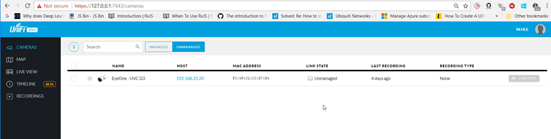
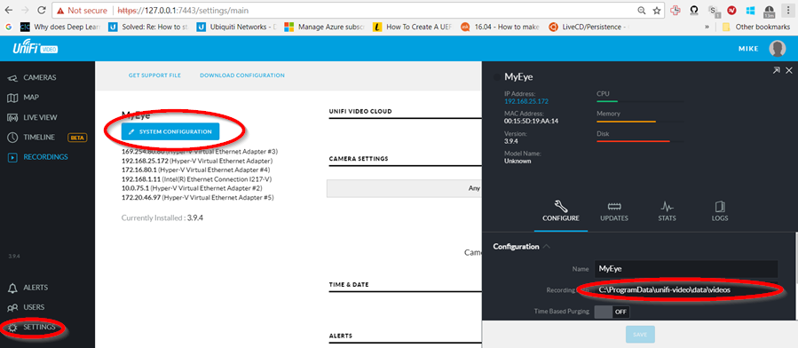

[up](https://mikewise2718.github.io/markdowndocs/)

# Intro
- UniFi G3 is an NVR (Network Video Recorder) Camera from Ubiqity Networks. Info [here](https://www.ubnt.com/unifi-video/unifi-video-camera-g3/)<br>

- Not exactly straightforward - either the hw or the sw.
- The camera is essentially some kind of a linux device that can/must be configured.
- Quick start guide [here](https://dl.ubnt.com/guides/unifivideo/UVC-G3_QSG.pdf)
- Software [here](https://www.ubnt.com/download/unifivideo/)

# Logging into the camera
- While the camera is being managed, you can't log into it in standalone mode
- Once it has been managed somewhere, it seems to have problems remembering it is unmanged
- When you unmanage it, it bizarrly *sometimes* changes the password without changing the user name
- You only get two attempts to login, then it just fails.

# Capturing a single shot from the command line
- Key is to look at the "link state" in the multi-camera management web client - it should say "Disconnected" whereever it appears under MANAGED or "Unmanaged" when it appears under UNMANAGED.


- And here is the capture command I used:

```
C:\Users\mike>curl -X POST -H "Content-Type: application/json" -H "Cache-Control: no-cache" -d '{"username":"ubnt","password":"ubnt"}' "http://xxx.xxx.x.xxx/api/1.1/snapshot" -o test.jpg
  % Total    % Received % Xferd  Average Speed   Time    Time     Time  Current
                                 Dload  Upload   Total   Spent    Left  Speed
100  210k  100  210k  100    37  1233k    216 --:--:-- --:--:-- --:--:-- 1239k
```

# Installing HW
- It needs PoE power. While you can buy a switch that has this on every port, I elected to buy a single shot adpater.
- It also needs some kind of a mount, I built something out of wood and an old table leg. 
- My first attempt using a wooden pole failed because
  - The wooden pole was made out of extrodinarily hard wood (the drill barely worked and burnt the wood)
  - I didn't have the right size drill bit.
  - I striped the screw and ruined a good screwdrive because of the hard wood.
  - Etc.

# Installing SW
- Setup management computer
  - You need to install the management software of course.
  - After you install it (on windows) it might start the tray applet
  - If not do `Windows Key-Unifi` and start the Desktop App - that should in turn start the tray applet.
  -  a tray applet will start running:<br><br>
  - You need to log into the mangement console by clicking on the applet and`"Open in Browser`
  - Then you need to create a user and password.
  - You also will need to know the IP address of this "managment computer".
- Setup camera
  - You need to log into the camera and enter and log into the camera. Default user and password are "ubnt".
  - You need to tell the camera that it is managed from the proper IP address. And reboot it (I think). 
- Manage camera
  - You need the management software to take the camera, upgrade its firmware, and take control.
  - now you can start recording video
  - It will be saved in (somewhere)

- Took me awhile to get this all working so not completely sure of the proper order of the above steps.

- When it is working it looks like this:<br><br>

## Installing SW on Ubuntu
- Didn't work so easily
- Had to use `deb unifi-video.Ubuntu16.05_amd64.v3.9.4.deb` as `gdebi` did not work
- Then had to start service with `systemctl start unifi-video`
- Query status with `systemctl status unifi-video`
- Then opened web browser on https://localhost:7443 and it finally was there.

# Storage
- Here is where you specify where the data gets saved (Settings/Something)<br><br>
- On Windows the video ends up getting stored in `C:\ProgramData\unif-video\data\videos`
- On Windows the video ends up getting stored in `C:\ProgramData\unif-video\data\videos`
- On Ubuntu the video ends up in `/usr/lib/unif-video/data/videos`
- On Ubuntu the snapshots ends up in `/usr/lib/unif-video/data/`
- Screenshots store the snapshots in `~/Download` on both Windows and Ubuntu(?)

# Screenshots