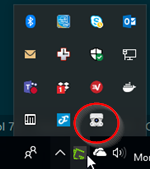

[up](https://mikewise2718.github.io/markdowndocs/)

# Intro
- UniFi G3 is an NVR (Network Video Recorder) Camera from Ubiqity Networks. Info [here](https://www.ubnt.com/unifi-video/unifi-video-camera-g3/) 

- Not exactly straightforward - either the hw or the sw.
- The camera is essentially some kind of a linux device that can/must be configured.
- Quick start guide [here](https://dl.ubnt.com/guides/unifivideo/UVC-G3_QSG.pdf)
- Softwar [here](https://www.ubnt.com/download/unifivideo/)

# Installing HW
- It needs PoE power. While you can buy a switch that has this on every port, I elected to buy a single shot adpater.
- It also needs some kind of a mount, I built something out of wood and an old table leg. 
- My first attempt using a wooden pole failed because
  - The wooden pole was made out of extrodinarily hard wood (the drill barely worked and burnt the wood)
  - I didn't have the right size drill bit.
  - I striped the screw and ruined a good screwdrive because of the hard wood.
  - Etc.

# Installing SW
- Setup management computer
  - You need to install the management software of course.
  - After you install it (on windows) a tray applet will start running:  
  - You need to log into the mangement console by clicking on the applet and "Open in Browser"
  - Then you need to create a user and password.
  - You also will need to know the IP address of this "managment computer".
- Setup camera
  - You need to log into the camera and enter and log into the camera. Default user and password are "ubnt".
  - You need to tell the camera that it is managed from the proper IP address. And reboot it (I think). 
- Manage camera
  - You need the management software to take the camera, upgrade its firmware, and take control.
  - now you can start recording video
  - It will be saved in (somewhere)

- Took me awhile to get this all working so not completely sure of the proper order of the above steps.

- When it is working it looks like this:  
