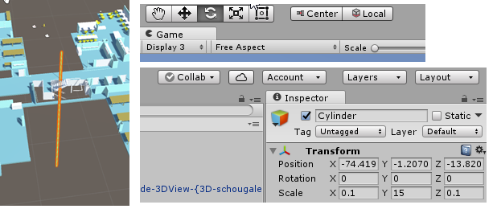

[up](https://mikewise2718.github.io/markdowndocs/)

# Intro
Unity3D is a powerful game engine. Here I keep notes on things that took me awhile to figure out that I think I might forget.

[Unity Technical Forums](http://answers.unity3d.com/page/faq.html)

# Coordinate Systems
* Haven't found a definitive doc yet on the Unity site
* There is this SO question/answer: <https://stackoverflow.com/questions/21937544/working-with-the-coordinate-system-and-game-screen-in-unity-2d>

# Editor Layout notes
* There are game windows but only one scene window. New The game windows get associated with a display (can be set on the upper left), and a camera is associated with a dispaly too. That is how it is done. Input goes to only one game window though, not sure which one.
* To create a new window, you create a new tab in an old window, and then drag it to a new location. Can even be detached from the application, so on another screen.
* You can grab the tag of a game window and drag it to another window in the layout,or even to a new place in the same window, which will cause it to create a new window there splitting up the space. 
* This is kind of odd, but it does make it easy to do pretty much any kind of layout quickly

# Github
 * There is a github component that you have to import into a project if you want github integration. Well worth it.

# Things that are hard to find
 * Scene Window
    * To turn off that silly camera icon in the or the lighting blub, or a lot of other thigns, you can go to the "Gizmos" button in the top window bar and find the appropriate checkbox.
    * To get rid of the UI hovering in the air, go to the Layers dropdown button in the button tool bar under the main window (it is on the right) and turn off the UI layer.

# Where to find new things
Asset Store is hidden in the window menu. To find out what assets you have bought, go to the "inbox-tray" icon in the Asset Store window.

# Assets 
 * Modern People 1.1
 * Handy Hacks (Measuring Tools)
 * Vostopia Mecanim Demo (broken, but I like the Xbox like people)

# Finding the pivot point of an object
The "pivot point" is the point that the object rotates around when you chose the rotate tool in the button bar. To find it:
* Select the object
* then select the rotate tool (pressed in button below)
* Then create a cylinder or a sphere at that point. 
* now just examine the coordinates of its "Postion" in the Inspector window.
* Those coordinates are the pivot point

# How to add a new window with a new camera view
This is somehow hard to stumble across:
* Create the camera you need
* Go to one of the Game windows and left-click on the tab on the top that says "Game"
* A dropdown menu will open up - select "Add Tab"
* Another dropdown menu will open up - Select a "Game" tab
* Now you have two Game tabs in that windows. Select the new one if it is not the visible one.
* In the new tab select an unused "Display" number (a choice widget on the top-left of the top status bar)
* Now go back to your camera and select that Display number for that camera. It should show (if it does not it may be that two cameras have that display number)

Now to make both windows simulatiously visible
 - Grab one of the tabs and drag it lower in the window.
 - Unity will take the hint and let you position the windows somewhere else in the original window - but as a seperate and new game window.

# System Stuff
## Build date
- Boo script here - see both answers: <https://forum.unity.com/threads/build-date-or-version-from-code.59134/>

# Cameras

## Multi-display mode
- Not available in Andorid, selections goes away if you have android selected as a target

## "No cameras rendering" in Editor
- Right click on the "game" tag and disable warning in dropdown that appears

# UI stuff
* It's all about the Rect Transform, best explained here: <https://docs.unity3d.com/Manual/UIBasicLayout.html>
* Note there are differences for how the Rect tool works when you have a rect transform attached or not (see above

## Anchors
* Anchors anchor a UI element to its parent
* All anchor points in one place mean that only the position will shift, not its size

## Text
* Text now appearing after I add to a panel....

## Mixamo animation import
- 1. Select an character/animation and download - you will get a fbx in the downloads file
- 2. Import it into a folder in Assets
- 3. Give the animation a name and create an "Animator Controler" in some folder in Assets. Note that the icon is 3 boxes and a run button. Don't confuse with the "Animation" (has a simple play button)
- 4. Double click and open it. It is empty.
- 5. Locate a character/prefab that is rigged correctly already (humanoid)
- 6. Add an "Animator" component to that character/prefab
- 7. Add your new empty Animator Controller to the "Controller" selector box in the component
- 8. Now drag and drop into the Animator Controller. It will add an orange box with the label "mixamo_com". You can rename this if you want but there seems to be no real reason at this point...
- 9. **Double click** on that orange box - an import settings window will open (I was using single click for awhile, went in circles)
- 10. Switch to the "Rig" tab
- 11. Set the animation type to "Humanoid".
- 12. Click the Apply button, it should import the animation into the contoller now.
- 13. Now if you hit the "Play" button, the character should animate as desired.

# ml-agents
- Split this off into a seperate file

# Unity Unit Testing
- This is pretty good (https://www.raywenderlich.com/9454-introduction-to-unity-unit-testing)

# Packages
- In a state of flux at the moment with a new package manager, etc. (9.10.2019)
- Official "Export Package" doc: (https://docs.unity3d.com/2018.4/Documentation/Manual/HOWTO-exportpackage.html)
- Doing it programatically (https://docs.unity3d.com/ScriptReference/AssetDatabase.ExportPackage.html)
- Some code: (https://stackoverflow.com/a/52883697/3458744)
- Fairly recent custom package creation instructions: (https://neogeek.dev/creating-custom-packages-for-unity-2018.3/)