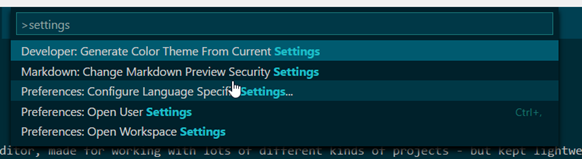
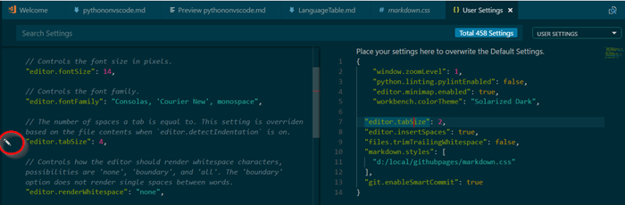
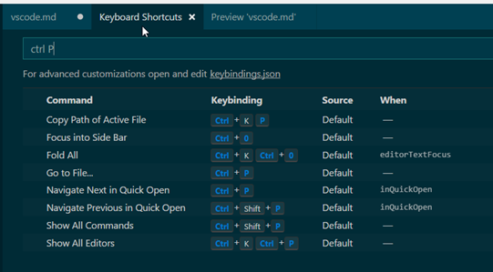
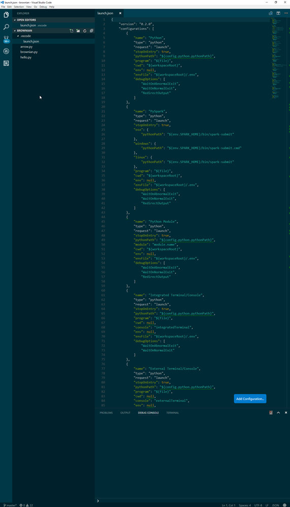

[up](https://mikewise2718.github.io/markdowndocs/)

A helpful question on using a local markdown.css: [local markdown.css](http://stackoverflow.com/questions/32410064/how-can-i-use-an-online-style-css-on-the-visual-studio-code-markdown-preview)


# VS Code
VS Code is a general editor, made for working with lots of different kinds of projects - but kept lightweight. Portability to platforms like MacOS and Linux are also high priorities. 

Note that to get a preview of this document in VS Code use Ctrl-Shift-V
A good place to start is the Help/Welcome command


## Command Palette
For some reason this is not always visible, if it is hidden to go to View/Command Palette or Ctrl-Shift-P.
There is also Ctrl-P, no idea what the difference is.

## Language Mode
- The current language mode (like `Markdown` or `Python`) is shown in the bottom status bar on the right.
- You can change it by clicking on it.

## Settings
- bring up the settings page with `ctrl-,` (Control comma)
- Then toggle between User and Workspace with the displayed tab
- Switch to direct editing of the `settings.json` file with the `Open Settings` command in the command palette
- Everything is explained here: (https://code.visualstudio.com/docs/getstarted/settings)

## .vscode
- vscode file is loaded when you open a directory and a .vscode subdirectory is there
- To create it make a `launch.json` and save it
Example:
```
{
    // Use IntelliSense to learn about possible attributes.
    // Hover to view descriptions of existing attributes.
    // For more information, visit: https://go.microsoft.com/fwlink/?linkid=830387
    "version": "0.2.0",
    "configurations": [

        {
            "name": "Python: Current File",
            "type":"python",
            "request":"launch",
            "program":"${file}",
            "console":"integratedTerminal"
        },
        {
            "name": "Python: launch.py",
            "type":"python",
            "request":"launch",
            "program":"${workspaceFolder}/ml-agents/mlagents/trainers/learn.py",
            "args": ["config/trainer_config.yaml","--train", "--run-id=codetest01"],
            "console":"integratedTerminal",
            "pythonPath": "${config:python.pythonPath}" 
        },
    ]
}
```


## Python debugging
- See if you get the same settings in your terminal window that you do in the command line
- `which python` is your friend

## Extensions
Extensions are the lifeblood of VS Code, lots of people write them. To get to them click on the square in a square icon on the left naviagtion bar. You can then search for new ones.

Useful command palette things to know :
 - Show installed extensions

Find the extensions

Useful extenstions to install:
  - Python (the one from Don Jayamanne)
  - Markdown Lint
  - Markdown Theme
  - Markdown TOC

## Themes
Go to Command Palette and type in Themes (I kind of like "Solarized Dark")

## Opening folders
VS Code manages its settings on a folder basis, so you should have a folder for each project that you are doing (one that needs seperate settings) and do an "Open Folder" from the VS Code menu when you switch to working with that project. At this point I am not sure if you can have two folders open at the same time, it seems you can although you wonder whose setting take priority.

## Settings
Settings are explained here: [settings](https://code.visualstudio.com/docs/getstarted/settings)

Go to Command Palette and type in Settings and then choose the one you want - two of the most ineresting are the User settings and the Workspace settings:<br>
    

 You get a list of the settings you can change to the left of the settings you are editing. You can have VScode copy them over by clicking on the pencil icon (which is not that obvious).<br>



# Storing stuff 
 - The user settings are stored in `C:/Users/mike/AppData/Roaming/Code/User/settings.json`
 - The Extensions are stored in `C:/Users/mike/.vscode/extensions`
 - The folder specific settings are stored in `..\folder/.vscode/settings.json`
 - The language specfic launch settings are stored in `..\folder/.vscode/launch.json`

## Key bindings
- `File > Preferences > Keyboard Shortcuts`<br>
  

## VS Code and Markdown
 - This might become a big topic, but for now we will lump it in here.
 - Some good stuff on colors here: [colors](http://clrs.cc/)
 - A helpful question on using a local `markdown.css`: [local markdown.css](http://stackoverflow.com/questions/32410064/how-can-i-use-an-online-style-css-on-the-visual-studio-code-markdown-preview)

## Starting a markdown topic
 - create a markdown folder under `local/markdownnotes`
 - put an md file in there
 - add a `markdown.css`
 - open it as a folder in VSCode
 - Because we have the settings to search for `markdown.css` in the user settings now you should not have to have change local workspace settings
 - preview with `Ctrl-Shift-V`

## Integrated Command Shell Terminals
- Described here: (https://code.visualstudio.com/docs/editor/integrated-terminal)
- Open settings with `Ctrl-,` (Control comma) and select User settings then search for "terminal" (it is at the bottom)
- What I put into the user `settings.json` to get the Anaconda prompt as my terminal:
```
...
  "editor.largeFileOptimizations": false,
  "terminal.integrated.shell.windows.old": "C:\\WINDOWS\\Sysnative\\cmd.exe",
  "terminal.integrated.shell.windows": "C:\\WINDOWS\\System32\\cmd.exe",
  "terminal.integrated.shellArgs.windows": "/K \"C:\\Program Files (x86)\\Microsoft Visual Studio\\VS15Preview\\Anaconda3_64\\Scripts\\activate.bat\"  C:\\Users\\mike\\AppData\\Local\\conda\\conda\\envs\\py27",
  "workbench.iconTheme": "material-icon-theme",
  "sync.gist": "b87eb69b843edf2e04b46f1174ed051b"
}
```


 ## Python Project 
 To figure out what is being set look in the `launch.json` fie in `.vscode` sub-directory of the folder you opened as vscode:<br>
   